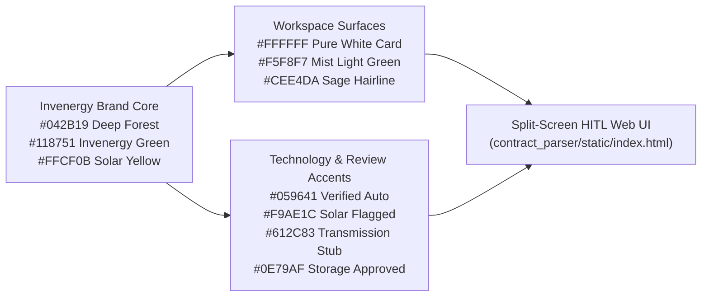

# Design System: Invenergy Contract Intelligence & HITL Workspace
**Source Reference:** Extracted directly from [https://invenergy.com/](https://invenergy.com/) (`@layer reset, base, tokens, recipes`)

---

## 1. Visual Theme & Atmosphere

Invenergy's digital brand language embodies **"Energy Innovation. Trusted Execution."** The interface combines executive infrastructure authority with clean, daylight-first readability:

* **Atmosphere:** Grounded, clinical, and high-trust—anchored by **Deep Forest Green (`#042B19`)** authority headers, **Mist Light Green (`#F5F8F7`)** workspace canvases, **Pure White (`#FFFFFF`)** data surfaces, and crisp **Sage Green (`#CEE4DA`)** structural hairlines.
* **Density & Variance:** Balanced analytical density (`Density: 6/10`) optimized for long-form legal clause inspection alongside a synchronized physical PDF viewport, paired with disciplined asymmetric split-screen proportions (`52% / 48%`).
* **Brand Signature:** The official Invenergy wordmark features crisp typographic letterforms with the signature **Invenergy Emerald Green (`#118751`)** first `"e"` set against either **Deep Forest Green (`#042B19`)** on light surfaces or **Pure White (`#FFFFFF`)** on dark executive headers.



---

## 2. Color Palette & Semantic Roles

All hex values below are extracted verbatim from `https://invenergy.com/`'s root CSS token layer (`--chakra-colors-*`):

### Primary Brand Palette
* **Invenergy Emerald Green** (`#118751` / `--chakra-colors-brand-invenergy-green`) — Primary brand accent, primary action buttons, active tab indicators, focus rings, and the signature `"e"` in the Invenergy wordmark.
* **Deep Forest Green** (`#042B19` / `--chakra-colors-brand-dark-green`) — Primary body copy ink on light surfaces, executive top navigation bar background, and high-contrast headings.
* **Pine Hover Green** (`#0F633C` / `--chakra-colors-green-600`) — Hover/active state for primary Invenergy Emerald buttons and interactive pills.
* **Canopy Dark Green** (`#084B2C` / `--chakra-colors-green-800`) — Secondary dark surface and PDF toolbar backdrop.
* **Solar Energy Yellow** (`#FFCF0B` / `--chakra-colors-brand-yellow`) — High-visibility brand highlight used sparingly for active page focus outlines, warning indicators, and header status accents.

### Neutral & Surface Palette
* **Pure Surface White** (`#FFFFFF` / `--chakra-colors-neutrals-white`) — Clause cards, input fields, review drawers, and modal surfaces.
* **Mist Light Green** (`#F5F8F7` / `--chakra-colors-neutrals-light-green`) — Primary workspace background canvas and subtle card header fills.
* **Soft Mint Wash** (`#EAF8F1` / `--chakra-colors-green-100`) — Selected card background tint and metadata summary bar surface.
* **Sage Hairline Green** (`#CEE4DA` / `--chakra-colors-neutrals-sage-green`) — Default 1px structural borders, dividers, and inactive pill outlines.
* **Muted Lichen Grey** (`#97A79F` / `--chakra-colors-neutrals-dark-grey`) — Subtle borders, disabled icons, and secondary metadata dividers.
* **Slate Moss Grey** (`#626D68` / `--chakra-colors-neutrals-gray`) — Secondary body text, page number labels, timestamps, and helper captions.
* **Disabled Surface Grey** (`#ECECEC` / `--chakra-colors-feedback-gray`) — Disabled button background fill (paired with `#626D68` text).

### Technology & HITL Status Palette
Invenergy's domain-specific technology tokens map directly to Contract Intelligence review states:
* **Feedback Emerald (`VERIFIED_AUTO`)** (`#059641` / `--chakra-colors-feedback-green`) — Automatically verified clauses with zero risk flags.
* **Solar Amber (`FLAGGED_FOR_REVIEW`)** (`#F9AE1C` / `--chakra-colors-technology-solar`) — Clauses flagged for human legal review (carve-outs, skipped hierarchy tiers, or unresolved external dependencies).
* **Transmission Plum (`PLACEHOLDER_FOR_REVIEW`)** (`#612C83` / `--chakra-colors-technology-transmission`) — Deferred modality placeholders (handwritten execution blocks and CAD/PLS-CADD exhibits).
* **Storage Cerulean (`APPROVED_BY_HUMAN`)** (`#0E79AF` / `--chakra-colors-technology-storage`) — Clauses reviewed, edited, and signed off by a human analyst.
* **Services Navy (PDF Stage Canvas)** (`#1F2A44` / `--chakra-colors-technology-services`) — High-contrast dark backdrop behind rendered physical PDF pages in the right-hand viewer pane.
* **Feedback Crimson (`ERROR / BROKEN_REF`)** (`#D21313` / `--chakra-colors-feedback-red`) — Error states and broken internal cross-reference alerts.

---

## 3. Typography Rules

Extracted from `--chakra-fonts-*` and `--chakra-font-sizes-*` on `https://invenergy.com/`:

* **Heading & Body Font Stack (`--font-sans`):**
  ```css
  NeueHelvetica, "Helvetica Neue", -apple-system, BlinkMacSystemFont, "Segoe UI", Helvetica, Arial, sans-serif
  ```
  Rendered with `-webkit-font-smoothing: antialiased`, `text-rendering: optimizeLegibility`, and `font-feature-settings: "cv11"`.
* **Condensed Display Stack (`--font-condensed`):**
  ```css
  "Helvetica Neue Condensed Bold", "Helvetica Neue", "Arial Narrow", Arial, sans-serif
  ```
* **Editorial / Quote Serif Stack (`--font-quote`):**
  ```css
  adonis, Georgia, serif
  ```
* **Monospace Stack (`--font-mono`):**
  ```css
  SFMono-Regular, Menlo, Monaco, Consolas, "Liberation Mono", "Courier New", monospace
  ```
  Used for `document_id`, `canonical_path` pills (`BODY.4.i`, `EXHIBIT_A.PARCEL_4.EXCEPT_1`), JSON entity previews, and physical page numbers.
* **Typographic Scale & Hierarchy:**
  * **Section / Eyebrow Labels:** `0.75rem` (`12px`), `font-weight: 700`, `text-transform: uppercase`, `letter-spacing: 0.06em`, `line-height: 1.2` (directly from `.css-orbn79` recipe).
  * **Clause Body Copy:** `0.875rem` (`14px`), `line-height: 1.6`, color `#042B19`, comfortable reading measure.
  * **Metadata & Chips:** `0.75rem` (`12px`), `font-weight: 600`, color `#626D68`.

---

## 4. Component Stylings

* **Executive Header Bar:**
  * Full-width `#042B19` (**Deep Forest Green**) bar with a `1px solid rgba(206, 228, 218, 0.22)` bottom border.
  * Displays the official **Invenergy** vector wordmark (`#FFFFFF` letterforms with `#118751` green `'e'`) alongside the application title and toolbar controls.
* **Buttons:**
  * **Primary Action (`button.primary`):** Solid `#118751` (**Invenergy Emerald Green**) background, `#FFFFFF` bold text, `6px` (`0.375rem`) radius, transitioning smoothly (`200ms cubic-bezier(0.32, 0.72, 0, 1)`) to `#0F633C` on hover with tactile `-1px` active press feedback.
  * **Secondary / Utility Buttons:** Crisp `#FFFFFF` or translucent header surface with `1px solid #CEE4DA` border and `#042B19` text; hovers to `#EAF8F1` with `#118751` border.
  * **Disabled State:** `#ECECEC` background with `#626D68` text (`opacity: 1`, matching `.css-1vffg4h:disabled`).
* **Navigation Tabs:**
  * Styled after `invenergy.com`'s uppercase tracked link pattern (`font-size: 12px`, `font-weight: 700`, `text-transform: uppercase`, `letter-spacing: 0.06em`).
  * Active tab features `#042B19` text, `#EAF8F1` subtle pill tint, and a `2px solid #118751` bottom indicator bar.
* **Clause & Entity Cards (`.clause-card`):**
  * `#FFFFFF` surface on `#F5F8F7` canvas, `1px solid #CEE4DA` border, `8px` (`0.5rem`) border radius, whisper-soft shadow (`0 1px 3px rgba(4, 43, 25, 0.05)`).
  * Left status accent bar (`4px solid`) color-coded by HITL status (`#059641` verified, `#F9AE1C` flagged, `#612C83` placeholder, `#0E79AF` human-approved).
  * Selected card elevates with `#118751` border and `#F5F8F7` header highlight.
* **Canonical Path & Risk Flag Pills:**
  * `.path-pill`: Monospace font, `#EAF8F1` background, `#0F633C` text, `1px solid #CEE4DA`.
  * `.flag-chip`: Warm amber tint (`#FFFBEB`), `#975A16` text, `1px solid #F6E05E` border for high scannability.

---

## 5. Layout, Motion & Anti-Patterns

* **Viewport & Split-Screen Architecture:**
  * Uses `min-height: 100dvh` / `height: 100dvh` (matching `invenergy.com` `@layer reset`) with zero horizontal overflow.
  * Desktop workspace splits `52%` (Left Structural Hierarchy & HITL Review Queue) and `48%` (Right Synchronized `pdf.js` Document Stage).
  * Responsive breakpoint (`< 960px`) collapses cleanly to a single-column stacked layout.
* **Motion & Transitions:**
  * Uses Invenergy's smooth easing curve `cubic-bezier(0.32, 0.72, 0, 1)` (`150ms–200ms`) on border, background, and transform states.
* **Banned Anti-Patterns:**
  * No generic AI dark-slate/neon-cyan (`#0f172a` / `#38bdf8`) or neon purple glows.
  * No pure `#000000` text—always use **Deep Forest Green (`#042B19`)** or `#09090B`.
  * No unstyled browser-default file inputs or jarring alert popups when inline status feedback can be shown.
