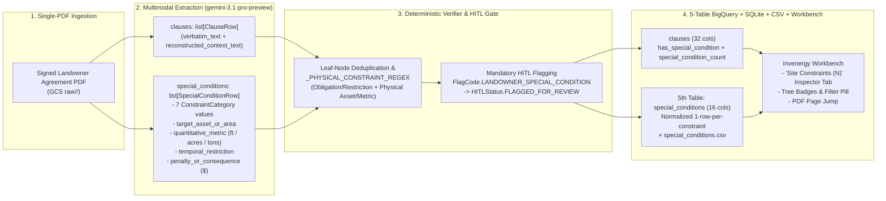

# Change Request CR-1: Landowner "Special Conditions" & Physical Site Constraint Extraction (R1)

* **CR ID:** `CR-001` (Requirement `R1` from Oct 1, 2026 Invenergy–Google Sync)
* **Status:** Reviewed & Fortified via `/egm-review` (Goldfish Comprehension, Critic & Readiness Passed) — Ready for `/design-implement`
* **Parent Architecture:** [DESIGN_DOC.md](file:///usr/local/google/home/prasannaankem/Code/Invenergy/Design/DESIGN_DOC.md)
* **Confirmed Design Decisions:**
  1. **Single-PDF Extraction Mode (Option 1A):** Extract all actionable physical/operational site constraints and explicit landowner riders directly from each ingested contract PDF without requiring an external baseline template diff.
  2. **5th Normalized Table (`special_conditions` — Option 2A):** Introduce a dedicated 5th normalized table (`special_conditions` + `special_conditions_latest` view in BigQuery, `special_conditions` in local SQLite, and `special_conditions.csv` in Cloud Storage / local exports) with a many-to-one foreign key to `ClauseRow.node_id` and `DocumentRegistryRow.document_id`, paired with summary roll-up fields on `clauses` (`has_special_condition`, `special_condition_count`) and `documents` (`special_conditions_count`).
  3. **Operational & Physical Site Constraint Taxonomy (Option 3):** Keep `FlagCode.SCOPE_CARVEOUT_DETECTED` strictly for legal/structural scope exceptions (such as indemnification or liability carve-outs) and classify physical/operational landowner rules under a dedicated 7-category operational taxonomy (`ConstraintCategory`).
  4. **Mandatory HITL Review Routing (Option 4 — Initial Rollout Policy):** Every clause containing one or more detected Landowner Special Conditions automatically receives `FlagCode.LANDOWNER_SPECIAL_CONDITION` in `hitl_flag_reasons` and routes to `HITLStatus.FLAGGED_FOR_REVIEW` so land administration or construction compliance staff sign off before field deployment (configurable to threshold-based auto-verification in later phases).

---

## Section 1: The Problem (Plain-English Business Context)

Invenergy develops and operates roughly 300 renewable energy projects (wind, solar, transmission, and storage), with an average of ~50 private landowner agreements per project (~15,000 executed contracts across the portfolio). While each project begins from a regional legal template (such as a Georgia solar or wind easement template), individual landowners routinely negotiate bespoke **"Special Conditions"** before signing.

These Special Conditions govern physical and operational behavior on the landowner's property during construction and multi-decade operations:
* **Tree & Vegetation Protection:** Prohibiting clearing of specific heritage trees, pecan orchards, windbreaks, or timber stands (e.g., *"Grantee shall not trim or remove the oak tree located 200 feet north of the main barn"*).
* **Structure, Barn, Well & Homestead Setbacks:** Enforcing custom no-disturbance buffers around barns, livestock sheds, water wells, septic fields, or residences.
* **Access Road, Gate & Crossing Protocols:** Requiring specific gates to be kept padlocked at all times, restricting heavy crane crossings over specific culverts, or mandating 48-hour advance notice before entering a parcel.
* **Livestock, Grazing & Agricultural Protections:** Protecting cattle grazing operations, drainage tiles, or center-pivot irrigation equipment.
* **Seasonal, Hunting & Noise Blackout Windows:** Prohibiting grading, trenching, or blasting during deer-hunting season, planting/harvest windows, or night hours.
* **Liquidated Damages & Financial Penalties:** Attaching explicit dollar penalties for violating a landowner restriction—which can reach **$100,000+ per incident**.

### Why the Current 4-Table Schema Is Insufficient
1. **Legal Carve-Outs vs. Field Constraints Are Conflated:** The existing parser in [gemini_parser.py](file:///usr/local/google/home/prasannaankem/Code/Invenergy/contract_parser/gemini_parser.py#L234-L237) flags `SCOPE_CARVEOUT_DETECTED` using legal exception phrases (*"except to the extent"*, *"notwithstanding the foregoing"*, *"provided, however"*). Most legal carve-outs are corporate liability or indemnification boilerplate—not physical site rules for construction crews. Conversely, physical landowner restrictions are frequently written as affirmative duties (*"Developer shall maintain a 150-foot buffer..."*) that do not trigger legal exception regexes.
2. **One Clause Often Bundles Multiple Physical Constraints:** A single "Special Conditions" paragraph (`BODY.12` or `EXHIBIT_C`) often contains three or four distinct physical restrictions (a 150-ft barn setback, a locked-gate rule, and a November hunting blackout). Storing only a boolean flag on the 30-column [ClauseRow](file:///usr/local/google/home/prasannaankem/Code/Invenergy/contract_parser/schemas.py#L87-L122) prevents construction and GIS teams from querying individual physical constraints by asset type, buffer distance, or seasonal window.

---

## Section 2: The Technical Plan

### Architecture Overview
CR-1 extends the existing Gemini-first pipeline across all four layers—Structured Extraction, Deterministic Guardrail Verification, Append-Only Storage (5th Normalized Table), and the Invenergy Split-Screen HITL Workbench—without adding external OCR or extra LLM round-trips.

### Key Technical Components

#### 1. Operational & Physical Site Constraint Taxonomy (`ConstraintCategory`)
To keep `FlagCode.SCOPE_CARVEOUT_DETECTED` strictly focused on legal/contractual scope exceptions, CR-1 introduces a dedicated `ConstraintCategory(StrEnum)` in [schemas.py](file:///usr/local/google/home/prasannaankem/Code/Invenergy/contract_parser/schemas.py):
* `TREE_VEGETATION_PROTECTION` — Protection of specific trees, groves, orchards, windbreaks, or timber.
* `STRUCTURE_BARN_WELL_SETBACK` — Setbacks or no-build buffers around barns, sheds, water wells, residences, fences, or septic systems.
* `ACCESS_ROAD_GATE_PROTOCOL` — Gate locking mandates, designated access roads, culvert weight limits, speed limits, or advance entry notice.
* `LIVESTOCK_AGRICULTURE` — Cattle/livestock protection, grazing continuity, drainage tile repair, or crop/irrigation rules.
* `TIMING_NOISE_HUNTING_BLACKOUT` — Seasonal construction blackouts (hunting seasons, harvest windows), daily work-hour limits, or noise/blasting curfews.
* `FINANCIAL_PENALTY_LIQUIDATED_DAMAGES` — Explicit dollar penalties, liquidated damages, or restoration fees tied to physical site violations.
* `OTHER_CUSTOM_RIDER` — Bespoke landowner obligations or addenda not covered by the six primary categories.

#### 2. 5th Normalized Table: `special_conditions` (`SpecialConditionRow`)
Each individual physical or operational constraint extracted from a clause is normalized into its own row in the new `special_conditions` table (`16 columns`), linked back to the parent clause via `(document_id, node_id)`:

| Column Name | Pydantic / BQ Type | Mode | Description |
| :--- | :--- | :--- | :--- |
| `condition_id` | `str` / `STRING` | `REQUIRED` | Deterministic ID (`sc_<node_id>_<1_based_index>`, e.g., `sc_BODY.12.a_1`) |
| `document_id` | `str` / `STRING` | `REQUIRED` | Parent contract SHA-256 document ID (`doc_<sha256[:16]>`) |
| `node_id` | `str` / `STRING` | `REQUIRED` | Source `ClauseRow.node_id` (most specific leaf node where constraint appears) |
| `canonical_path` | `str` / `STRING` | `REQUIRED` | Lossless dot-delimited clause path from `ClauseRow.canonical_path` |
| `constraint_category` | `ConstraintCategory` / `STRING` | `REQUIRED` | One of the 7 `ConstraintCategory` enum values |
| `target_asset_or_area` | `str` / `STRING` | `REQUIRED` | Physical feature, structure, or parcel zone (e.g., `"Northern Red Barn"`, `"Gate #3"`) |
| `quantitative_metric` | `str \| None` / `STRING` | `NULLABLE` | Extracted buffer distance, weight limit, or measurement (e.g., `"150 feet"`, `"20 tons"`) |
| `temporal_restriction` | `str \| None` / `STRING` | `NULLABLE` | Extracted date window, notice period, or hours (e.g., `"Nov 15 - Dec 15"`, `"48 hours notice"`) |
| `penalty_or_consequence` | `str \| None` / `STRING` | `NULLABLE` | Explicit financial penalty or remedy if violated (e.g., `"$100,000 liquidated damages"`) |
| `actionable_obligation_summary` | `str` / `STRING` | `REQUIRED` | Plain-English instruction for field/construction crews |
| `verbatim_excerpt` | `str` / `STRING` | `REQUIRED` | Exact substring from the contract establishing the constraint |
| `page_number` | `int` / `INT64` | `REQUIRED` | 1-indexed physical PDF page number (`ge=1`) for instant `pdf.js` jump |
| `extraction_confidence` | `float` / `FLOAT64` | `REQUIRED` | Model confidence score (`[0.0, 1.0]`, default `0.95` for LLM, `0.75` for regex fallback) |
| `hitl_status` | `HITLStatus` / `STRING` | `REQUIRED` | Defaults to `HITLStatus.FLAGGED_FOR_REVIEW` per Decision #4 (`APPROVED_BY_HUMAN` after sign-off) |
| `updated_at` | `str` / `TIMESTAMP` | `REQUIRED` | Append-only UTC timestamp (`QUALIFY ROW_NUMBER() OVER (PARTITION BY document_id, condition_id ORDER BY updated_at DESC) = 1`) |
| `reviewed_by` | `str \| None` / `STRING` | `NULLABLE` | Reviewer identifier once verified in the HITL Workbench |

**Top-Level Schema Placement (Avoiding Nested List Serialization Bugs):**
* Because [GeminiContractExtraction](file:///usr/local/google/home/prasannaankem/Code/Invenergy/contract_parser/schemas.py#L186-L210) uses `clauses: list[ClauseRow]` directly and `CLAUSE_CSV_COLUMNS = list(ClauseRow.model_fields.keys())`, `special_conditions: list[SpecialConditionRow]` is placed as a **top-level list** on both `GeminiContractExtraction` and `ParsedContractBundle` (mirroring `defined_terms` and `exhibits_catalog`).
* [ClauseRow](file:///usr/local/google/home/prasannaankem/Code/Invenergy/contract_parser/schemas.py#L87-L122) receives two scalar roll-up fields (`32 columns` total) so spreadsheet analysts viewing `clauses.csv` can immediately filter clauses with site constraints:
  * `has_special_condition: bool = Field(default=False, description="True if one or more Landowner Special Conditions are attached to this node_id")`
  * `special_condition_count: int = Field(default=0, description="Number of normalized SpecialConditionRow items attached to this node_id")`
* [DocumentRegistryRow](file:///usr/local/google/home/prasannaankem/Code/Invenergy/contract_parser/schemas.py#L156-L173) receives one scalar roll-up field (`13 columns` total):
  * `special_conditions_count: int = Field(default=0, description="Total number of normalized Landowner Special Conditions extracted across the document")`

#### 3. Deterministic Guardrail, Leaf-Node Deduplication & Mandatory HITL Routing
In [gemini_parser.py](file:///usr/local/google/home/prasannaankem/Code/Invenergy/contract_parser/gemini_parser.py):
1. **LLM Extraction (`SYSTEM_PROMPT` Rule 6):** Gemini extracts zero, one, or multiple `SpecialConditionRow` items into `GeminiContractExtraction.special_conditions` during the single multimodal pass, always linking each constraint to the **most specific leaf `node_id`** where the restriction appears.
2. **Sandwich-Clause Leaf Deduplication:** In [normalize_and_enrich_extraction](file:///usr/local/google/home/prasannaankem/Code/Invenergy/contract_parser/gemini_parser.py#L240-L480), parent container clauses (e.g., `BODY.12`) hold the full paragraph in `verbatim_text` while child nodes (`BODY.12.a`, `BODY.12.b`) hold each sub-clause's atomic text. To prevent double-counting:
   * Identify the set of parent container IDs (`parent_node_ids = {c.parent_node_id for c in extraction.clauses if c.parent_node_id}`).
   * If Gemini attaches a duplicate condition to both a parent container `P` and its child `C` (matching the same `constraint_category` and overlapping `verbatim_excerpt` / `target_asset_or_area`), retain only the child leaf condition on `C`.
3. **Deterministic Fallback (`_PHYSICAL_CONSTRAINT_REGEX`):**
   * To avoid false positives on surveyor metes-and-bounds bearings in `Exhibit A` (e.g., *"thence 200 feet along the old fence line"*), the deterministic fallback requires **two co-occurring signals** on a leaf clause (or an explicit `LESS_AND_EXCEPT` property carve-out node with physical structure/acreage exclusions) when Gemini returned zero special conditions for that clause (and its children):
     * **Signal 1 (Operational Restriction / Duty / Penalty):** `\b(?:shall\s+not|must\s+not|may\s+not|will\s+not|prohibit(?:ed|s)?|restrict(?:ed|ion)?|setback|buffer|no[-\s]?build|no[-\s]?disturbance|no\s+closer\s+than|minimum\s+distance|keep\s+.*?\s*locked|padlock(?:ed)?|advance\s+notice|prior\s+(?:written\s+)?notice|blackout|curfew|hunting\s+season|liquidated\s+damages|penalty\s+of)\b`
     * **Signal 2 (Physical Site Asset, Distance/Weight Metric, or Dollar Penalty):** `\b(?:\d+(?:,\d{3})*\s*(?:feet|ft\.?|yards|meters|acres|tons|hours|days)|tree|trees|grove|orchard|timber|windbreak|barn|shed|well|wells|residence|homestead|septic|gate|gates|culvert|cattle|livestock|grazing|drainage\s+tile|irrigation|hunting|harvest|blasting|trenching|\$\s*\d+(?:,\d{3})+)\b`
   * When both signals match on a leaf clause with zero LLM-extracted conditions, [normalize_and_enrich_extraction](file:///usr/local/google/home/prasannaankem/Code/Invenergy/contract_parser/gemini_parser.py#L240-L480) synthesizes a fallback `SpecialConditionRow` (`constraint_category` inferred by keyword or `ConstraintCategory.OTHER_CUSTOM_RIDER`, `extraction_confidence=0.75`, `hitl_status=HITLStatus.FLAGGED_FOR_REVIEW`).
4. **Mandatory HITL Gate (Decision #4):** After normalizing all `SpecialConditionRow` items and re-indexing `condition_id = f"sc_{sc.node_id}_{idx}"`, every clause with `special_condition_count > 0` automatically gets `FlagCode.LANDOWNER_SPECIAL_CONDITION.value` added to `hitl_flag_reasons` and `clause.hitl_status = HITLStatus.FLAGGED_FOR_REVIEW` (unless already `APPROVED_BY_HUMAN` or `PLACEHOLDER_FOR_REVIEW`).

#### 4. Idempotent SQLite & BigQuery Schema Evolution
Because `pr-tftest.contract_intelligence` in BigQuery and `./data/contract_intelligence.db` in SQLite already contain existing 12-column `documents` and 30-column `clauses` tables:
1. **SQLite Migration (`_ensure_local_dirs_and_db`):**
   * Create the `special_conditions` table (`CREATE TABLE IF NOT EXISTS special_conditions (...)`).
   * Inspect `PRAGMA table_info(documents)` and `PRAGMA table_info(clauses)` and execute `ALTER TABLE documents ADD COLUMN special_conditions_count INTEGER NOT NULL DEFAULT 0`, `ALTER TABLE clauses ADD COLUMN has_special_condition INTEGER NOT NULL DEFAULT 0`, and `ALTER TABLE clauses ADD COLUMN special_condition_count INTEGER NOT NULL DEFAULT 0` if missing.
2. **BigQuery Schema Evolution (`ensure_bq_tables`):**
   * Declare `special_conditions_count` in `BQ_DOCUMENTS_SCHEMA` and `has_special_condition`, `special_condition_count` in `BQ_CLAUSES_SCHEMA` with `mode="NULLABLE"` (BigQuery requires new columns added to existing tables to be `NULLABLE`).
   * After `create_table(table, exists_ok=True)`, fetch the live table via `bq_client.get_table(table_id)`; if any schema fields in `schema` are missing on the live table, append them to `live_table.schema` and call `bq_client.update_table(live_table, ["schema"])`.
   * Use `CREATE OR REPLACE VIEW` SQL (or update `view.view_query` via `update_table`) so `documents_latest`, `clauses_latest`, and the new `special_conditions_latest` view expose all current columns.
   * In `list_documents` and `get_bundle_from_bigquery`, coalesce `None` values from pre-CR-1 rows (`has_special_condition -> False`, `special_condition_count -> 0`, `special_conditions_count -> 0`).

---

## Section 3: Alternatives Considered & Ruled Out

| Dimension | Chosen Design | Alternative Ruled Out | Why It Was Ruled Out |
| :--- | :--- | :--- | :--- |
| **1. Detection Mode** | **Option 1A: Single-PDF Operational & Physical Constraint Extraction** | **Option 1B: Mandatory Regional Template Upload & Diffing** | Requiring users to locate and upload the exact historical regional Word/PDF template before parsing a landowner agreement blocks self-service ingestion and fails when templates evolved over years. Extracting all actionable physical/operational constraints directly from the signed PDF delivers immediate value for field crews. |
| **2. Data Model** | **Option 2A: 5th Normalized Table (`special_conditions`) + Roll-Up Badges on `clauses` & `documents`** | **Option 2B: Flat Columns Only on `clauses` (4-Table Limit)** | A single "Special Conditions" paragraph often contains 3+ distinct constraints (e.g., tree buffer + gate protocol + hunting season blackout). Flat columns on `clauses` either concatenate multiple constraints into unqueryable text blobs or lose structured per-constraint metrics (`quantitative_metric`, `target_asset_or_area`). |
| **3. Exception Taxonomy** | **Option 3: Separate `ConstraintCategory` from `SCOPE_CARVEOUT_DETECTED`** | **Re-using `SCOPE_CARVEOUT_DETECTED` for Landowner Constraints** | Legal liability carve-outs (*"except for gross negligence"*) occur in almost every contract section. Mixing legal carve-outs with physical site rules floods construction compliance views with legal boilerplate noise. |
| **4. HITL Policy** | **Option 4: Auto-Flag All Special Conditions (`FLAGGED_FOR_REVIEW`)** | **Auto-Verifying High-Confidence ($\ge 0.85$) Special Conditions** | Because a single missed or misread landowner condition (e.g., `15 ft` vs `150 ft`) carries $100,000+ penalty risk, initial production rollout requires human sign-off on all detected special conditions. |
| **5. Schema Nesting** | **Top-Level `special_conditions: list[SpecialConditionRow]` on `GeminiContractExtraction` & `ParsedContractBundle`** | **Nesting `special_conditions` Inside `ClauseRow`** | `CLAUSE_CSV_COLUMNS` is derived directly from `ClauseRow.model_fields.keys()`. Nesting a list of objects inside `ClauseRow` breaks SQLite parameter binding and pollutes `clauses.csv`. Top-level placement matches `defined_terms` and `exhibits_catalog`. |

---

## Section 4: Detailed File-by-File Implementation Plan

Every file in `/usr/local/google/home/prasannaankem/Code/Invenergy` that will be modified for CR-1 is enumerated below with its exact symbols and rationale:

### 1. [contract_parser/schemas.py](file:///usr/local/google/home/prasannaankem/Code/Invenergy/contract_parser/schemas.py) `[MODIFY]`
* **Changes:**
  * Add `LANDOWNER_SPECIAL_CONDITION = "LANDOWNER_SPECIAL_CONDITION"` to [FlagCode](file:///usr/local/google/home/prasannaankem/Code/Invenergy/contract_parser/schemas.py#L67-L76).
  * Add `ConstraintCategory(StrEnum)` with the 7 operational/physical constraint categories (`TREE_VEGETATION_PROTECTION`, `STRUCTURE_BARN_WELL_SETBACK`, `ACCESS_ROAD_GATE_PROTOCOL`, `LIVESTOCK_AGRICULTURE`, `TIMING_NOISE_HUNTING_BLACKOUT`, `FINANCIAL_PENALTY_LIQUIDATED_DAMAGES`, `OTHER_CUSTOM_RIDER`).
  * Add `SpecialConditionRow(BaseModel)` with the 16 columns defined in Section 2.2 (`condition_id`, `document_id`, `node_id`, `canonical_path`, `constraint_category`, `target_asset_or_area`, `quantitative_metric`, `temporal_restriction`, `penalty_or_consequence`, `actionable_obligation_summary`, `verbatim_excerpt`, `page_number`, `extraction_confidence`, `hitl_status`, `updated_at`, `reviewed_by`).
  * Add `has_special_condition: bool = Field(default=False, ...)` and `special_condition_count: int = Field(default=0, ...)` to [ClauseRow](file:///usr/local/google/home/prasannaankem/Code/Invenergy/contract_parser/schemas.py#L87-L122).
  * Add `special_conditions_count: int = Field(default=0, ...)` to [DocumentRegistryRow](file:///usr/local/google/home/prasannaankem/Code/Invenergy/contract_parser/schemas.py#L156-L173).
  * Add `special_conditions: list[SpecialConditionRow] = Field(default_factory=list, ...)` to both [GeminiContractExtraction](file:///usr/local/google/home/prasannaankem/Code/Invenergy/contract_parser/schemas.py#L186-L210) and [ParsedContractBundle](file:///usr/local/google/home/prasannaankem/Code/Invenergy/contract_parser/schemas.py#L212-L219).
  * Export `SPECIAL_CONDITION_CSV_COLUMNS: list[str] = list(SpecialConditionRow.model_fields.keys())`.
* **Rationale:** Enforces strict type safety and flat table/CSV column alignment across Gemini Structured Outputs, SQLite, BigQuery, CSV exports, and FastAPI responses.

### 2. [contract_parser/gemini_parser.py](file:///usr/local/google/home/prasannaankem/Code/Invenergy/contract_parser/gemini_parser.py) `[MODIFY]`
* **Changes:**
  * Update `SYSTEM_PROMPT` ([gemini_parser.py:L31-L78](file:///usr/local/google/home/prasannaankem/Code/Invenergy/contract_parser/gemini_parser.py#L31-L78)) with Rule 6 instructing Gemini to extract all physical/operational landowner special conditions into `special_conditions`, decompose multi-constraint clauses into separate `SpecialConditionRow` items attached to the most specific leaf `node_id`, and strictly separate physical/operational site rules from legal liability carve-outs (`SCOPE_CARVEOUT_DETECTED`).
  * Add `_PHYSICAL_CONSTRAINT_RESTRICTION_PATTERN` and `_PHYSICAL_CONSTRAINT_ASSET_OR_METRIC_PATTERN` (plus category inference helper `_infer_constraint_category`) in [gemini_parser.py](file:///usr/local/google/home/prasannaankem/Code/Invenergy/contract_parser/gemini_parser.py).
  * Extend [normalize_and_enrich_extraction](file:///usr/local/google/home/prasannaankem/Code/Invenergy/contract_parser/gemini_parser.py#L240-L480) to:
    1. Normalize LLM-extracted `extraction.special_conditions` (`document_id`, `canonical_path` from `clauses_by_id`, `page_number` clamped to `>= 1`, `extraction_confidence` clamped to `[0.0, 1.0]`, `updated_at = now_iso`), deduplicating parent-vs-child sandwich duplicates onto the leaf `node_id`.
    2. Run the two-signal deterministic fallback regex on leaf clauses (excluding pure `Exhibit A` metes-and-bounds survey bearings unless restricted by obligation/prohibition terms) to synthesize fallback `SpecialConditionRow` entries when missed by the LLM.
    3. Assign deterministic IDs (`condition_id = f"sc_{clause.node_id}_{idx}"`), set `clause.has_special_condition = True` and `clause.special_condition_count = len(node_conditions)`, and append `FlagCode.LANDOWNER_SPECIAL_CONDITION.value` to `clause.hitl_flag_reasons` so `clause.hitl_status` transitions to `HITLStatus.FLAGGED_FOR_REVIEW`.
* **Rationale:** Combines Gemini's multimodal extraction with leaf-node deduplication, surveyor-bearing false-positive protection, and mandatory HITL flagging.

### 3. [contract_parser/storage.py](file:///usr/local/google/home/prasannaankem/Code/Invenergy/contract_parser/storage.py) `[MODIFY]`
* **Changes:**
  * Add `BQ_SPECIAL_CONDITIONS_SCHEMA` (16 columns) and add `NULLABLE` fields `special_conditions_count` to `BQ_DOCUMENTS_SCHEMA` and `has_special_condition`, `special_condition_count` to `BQ_CLAUSES_SCHEMA`.
  * Update `_ensure_local_dirs_and_db` ([storage.py:L141-L233](file:///usr/local/google/home/prasannaankem/Code/Invenergy/contract_parser/storage.py#L141-L233)) to create the `special_conditions` SQLite table and run idempotent `ALTER TABLE` column additions on existing `documents` and `clauses` tables.
  * Update `ensure_bq_tables` ([storage.py:L234-L269](file:///usr/local/google/home/prasannaankem/Code/Invenergy/contract_parser/storage.py#L234-L269)) to register `"special_conditions": (BQ_SPECIAL_CONDITIONS_SCHEMA, "document_id, condition_id")`, patch missing columns onto existing BigQuery tables via `bq_client.update_table`, and refresh the `*_latest` views.
  * Add `append_special_conditions(self, conditions: list[SpecialConditionRow]) -> None` and call it inside `persist_bundle`.
  * Update `export_csvs`, `get_csv_bytes`, `_get_bundle_from_sqlite`, `get_bundle_from_bigquery`, and `load_bundle_from_csv` to include `special_conditions` / `special_conditions.csv` (with backward-compatible defaults if loading a legacy 3-CSV directory or pre-CR-1 BigQuery rows).
  * Update `review_clause` ([storage.py:L634-L714](file:///usr/local/google/home/prasannaankem/Code/Invenergy/contract_parser/storage.py#L634-L714)) so approving or updating a clause (`node_id`) also appends updated `SpecialConditionRow` versions for that `node_id` (`hitl_status=review.hitl_status`, `reviewed_by=review.reviewed_by`, `updated_at=now_iso`) and re-exports `special_conditions.csv`.
* **Rationale:** Persists the 5th normalized table across SQLite, BigQuery, and GCS CSV exports with zero downtime on existing datasets.

### 4. [contract_parser/app.py](file:///usr/local/google/home/prasannaankem/Code/Invenergy/contract_parser/app.py) `[MODIFY]`
* **Changes:**
  * Populate `special_conditions_count=len(extraction.special_conditions)` on `completed_doc` and pass `special_conditions=extraction.special_conditions` into `ParsedContractBundle` inside `ingest_pdf_bytes` ([app.py:L94-L115](file:///usr/local/google/home/prasannaankem/Code/Invenergy/contract_parser/app.py#L94-L115)).
  * In `PATCH /api/v1/documents/{document_id}/clauses/{node_id}` ([app.py:L293-L307](file:///usr/local/google/home/prasannaankem/Code/Invenergy/contract_parser/app.py#L293-L307)), include the updated document-level `"special_conditions"` list in the JSON response alongside `"clause"` and `"document"` so the Workbench UI updates the Site Constraints tab live.
  * Update `cli_main` ([app.py:L367-L389](file:///usr/local/google/home/prasannaankem/Code/Invenergy/contract_parser/app.py#L367-L389)) to include `"special_conditions.csv"` in `exported` and `"special_conditions_count": len(bundle.special_conditions)` in the CLI summary output.
* **Rationale:** Exposes the 5th normalized table across REST endpoints, live HITL review responses, and CLI batch exports.

### 5. [contract_parser/static/index.html](file:///usr/local/google/home/prasannaankem/Code/Invenergy/contract_parser/static/index.html) `[MODIFY]`
* **Changes:**
  * Add a **"Site Constraints (N)"** KPI pill in the top bar and a **"Site Constraints"** filter button in the left-hand Clause Hierarchy Tree.
  * Render an Invenergy Solar Yellow (`#FFCF0B`) / Emerald (`#118751`) badge (`⚡ N Constraint(s)`) on clause tree nodes where `has_special_condition === true`.
  * Add a dedicated **"Site Constraints (N)"** tab in the right-hand Inspector drawer displaying each `SpecialConditionRow` card (category badge, target asset, quantitative metric, temporal window, financial penalty callout, verbatim excerpt, HITL status badge, and one-click jump to `page_number` in `pdf.js` + selecting the source `node_id`), plus a direct download button for `special_conditions.csv`.
* **Rationale:** Gives land administration and construction compliance teams an immediate operational view of all physical site restrictions with 1-click PDF page verification.

### 6. [tests/test_pipeline.py](file:///usr/local/google/home/prasannaankem/Code/Invenergy/tests/test_pipeline.py) `[MODIFY]`
* **Changes:**
  * Add comprehensive unit and integration tests covering:
    1. **Multi-Constraint Decomposition & Leaf Deduplication:** 1 clause with 3 physical constraints (150-ft barn setback, locked Gate #3 protocol, Nov 15–Dec 15 deer-hunting blackout with $100,000 penalty) produces 3 normalized `SpecialConditionRow` records in `special_conditions`, sets `has_special_condition=True` and `special_condition_count=3`, and does not double-count on parent sandwich containers.
    2. **Legal Carve-Out Separation:** Standard legal indemnification carve-outs (`BODY.4`, `BODY.5`, `BODY.8` with `SCOPE_CARVEOUT_DETECTED`) and surveyor metes-and-bounds descriptions in `Exhibit A` do **not** trigger `LANDOWNER_SPECIAL_CONDITION`.
    3. **Deterministic Fallback (`_PHYSICAL_CONSTRAINT_REGEX`):** When a clause contains an unflagged physical restriction (*"Developer shall not clear or trim any pecan trees within 200 feet of the homestead well"*), `normalize_and_enrich_extraction` synthesizes a fallback `SpecialConditionRow` (`extraction_confidence=0.75`) and flags the clause `FLAGGED_FOR_REVIEW`.
    4. **Cascading HITL Approval & 5th CSV Export:** `PATCH /api/v1/documents/{document_id}/clauses/{node_id}` transitions both the parent `ClauseRow` and its child `SpecialConditionRow` items to `APPROVED_BY_HUMAN`, and `GET /api/v1/documents/{document_id}/export/special_conditions.csv` returns valid `utf-8-sig` CSV bytes reloadable via `load_bundle_from_csv`.
* **Rationale:** Verifies every CR-1 requirement and edge case deterministically.

### 7. [Changelog.md](file:///usr/local/google/home/prasannaankem/Code/Invenergy/Changelog.md) `[APPEND]`
* **Changes:** Append the `[0.2.0]` entry documenting CR-1 (`R1: Landowner "Special Conditions" & Physical Site Constraint Extraction`) upon implementation completion.
* **Rationale:** Preserves the append-only project changelog.
