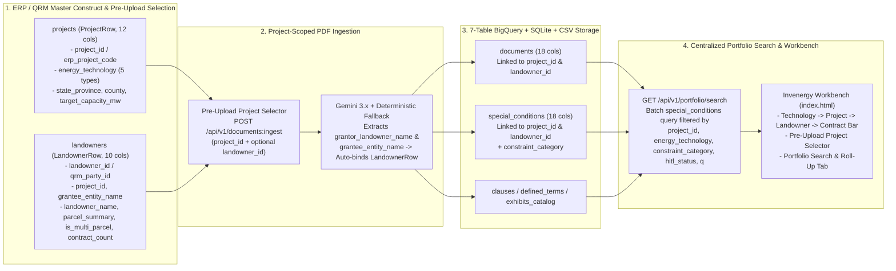

# Change Request CR-2: Project-Level & Multi-Contract Portfolio Hierarchy (300 Projects × ~50 Landowners)

* **CR ID:** `CR-002` (Requirement `R3` from Oct 1, 2026 Invenergy–Google Sync)
* **Status:** Reviewed & Fortified
* **Parent Architecture:** [DESIGN_DOC.md](file:///usr/local/google/home/prasannaankem/Code/Invenergy/Design/DESIGN_DOC.md), [CR1_LANDOWNER_SPECIAL_CONDITIONS.md](file:///usr/local/google/home/prasannaankem/Code/Invenergy/Design/CR1_LANDOWNER_SPECIAL_CONDITIONS.md)
* **Confirmed Design Decisions:**
  1. **Normalized Portfolio & Landowner Master Schema (`projects` + `landowners` — Option 1B, with Parcel Sub-Table Parked):** Expand the 5-table schema to a **7-table normalized schema** by adding `projects` (`ProjectRow`, synced/seeded from Oracle ERP) and `landowners` (`LandownerRow`, synced/looked up from Oracle QRM or bound during ingestion), alongside `documents`, `clauses`, `defined_terms`, `exhibits_catalog`, and `special_conditions`.
  2. **Pre-Upload Project Selection + ERP/QRM Lookup + Gemini Grantor Auto-Binding (Option 2A):** Introduce `Project` as a mandatory parent construct selected *before* uploading a PDF (with a pre-seeded ERP project catalog spanning Invenergy's 5 energy technologies: `ONSHORE_WIND`, `SOLAR`, `STORAGE`, `TRANSMISSION`, `GEOTHERMAL`). Users can optionally select an existing QRM landowner before upload, or let Gemini (plus a deterministic preamble party-extraction fallback) extract the Grantor/Landowner name (`grantor_landowner_name`) and Grantee SPV (`grantee_entity_name`) from the PDF and automatically match or register the `LandownerRow` under that `project_id`.
  3. **Multi-Parcel `Exhibit A` Sub-Modeling Parked for Future Phase (`CR-2b` — Option 3):** Keep `is_multi_parcel` and `contract_count` indicators on `LandownerRow` to support the 90% 1:1 vs. 10% 1:N landowner-to-contract cardinality (inferring `is_multi_parcel = True` when `contract_count > 1` or when multiple `EXHIBIT_A.PARCEL_*` nodes exist), while parking granular `Exhibit A` parcel/metes-and-bounds table extraction (`parcels`) for a dedicated future phase (`CR-2b`).
  4. **Centralized Project / Category Search & Portfolio Roll-Up UI (Option 4 — Confirmed):** Propagate `project_id` and `landowner_id` onto `DocumentRegistryRow` (`documents`) and `SpecialConditionRow` (`special_conditions`) to enable centralized and agentic search across `project_id`, `energy_technology`, `constraint_category`, `hitl_status`, and keyword queries (`GET /api/v1/portfolio/search`), paired with a **Project Portfolio Selector Bar** and **Project Roll-Up & Search View** in [index.html](file:///usr/local/google/home/prasannaankem/Code/Invenergy/contract_parser/static/index.html).

---

## Section 1: The Problem (Plain-English Business Context)

Invenergy develops, builds, and operates roughly **300 active energy projects** across five renewable technologies—**Onshore Wind**, **Solar**, **Storage**, **Transmission**, and **Geothermal**—with an average of **~50 private landowner agreements per project** (~15,000 executed contracts portfolio-wide).

### Why Single-Document Isolation Breaks at Portfolio Scale
1. **No Project Construct Before Upload:** In the baseline platform ([schemas.py](file:///usr/local/google/home/prasannaankem/Code/Invenergy/contract_parser/schemas.py)), every uploaded PDF is stored as an isolated `document_id`. A contract PDF rarely states Invenergy's internal Oracle ERP project code or technology classification (`ONSHORE_WIND` vs. `SOLAR`). Without selecting a `Project` construct prior to upload, extracted clauses and site constraints cannot be grouped into a 50-contract project stack.
2. **No ERP / QRM Master-Data Linkage:** Invenergy tracks project financials in **Oracle ERP** (`erp_project_code`) and landowner contact/relationship records in **QRM** (`qrm_party_id`). Roughly 90% of landowners have a 1-to-1 relationship with a single contract, while 10% span multiple contracts, addenda, or parcels within a project.
3. **No Centralized Cross-Project or Category-Level Search:** Once contracts are parsed, developers, construction managers, and AI agents (BigQuery Conversational Analytics / ADK agents) need to query across an entire **Project**, across an **Energy Technology**, or across a **`ConstraintCategory`** (for example: *"Show all `TREE_VEGETATION_PROTECTION` and `STRUCTURE_BARN_WELL_SETBACK` conditions across all 50 landowners in the Cedar Lantern Wind project"*).

---

## Section 2: The Technical Plan

### Architecture Overview

---

### Key Technical Components

#### 1. New & Extended Enums in [schemas.py](file:///usr/local/google/home/prasannaankem/Code/Invenergy/contract_parser/schemas.py)
* **`EnergyTechnology(StrEnum)`:**
  * `ONSHORE_WIND = "ONSHORE_WIND"`
  * `SOLAR = "SOLAR"`
  * `STORAGE = "STORAGE"`
  * `TRANSMISSION = "TRANSMISSION"`
  * `GEOTHERMAL = "GEOTHERMAL"`
* **`ConstraintCategory(StrEnum)` (Unified 17-Value Taxonomy across CR-1 & CR-2):**
  * Preserves the 7 CR-1 values (`TREE_VEGETATION_PROTECTION`, `STRUCTURE_BARN_WELL_SETBACK`, `ACCESS_ROAD_GATE_PROTOCOL`, `LIVESTOCK_AGRICULTURE`, `TIMING_NOISE_HUNTING_BLACKOUT`, `FINANCIAL_PENALTY_LIQUIDATED_DAMAGES`, `OTHER_CUSTOM_RIDER`) and adds 10 cross-technology CR-2 categories (`SETBACK_OR_BUFFER`, `CONSTRUCTION_OR_BLACKOUT_WINDOW`, `CROP_OR_TIMBER_COMPENSATION`, `NOISE_OR_SHADOW_FLICKER`, `DRAINAGE_OR_SOIL_RESTORATION`, `GATES_FENCING_OR_LIVESTOCK`, `ACCESS_ROAD_OR_PARCEL_RESTRICTION`, `BLASTING_OR_EXCAVATION`, `DECOMMISSIONING_OR_BOND`, `OTHER_SPECIAL_CONDITION`) with bidirectional alias resolution in `search_portfolio`.

#### 2. 6th Normalized Table: `projects` (`ProjectRow` — 12 Columns)
Represents the master Project construct synced from Oracle ERP or registered in the platform prior to contract upload:

| Column Name | Pydantic / BQ Type | Mode | Description |
| :--- | :--- | :--- | :--- |
| `project_id` | `str` / `STRING` | `REQUIRED` | Canonical project identifier (e.g., `prj_cedar_lantern_wind`) |
| `project_name` | `str` / `STRING` | `REQUIRED` | Human-readable project name (e.g., `Cedar Lantern Wind Energy Center`) |
| `energy_technology` | `EnergyTechnology` / `STRING` | `REQUIRED` | One of `ONSHORE_WIND`, `SOLAR`, `STORAGE`, `TRANSMISSION`, `GEOTHERMAL` |
| `erp_project_code` | `str` / `STRING` | `REQUIRED` | Downstream Oracle ERP project code (e.g., `ERP-WND-001`) |
| `state_province` | `str \| None` / `STRING` | `NULLABLE` | Primary state or province jurisdiction (e.g., `IL`, `OH`, `TX`, `KS`, `NV`) |
| `county` | `str \| None` / `STRING` | `NULLABLE` | Primary county jurisdiction (e.g., `McLean`, `Hardin`, `Pecos`) |
| `target_capacity_mw` | `float \| None` / `FLOAT64` | `NULLABLE` | Target nameplate capacity in megawatts (e.g., `250.0`) |
| `landowner_count` | `int` / `INT64` | `REQUIRED` | Total distinct landowners bound to this project (`default=0`) |
| `document_count` | `int` / `INT64` | `REQUIRED` | Total deduplicated contract PDFs in this project's stack (`default=0`) |
| `special_conditions_count` | `int` / `INT64` | `REQUIRED` | Total extracted `SpecialConditionRow` items across all contracts in this project (`default=0`) |
| `flagged_node_count` | `int` / `INT64` | `REQUIRED` | Total clauses awaiting HITL review across this project (`default=0`) |
| `updated_at` | `str` / `TIMESTAMP` | `REQUIRED` | ISO-8601 UTC timestamp (`QUALIFY ROW_NUMBER() OVER (PARTITION BY project_id ORDER BY updated_at DESC) = 1`) |

#### 3. 7th Normalized Table: `landowners` (`LandownerRow` — 10 Columns)
Represents the private Landowner (Grantor) construct synced from Oracle QRM or automatically matched/created when a contract is ingested into a Project:

| Column Name | Pydantic / BQ Type | Mode | Description |
| :--- | :--- | :--- | :--- |
| `landowner_id` | `str` / `STRING` | `REQUIRED` | Deterministic or QRM-backed ID (`lnd_<project_slug>_<name_slug>`) |
| `project_id` | `str` / `STRING` | `REQUIRED` | Parent `ProjectRow.project_id` |
| `landowner_name` | `str` / `STRING` | `REQUIRED` | Canonical Grantor / Landowner counterparty name (e.g., `Blue Meridian Transmission LLC`) |
| `qrm_party_id` | `str \| None` / `STRING` | `NULLABLE` | External Oracle QRM landowner key (e.g., `QRM-A1B2C3`) |
| `grantee_entity_name` | `str \| None` / `STRING` | `NULLABLE` | Project operating subsidiary / Grantee SPV (e.g., `Cedar Lantern Wind, LLC`) |
| `parcel_summary` | `str \| None` / `STRING` | `NULLABLE` | Summary of parcels or multi-contract stack across agreements |
| `is_multi_parcel` | `bool` / `BOOL` | `REQUIRED` | `False` for the 90% 1:1 case; `True` when `contract_count > 1` or when multiple `EXHIBIT_A.PARCEL_*` nodes exist |
| `contract_count` | `int` / `INT64` | `REQUIRED` | Number of deduplicated contracts linked to this landowner in this project (`default=1`) |
| `special_conditions_count` | `int` / `INT64` | `REQUIRED` | Total `SpecialConditionRow` constraints across this landowner's contracts (`default=0`) |
| `updated_at` | `str` / `TIMESTAMP` | `REQUIRED` | ISO-8601 UTC timestamp (`QUALIFY ROW_NUMBER() OVER (PARTITION BY project_id, landowner_id ORDER BY updated_at DESC) = 1`) |

#### 4. Foreign Key Extensions on Existing Tables
To make centralized project-level and category-level search fast (single-table batch query in BigQuery and SQLite):
* **`DocumentRegistryRow` (`documents` — extended from 13 to 18 columns):**
  * `project_id: str = Field(default="prj_cedar_lantern_wind", description="Parent ProjectRow.project_id")`
  * `landowner_id: str = Field(default="lnd_unassigned", description="Parent LandownerRow.landowner_id")`
  * `energy_technology: EnergyTechnology = Field(default=EnergyTechnology.ONSHORE_WIND, description="Project energy technology classification")`
  * `grantor_landowner_name: str | None = Field(default=None, description="Grantor / Landowner counterparty name extracted from the contract")`
  * `grantee_entity_name: str | None = Field(default=None, description="Grantee / Developer SPV entity name extracted from the contract")`
* **`SpecialConditionRow` (`special_conditions` — extended from 16 to 18 columns):**
  * `project_id: str = Field(default="prj_cedar_lantern_wind", description="Parent ProjectRow.project_id for centralized project-level constraint search")`
  * `landowner_id: str = Field(default="lnd_unassigned", description="Parent LandownerRow.landowner_id for landowner-level constraint roll-up")`
* **`GeminiContractExtraction`:**
  * Adds optional top-level extraction fields `grantor_landowner_name: str | None = Field(default=None, ...)` and `grantee_entity_name: str | None = Field(default=None, ...)`.

#### 5. Deterministic Party Fallback, Canonical Entity Resolution, Batch Search & Idempotent Roll-Ups
1. **Deterministic Counterparty Extraction Fallback (`_extract_parties_fallback` & `canonical_party_key` in [gemini_parser.py](file:///usr/local/google/home/prasannaankem/Code/Invenergy/contract_parser/gemini_parser.py)):**
   * In `SYSTEM_PROMPT` (Rule 7), Gemini is instructed to extract `grantor_landowner_name` (the Landowner / Grantor / Property Owner) and `grantee_entity_name` (the Developer SPV / Grantee) from the contract's `PREAMBLE`, `RECITALS`, or `SIGNATURES`.
   * If `extraction.grantor_landowner_name` or `extraction.grantee_entity_name` is `None`, `normalize_and_enrich_extraction` inspects `contracting_parties_json` and scans `PREAMBLE` / `RECITALS` / `BODY` clauses using deterministic regexes (`by and between <Party A> ... and <Party B>`) so counterparty names are populated without extra LLM calls.
   * `canonical_party_key(name)` normalizes corporate entity designators (`LLC`, `Inc.`, `LP`, `LLP`, `Corp.`, `Co.`, `Ltd.`) so that slight suffix variations across a landowner's primary lease and subsequent amendments/easements resolve to the same `LandownerRow` within a project.
2. **Idempotent Roll-Up Recalculation (`recalculate_project_rollups` in [storage.py](file:///usr/local/google/home/prasannaankem/Code/Invenergy/contract_parser/storage.py)):**
   * Rather than naively incrementing counters (`document_count += 1`), which would double-count when a PDF is re-ingested or when `review_clause` appends a new version of `DocumentRegistryRow`, `recalculate_project_rollups(project_id)` queries the **deduplicated latest** documents for `project_id` and computes:
     * `document_count = len(project_docs)`
     * `landowner_count = sum(1 for l in updated_landowners if l.contract_count > 0)`
     * `special_conditions_count = sum(d.special_conditions_count for d in project_docs)`
     * `flagged_node_count = sum(d.flagged_node_count for d in project_docs)`
   * For each `LandownerRow` in the project, `contract_count`, `special_conditions_count`, `is_multi_parcel` (`contract_count > 1` or $\ge 2$ `EXHIBIT_A.PARCEL_*` clauses), and `parcel_summary` (updating `"Single Parcel / Standard Agreement"` to `f"Multi-Contract Stack ({contract_count} Agreements)"` when `contract_count > 1`) are recomputed deterministically and appended only when changed.
3. **Batch Deduplicated Portfolio Search (`_list_special_conditions_for_documents` in [storage.py](file:///usr/local/google/home/prasannaankem/Code/Invenergy/contract_parser/storage.py)):**
   * Rather than calling `get_bundle(doc.document_id)` in an $O(N)$ loop across documents (which would trigger 5 queries per document in BigQuery), `search_portfolio` loads deduplicated `SpecialConditionRow` records across all matching documents in a **single batch query** (`ROW_NUMBER() OVER (PARTITION BY document_id, condition_id ORDER BY updated_at DESC) = 1`) and applies bidirectional CR-1 $\leftrightarrow$ CR-2 `ConstraintCategory` alias resolution.
4. **Legacy `NULL` Coalescing in SQLite & BigQuery:**
   * Pre-CR-2 rows in `pr-tftest.contract_intelligence.documents` and `special_conditions` have `NULL` for the new columns after `ALTER TABLE` / BigQuery schema patching.
   * `_coalesce_doc_field` and `_coalesce_sc_field` coalesce `project_id` to `"prj_cedar_lantern_wind"`, `landowner_id` to `"lnd_unassigned"` (before `ensure_portfolio_seed()` auto-binds unassigned documents), and `energy_technology` to `EnergyTechnology.ONSHORE_WIND`.

---

## Section 3: Alternatives Considered & Parked Scope (`CR-2b`)

| Dimension | Chosen Design | Alternative Ruled Out / Parked | Rationale |
| :--- | :--- | :--- | :--- |
| **1. Portfolio Normalization** | **Option 1B: 7-Table Schema (`projects` + `landowners` + 5 Contract Tables)** | **Single Denormalized `project_id` String on `documents` Only** | Without a first-class `projects` table, users cannot select an ERP project *before* uploading its first PDF, nor can the platform store `erp_project_code`, `energy_technology`, `state_province`, and `target_capacity_mw` for empty or in-progress projects. |
| **2. Upload Workflow** | **Option 2A: Pre-Upload Project Selector + ERP/QRM Seed + Gemini Grantor Binding** | **Post-Upload Manual Tagging Only** | Selecting the Project prior to upload matches how developers work (uploading a stack of PDFs for a specific project) while Gemini automatically extracts the Grantor/Landowner name from each PDF. |
| **3. Multi-Parcel Sub-Modeling** | **Option 3: `is_multi_parcel`, `parcel_summary` & `contract_count` on `LandownerRow`; Park `parcels` Table for `CR-2b`** | **Full 8th `parcels` Metes-and-Bounds Table in `CR-2`** | Keeps `CR-2` focused on the Portfolio $\rightarrow$ Project $\rightarrow$ Landowner $\rightarrow$ Contract hierarchy and centralized search; granular parcel/APN extraction is cleanly parked for `CR-2b`. |
| **4. Portfolio Search** | **Option 4: Propagate `project_id` & `landowner_id` to `documents` and `special_conditions` + Batch Query in `GET /api/v1/portfolio/search`** | **$O(N)$ Per-Document Bundle Hydration or 4-Way Joins** | Querying deduplicated `special_conditions` in a single batch query avoids N+1 BigQuery round-trips across 15,000 contracts while supporting both the Workbench UI and BigQuery Conversational Analytics agents. |

---

## Section 4: Detailed File-by-File Implementation Plan

### 1. [contract_parser/schemas.py](file:///usr/local/google/home/prasannaankem/Code/Invenergy/contract_parser/schemas.py) `[MODIFY]`
* **Changes:**
  * Add `EnergyTechnology(StrEnum)` with values `ONSHORE_WIND`, `SOLAR`, `STORAGE`, `TRANSMISSION`, `GEOTHERMAL`, and expand `ConstraintCategory(StrEnum)` to the 17-value unified CR-1/CR-2 taxonomy.
  * Add `ProjectRow(BaseModel)` (12 columns: `project_id`, `project_name`, `energy_technology`, `erp_project_code`, `state_province`, `county`, `target_capacity_mw`, `landowner_count`, `document_count`, `special_conditions_count`, `flagged_node_count`, `updated_at`) and `PROJECT_CSV_COLUMNS: list[str]`.
  * Add `LandownerRow(BaseModel)` (10 columns: `landowner_id`, `project_id`, `landowner_name`, `qrm_party_id`, `grantee_entity_name`, `parcel_summary`, `is_multi_parcel`, `contract_count`, `special_conditions_count`, `updated_at`) and `LANDOWNER_CSV_COLUMNS: list[str]`.
  * Extend [SpecialConditionRow](file:///usr/local/google/home/prasannaankem/Code/Invenergy/contract_parser/schemas.py#L258-L333) from 16 to 18 columns by adding `project_id: str = Field(default="prj_cedar_lantern_wind", ...)` and `landowner_id: str = Field(default="lnd_unassigned", ...)`.
  * Extend [DocumentRegistryRow](file:///usr/local/google/home/prasannaankem/Code/Invenergy/contract_parser/schemas.py#L335-L376) from 13 to 18 columns by adding `project_id`, `landowner_id`, `energy_technology`, `grantor_landowner_name`, and `grantee_entity_name`.
  * Extend [GeminiContractExtraction](file:///usr/local/google/home/prasannaankem/Code/Invenergy/contract_parser/schemas.py#L404-L450) with optional `grantor_landowner_name: str | None = None` and `grantee_entity_name: str | None = None`.
  * Add `CreateProjectRequest(BaseModel)` for registering new ERP projects via API.

### 2. [contract_parser/gemini_parser.py](file:///usr/local/google/home/prasannaankem/Code/Invenergy/contract_parser/gemini_parser.py) `[MODIFY]`
* **Changes:**
  * Add Rule 7 to `SYSTEM_PROMPT` instructing Gemini to extract `grantor_landowner_name` and `grantee_entity_name` from the contract preamble, recitals, or signature blocks.
  * Add `canonical_party_key(name: str | None) -> str` and `_extract_parties_fallback(extraction: GeminiContractExtraction) -> tuple[str | None, str | None]` to deterministically extract and normalize Grantor/Landowner and Grantee/Developer SPV names from `contracting_parties_json` and `PREAMBLE` / `RECITALS` / `BODY` clauses when not populated by the LLM.
  * Update `normalize_and_enrich_extraction` to accept optional `project_id: str = "prj_cedar_lantern_wind"` and `landowner_id: str | None = None`, auto-derive a deterministic `landowner_id` (`lnd_<project_slug>_<name_slug>`) from `grantor_landowner_name` when `landowner_id` is not provided, and stamp `project_id` and `landowner_id` onto all `SpecialConditionRow` items.

### 3. [contract_parser/storage.py](file:///usr/local/google/home/prasannaankem/Code/Invenergy/contract_parser/storage.py) `[MODIFY]`
* **Changes:**
  * Add `BQ_PROJECTS_SCHEMA` (12 columns) and `BQ_LANDOWNERS_SCHEMA` (10 columns), and append the new `NULLABLE` columns (`project_id`, `landowner_id`, `energy_technology`, `grantor_landowner_name`, `grantee_entity_name`) to `BQ_DOCUMENTS_SCHEMA` (18 columns) and (`project_id`, `landowner_id`) to `BQ_SPECIAL_CONDITIONS_SCHEMA` (18 columns).
  * Update `_ensure_local_dirs_and_db` and `ensure_bq_tables` to create `projects` / `projects_latest` and `landowners` / `landowners_latest`, and idempotently add the new columns to `documents` and `special_conditions` (refreshing `documents_latest` and `special_conditions_latest` views).
  * Add `DEFAULT_ERP_PROJECTS` (5 Invenergy projects across all 5 `EnergyTechnology` types) and `ensure_portfolio_seed()` so default ERP projects and existing documents are seeded and bound idempotently.
  * Add `list_projects(energy_technology: str | None = None) -> list[ProjectRow]`, `upsert_project(project: ProjectRow) -> ProjectRow`, `list_landowners(project_id: str | None = None) -> list[LandownerRow]`, `bind_document_to_portfolio(bundle: ParsedContractBundle, project_id: str, landowner_id: str | None = None) -> tuple[ParsedContractBundle, ProjectRow, LandownerRow]`, `_list_special_conditions_for_documents(document_ids: set[str]) -> dict[str, list[SpecialConditionRow]]`, and `search_portfolio(...) -> dict[str, object]`.
  * Update `review_clause` so approving/flagging a clause also recalculates and updates the parent `ProjectRow.flagged_node_count`.

### 4. [contract_parser/app.py](file:///usr/local/google/home/prasannaankem/Code/Invenergy/contract_parser/app.py) `[MODIFY]`
* **Changes:**
  * Update `ingest_pdf_bytes` and `POST /api/v1/documents:ingest` to accept `project_id: str = Form("prj_cedar_lantern_wind")` and `landowner_id: str | None = Form(None)`, bind the ingested bundle to the target `ProjectRow` and `LandownerRow`, and update project/landowner roll-up metrics.
  * Update `GET /api/v1/documents` to support optional `project_id`, `landowner_id`, and `energy_technology` query filters.
  * Add `GET /api/v1/projects`, `POST /api/v1/projects`, `GET /api/v1/projects/{project_id}/landowners`, `GET /api/v1/landowners`, and `GET /api/v1/portfolio/search` (`project_id`, `landowner_id`, `energy_technology`, `constraint_category`, `hitl_status`, `q`).

### 5. [contract_parser/static/index.html](file:///usr/local/google/home/prasannaankem/Code/Invenergy/contract_parser/static/index.html) `[MODIFY]`
* **Changes:**
  * Add the **Portfolio Hierarchy Bar** in the header:
    * **Technology Filter:** `All Technologies (5)`, `Onshore Wind`, `Solar`, `Storage`, `Transmission`, `Geothermal`
    * **Project Selector (Pre-Upload & Active View Anchor):** Displays `[erp_project_code] project_name (N docs · M constraints)` and binds any newly uploaded PDF directly to the selected `project_id`.
    * **Document / Landowner Selector:** Filters contracts to the selected Project (showing Landowner name + multi-parcel badge when applicable).
  * Add a **"Portfolio Search & Roll-Up"** tab in the right-hand inspector enabling cross-project and category-level search (`ConstraintCategory` filter, `HITLStatus` filter, keyword search box, project roll-up KPI strip, landowner table, and 1-click jump to any matching contract & PDF page).

### 6. [tests/test_pipeline.py](file:///usr/local/google/home/prasannaankem/Code/Invenergy/tests/test_pipeline.py) `[MODIFY]`
* **Changes:**
  * Update `test_schema_parity_and_config_defaults` for the 7-table schema (`projects`: 12 cols, `landowners`: 10 cols, `documents`: 18 cols, `clauses`: 32 cols, `defined_terms`: 8 cols, `exhibits_catalog`: 10 cols, `special_conditions`: 18 cols).
  * Add `test_cr2_project_portfolio_hierarchy_and_centralized_search` verifying:
    1. ERP seed of 5 projects across all 5 `EnergyTechnology` values (`ONSHORE_WIND`, `SOLAR`, `STORAGE`, `TRANSMISSION`, `GEOTHERMAL`).
    2. Pre-upload project selection and ingestion of multiple landowner contracts into a project, automatic Grantor/Landowner extraction (`grantor_landowner_name`), QRM `LandownerRow` binding, and 90% 1:1 vs. 10% `is_multi_parcel` detection.
    3. Deduplicated roll-up recalculation on `ProjectRow` (`landowner_count`, `document_count`, `special_conditions_count`, `flagged_node_count`) including cascading updates after `PATCH /api/v1/documents/{document_id}/clauses/{node_id}`.
    4. Centralized search via `GET /api/v1/portfolio/search` filtering by `project_id`, `energy_technology`, `constraint_category`, `hitl_status`, and keyword `q`.

### 7. [Changelog.md](file:///usr/local/google/home/prasannaankem/Code/Invenergy/Changelog.md) `[APPEND]`
* **Changes:** Append release `[0.3.0] - 2026-10-02` documenting CR-2 (`R3: Project-Level & Multi-Contract Portfolio Hierarchy`).

---

## Section 5: The Verification Plan

| Scenario ID | Verification Level | Description & Assertion | Command |
| :--- | :--- | :--- | :--- |
| `CR2-SA-1` | Schema & BigQuery Parity | Verify all 7 Pydantic models match their `BQ_*_SCHEMA` definitions and `*_CSV_COLUMNS` lists (`projects`: 12, `landowners`: 10, `documents`: 18, `clauses`: 32, `defined_terms`: 8, `exhibits_catalog`: 10, `special_conditions`: 18). | `.venv/bin/pytest -k test_schema_parity_and_config_defaults -v` |
| `CR2-UT-1` | Counterparty & Multi-Parcel Inference | Verify `_extract_parties_fallback` extracts Grantor and Grantee names from contract preambles and sets `is_multi_parcel=True` when multiple `EXHIBIT_A.PARCEL_*` nodes or multiple contracts per landowner exist. | `.venv/bin/pytest -k test_cr2_project_portfolio_hierarchy_and_centralized_search -v` |
| `CR2-IT-1` | Pre-Upload Project Selection & Roll-Ups | Verify ingesting contracts under a selected `project_id` binds `DocumentRegistryRow` and `SpecialConditionRow` to `project_id` & `landowner_id`, updates `ProjectRow` and `LandownerRow` roll-up counts without inflation on re-ingestion, and updates `flagged_node_count` on HITL review. | `.venv/bin/pytest -k test_cr2_project_portfolio_hierarchy_and_centralized_search -v` |
| `CR2-IT-2` | Centralized Project & Category Search API | Verify `GET /api/v1/portfolio/search` accurately filters by `project_id`, `energy_technology`, `constraint_category`, `hitl_status`, and free-text query `q`. | `.venv/bin/pytest -k test_cr2_project_portfolio_hierarchy_and_centralized_search -v` |
| `CR2-LIVE-1` | Live BigQuery & SQLite Migration (`pr-tftest`) | Run live migration on `pr-tftest.contract_intelligence` and `./data/contract_intelligence.db`, seeding the 5 ERP projects and binding `doc_70fc075850990305` to `prj_cedar_lantern_wind`. | `.venv/bin/pytest -v` |

---

## Section 6: The Exit Criteria

1. All 7 tables (`projects`, `landowners`, `documents`, `clauses`, `defined_terms`, `exhibits_catalog`, `special_conditions`) and their `*_latest` deduplicated views exist in both BigQuery (`pr-tftest.contract_intelligence`) and local SQLite (`./data/contract_intelligence.db`).
2. Five default ERP projects spanning `ONSHORE_WIND`, `SOLAR`, `STORAGE`, `TRANSMISSION`, and `GEOTHERMAL` are seeded, and benchmark contract `doc_70fc075850990305` is bound to `prj_cedar_lantern_wind` (`ERP-WND-001`) and its QRM landowner record.
3. Users can select a target Project prior to PDF upload in [index.html](file:///usr/local/google/home/prasannaankem/Code/Invenergy/contract_parser/static/index.html) and execute centralized searches across Project, Energy Technology, Constraint Category, HITL Status, and keywords via `GET /api/v1/portfolio/search`.
4. All automated pytest suites in [test_pipeline.py](file:///usr/local/google/home/prasannaankem/Code/Invenergy/tests/test_pipeline.py) pass with zero errors, and `quality_agent_review` (`REVIEW` mode) completes cleanly.
