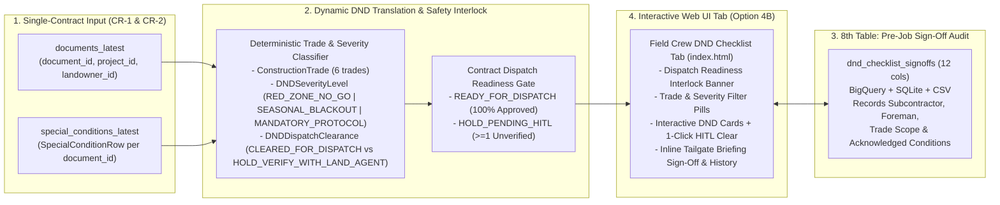

# Change Request CR-3: Subcontractor / Construction Field Crew "Do-Not-Disturb" (DND) Checklist

* **CR ID:** `CR-003` (Requirement `R6` from Oct 1, 2026 Invenergy–Google Sync)
* **Status:** Ready for Implementation 
* **Parent Architecture:** [DESIGN_DOC.md](file:///usr/local/google/home/prasannaankem/Code/Invenergy/Design/DESIGN_DOC.md), [CR1_LANDOWNER_SPECIAL_CONDITIONS.md](file:///usr/local/google/home/prasannaankem/Code/Invenergy/Design/CR1_LANDOWNER_SPECIAL_CONDITIONS.md), [CR2_PROJECT_PORTFOLIO_HIERARCHY.md](file:///usr/local/google/home/prasannaankem/Code/Invenergy/Design/CR2_PROJECT_PORTFOLIO_HIERARCHY.md)
* **Confirmed Design Decisions:**
  1. **Single-Contract / Document Scoping (`document_id` — Option 1B):** Generate each Field Crew "Do-Not-Disturb" (DND) Checklist strictly scoped to a single selected contract PDF (`document_id`), while surfacing the parent Project (`project_id`, `erp_project_code`, `energy_technology`) and Landowner (`landowner_id`, `landowner_name`, `parcel_summary`) context in the checklist header.
  2. **Safety Gate with "PROVISIONAL / HOLD" Interlock (`APPROVED_BY_HUMAN` + `FLAGGED_FOR_REVIEW` — Option 2A):** Include both `APPROVED_BY_HUMAN` and `FLAGGED_FOR_REVIEW` / `PLACEHOLDER_FOR_REVIEW` special conditions on the DND Checklist so physical site hazards are never hidden from field crews. Stamp unapproved items with `dispatch_clearance = "HOLD_VERIFY_WITH_LAND_AGENT"` and a high-visibility **`HOLD — VERIFY WITH LAND AGENT`** badge, compute a contract-level `dispatch_readiness` state (`READY_FOR_DISPATCH`, `HOLD_PENDING_HITL`, or `NO_CONSTRAINTS_IDENTIFIED`), and provide a one-click **"Approve & Clear for Field Dispatch"** action directly on the checklist card.
  3. **Dynamic DND Synthesis + 8th Audit Table `dnd_checklist_signoffs` (Option 3A):** Dynamically synthesize `DNDChecklistItem` records on the fly from the contract's `SpecialConditionRow` rows (zero duplicate constraint storage) using a deterministic **Construction Trade & Severity Classifier**, and add an 8th normalized table (`dnd_checklist_signoffs` / `DNDChecklistSignoffRow`, 12 columns) in BigQuery, local SQLite, and CSV export to record immutable **Pre-Job Tailgate Briefing Sign-Offs** by subcontractors and field foremen.
  4. **Interactive Web UI Checklist View Only (Option 4B):** Deliver the experience as a dedicated interactive **"Field Crew DND Checklist"** tab inside [index.html](file:///usr/local/google/home/prasannaankem/Code/Invenergy/contract_parser/static/index.html) featuring trade/severity filters, interactive verification checkboxes, one-click HITL clearance, PDF page jump links, and an inline Subcontractor Pre-Job Sign-Off form and audit log—without standalone print popups or separate file export buttons.

---

## Section 1: The Problem (Plain-English Business Context)

During the October 1, 2026 discovery session (`00:05:20` and `00:07:12`–`00:08:25`), Invenergy's business transformation leads identified a costly disconnect between **Legal Contract Extraction** and **Construction Field Execution**:

1. **The "Legal Text vs. Bulldozer Cab" Gap:** When land agents negotiate wind, solar, storage, transmission, or geothermal agreements, they frequently agree to landowner-specific physical concessions—such as preserving a grove of 200-year-old oak trees (`$100,000 per tree` liquidated damages), staying `300 feet` away from an existing livestock barn or water well, keeping pasture Gate #3 double-locked at all times, avoiding loud excavation during deer hunting season (`Nov 15 – Dec 1`), or repairing crushed agricultural drainage tiles within `10 business days`. Civil grading, clearing, trenching, and crane subcontractors never read 40-page legal agreements.
2. **The Unverified Constraint Liability Trap:** If an AI-extracted constraint is still awaiting legal review (`FLAGGED_FOR_REVIEW`) when a clearing crew mobilizes on site, hiding the constraint from the field checklist risks an accidental `$100,000` landowner violation, whereas showing it without a warning risks acting on unverified numbers. Field superintendents need every extracted constraint visible on the contract's checklist, paired with a strict **`HOLD — VERIFY WITH LAND AGENT`** safety interlock until approved.
3. **Subcontractor Accountability & Pre-Job Sign-Off:** Before a subcontractor crew enters a landowner's property, the site superintendent conducts a tailgate briefing. Invenergy needs an immutable digital sign-off record (`dnd_checklist_signoffs`) proving which subcontractor company and foreman acknowledged the contract's Do-Not-Disturb rules and whether the contract was `READY_FOR_DISPATCH` at the time of sign-off.

---

## Section 2: The Technical Plan

### Architecture Overview

---

### Key Technical Components

#### 1. New Enums in [schemas.py](file:///usr/local/google/home/prasannaankem/Code/Invenergy/contract_parser/schemas.py)

* **`ConstructionTrade(StrEnum)` — Field Crew Trade Routing:**
  * `ACCESS_FENCING_GATES = "ACCESS_FENCING_GATES"` (Gates, haul roads, cattle guards, perimeter fencing, speed limits)
  * `CLEARING_VEGETATION = "CLEARING_VEGETATION"` (Tree protection, timber salvage, brush clearing, crop avoidance)
  * `CIVIL_GRADING_SOIL = "CIVIL_GRADING_SOIL"` (Topsoil segregation, drainage tiles, compaction, erosion, grading setbacks)
  * `BLASTING_TRENCHING_FOUNDATION = "BLASTING_TRENCHING_FOUNDATION"` (Blasting prohibited zones, underground cable trenching, water well/septic/barn buffers)
  * `CRANE_TRANSPORT_ERECTION = "CRANE_TRANSPORT_ERECTION"` (Heavy haul weight limits, overhead clearances, laydown yards, noise/flicker)
  * `GENERAL_SITE_OPERATIONS = "GENERAL_SITE_OPERATIONS"` (Hunting blackouts, advance notice windows, general landowner protocols)

* **`DNDSeverityLevel(StrEnum)` — Field Hazard Classification:**
  * `RED_ZONE_NO_GO = "RED_ZONE_NO_GO"` (Physical exclusion zones, tree/barn/well setbacks, blasting bans, or physical exclusions carrying financial penalties / liquidated damages)
  * `SEASONAL_BLACKOUT = "SEASONAL_BLACKOUT"` (Date/time blackout windows, hunting seasons, curfews, or mandatory notice lead times)
  * `MANDATORY_PROTOCOL = "MANDATORY_PROTOCOL"` (Ongoing operational rules such as locking gates, livestock protection, and soil/drainage restoration duties)

* **`DNDDispatchClearance(StrEnum)` — Item-Level Safety Interlock (Option 2A):**
  * `CLEARED_FOR_DISPATCH = "CLEARED_FOR_DISPATCH"` (Underlying `SpecialConditionRow.hitl_status == HITLStatus.APPROVED_BY_HUMAN`)
  * `HOLD_VERIFY_WITH_LAND_AGENT = "HOLD_VERIFY_WITH_LAND_AGENT"` (Underlying `SpecialConditionRow.hitl_status != HITLStatus.APPROVED_BY_HUMAN`)

* **`DNDDispatchReadiness(StrEnum)` — Contract-Level Dispatch Gate:**
  * `READY_FOR_DISPATCH = "READY_FOR_DISPATCH"` (Contract has $\ge 1$ DND items and 100% are `CLEARED_FOR_DISPATCH`)
  * `HOLD_PENDING_HITL = "HOLD_PENDING_HITL"` (Contract has $\ge 1$ DND items with `HOLD_VERIFY_WITH_LAND_AGENT`)
  * `NO_CONSTRAINTS_IDENTIFIED = "NO_CONSTRAINTS_IDENTIFIED"` (Contract has 0 extracted special conditions)

---

#### 2. Dynamic Checklist Item Model: `DNDChecklistItem` in [schemas.py](file:///usr/local/google/home/prasannaankem/Code/Invenergy/contract_parser/schemas.py)

Synthesized dynamically from each `SpecialConditionRow` belonging to `document_id` via `build_dnd_checklist_item(sc: SpecialConditionRow) -> DNDChecklistItem`:

| Field Name | Type | Description |
| :--- | :--- | :--- |
| `condition_id` | `str` | Source `SpecialConditionRow.condition_id` (e.g., `sc_BODY.12.a_1`) |
| `document_id` | `str` | Parent contract `document_id` |
| `project_id` | `str` | Parent `ProjectRow.project_id` |
| `landowner_id` | `str` | Parent `LandownerRow.landowner_id` |
| `node_id` | `str` | Source `ClauseRow.node_id` for 1-click HITL approval |
| `canonical_path` | `str` | Dot-delimited clause path |
| `constraint_category` | `ConstraintCategory` | Source legal/operational constraint category |
| `construction_trade` | `ConstructionTrade` | Deterministically mapped field crew trade |
| `severity_level` | `DNDSeverityLevel` | Deterministically mapped hazard severity (`RED_ZONE_NO_GO`, `SEASONAL_BLACKOUT`, `MANDATORY_PROTOCOL`) |
| `dispatch_clearance` | `DNDDispatchClearance` | `CLEARED_FOR_DISPATCH` if `hitl_status == APPROVED_BY_HUMAN`, else `HOLD_VERIFY_WITH_LAND_AGENT` |
| `field_directive_title` | `str` | Concise uppercase field callout (e.g., `DO NOT DISTURB: NORTHERN OAK GROVE (150 FEET)`) |
| `target_asset_or_area` | `str` | Physical structure, gate, well, or parcel zone |
| `quantitative_metric` | `str \| None` | Hard distance, setback, weight limit, or dimension |
| `temporal_restriction` | `str \| None` | Blackout dates, hours, or required notice window |
| `penalty_or_consequence` | `str \| None` | Financial penalty or liquidated damages exposure |
| `actionable_obligation_summary` | `str` | Plain-English crew instruction |
| `verbatim_excerpt` | `str` | Exact contract text for verification |
| `page_number` | `int` | 1-indexed PDF page number for instant `pdf.js` jump |
| `hitl_status` | `HITLStatus` | Underlying verification status (`FLAGGED_FOR_REVIEW` or `APPROVED_BY_HUMAN`) |
| `reviewed_by` | `str \| None` | Reviewer who approved the constraint |

**Deterministic Trade, Severity & Directive Title Rules (`classify_dnd_condition`):**
1. **Trade Routing (`ConstructionTrade`) with Keyword Refinement:**
   * Let `combined_text = f"{sc.target_asset_or_area} {sc.actionable_obligation_summary} {sc.verbatim_excerpt}".lower()`.
   * Direct category mappings:
     * `TREE_VEGETATION_PROTECTION`, `CROP_OR_TIMBER_COMPENSATION` $\rightarrow$ `ConstructionTrade.CLEARING_VEGETATION`
     * `ACCESS_ROAD_GATE_PROTOCOL`, `GATES_FENCING_OR_LIVESTOCK`, `ACCESS_ROAD_OR_PARCEL_RESTRICTION`, `LIVESTOCK_AGRICULTURE` $\rightarrow$ `ConstructionTrade.ACCESS_FENCING_GATES`
     * `DRAINAGE_OR_SOIL_RESTORATION` $\rightarrow$ `ConstructionTrade.CIVIL_GRADING_SOIL`
     * `NOISE_OR_SHADOW_FLICKER` $\rightarrow$ `ConstructionTrade.CRANE_TRANSPORT_ERECTION`
     * `BLASTING_OR_EXCAVATION`, `STRUCTURE_BARN_WELL_SETBACK` $\rightarrow$ `ConstructionTrade.BLASTING_TRENCHING_FOUNDATION` (unless `combined_text` matches crane/turbine/rig/overhead keywords $\rightarrow$ `CRANE_TRANSPORT_ERECTION`)
   * Cross-cutting categories (`SETBACK_OR_BUFFER`, `TIMING_NOISE_HUNTING_BLACKOUT`, `CONSTRUCTION_OR_BLACKOUT_WINDOW`, `FINANCIAL_PENALTY_LIQUIDATED_DAMAGES`, `DECOMMISSIONING_OR_BOND`, `OTHER_CUSTOM_RIDER`, `OTHER_SPECIAL_CONDITION`) inspect `combined_text` in priority order:
     1. `"tree|trees|oak|pecan|timber|grove|orchard|brush|clearing"` $\rightarrow$ `ConstructionTrade.CLEARING_VEGETATION`
     2. `"drainage|tile|tiles|topsoil|erosion|compaction|re-grade|grading"` $\rightarrow$ `ConstructionTrade.CIVIL_GRADING_SOIL`
     3. `"gate|gates|fence|fencing|cattle|livestock|pasture|culvert|haul road|speed limit"` $\rightarrow$ `ConstructionTrade.ACCESS_FENCING_GATES`
     4. `"crane|turbine|rig|heavy haul|overhead|laydown"` $\rightarrow$ `ConstructionTrade.CRANE_TRANSPORT_ERECTION`
     5. `"blast|blasting|trench|trenching|excavat|well|wells|barn|shed|residence|homestead|septic|foundation|setback|buffer"` $\rightarrow$ `ConstructionTrade.BLASTING_TRENCHING_FOUNDATION`
     6. Fallback $\rightarrow$ `ConstructionTrade.GENERAL_SITE_OPERATIONS`
2. **Severity Classification (`DNDSeverityLevel`):**
   * `SEASONAL_BLACKOUT`: Assigned first when `sc.constraint_category in {TIMING_NOISE_HUNTING_BLACKOUT, CONSTRUCTION_OR_BLACKOUT_WINDOW}` (unless `sc.quantitative_metric` specifies a physical distance setback), or when `sc.temporal_restriction` is populated and no physical exclusion / financial penalty is present.
   * `RED_ZONE_NO_GO`: Assigned when not `SEASONAL_BLACKOUT` and any of the following hold:
     * `sc.penalty_or_consequence` is non-empty, OR
     * `sc.constraint_category in {TREE_VEGETATION_PROTECTION, CROP_OR_TIMBER_COMPENSATION, STRUCTURE_BARN_WELL_SETBACK, SETBACK_OR_BUFFER, BLASTING_OR_EXCAVATION, FINANCIAL_PENALTY_LIQUIDATED_DAMAGES}`, OR
     * `sc.quantitative_metric` contains a setback/exclusion distance (`feet`, `ft`, `meters`, `yards`, `acres`) coupled with setback/no-disturb/no-build language in `combined_text`, OR
     * `combined_text` contains `"do not disturb"`, `"shall not cut"`, `"shall not clear"`, `"no-build"`, `"no entry"`, `"blasting prohibited"`.
   * `MANDATORY_PROTOCOL`: Assigned to all remaining operational protocols (e.g., keeping gates locked, livestock care, drainage tile repair, topsoil segregation).
3. **Field Directive Title Synthesis (`field_directive_title`):**
   * Prefix is derived from `severity_level`:
     * `RED_ZONE_NO_GO` $\rightarrow$ `"DO NOT DISTURB"`
     * `SEASONAL_BLACKOUT` $\rightarrow$ `"SEASONAL BLACKOUT"`
     * `MANDATORY_PROTOCOL` $\rightarrow$ `"MANDATORY PROTOCOL"`
   * Target is `sc.target_asset_or_area.strip().upper()`, appended with `f" ({metric_or_window.upper()})"` when `sc.quantitative_metric` or `sc.temporal_restriction` is present (e.g., `"DO NOT DISTURB: PECAN OR OAK TREES IN THE PECAN GROVE"`, `"DO NOT DISTURB: HOMESTEAD BARN (300 FEET)"`, `"SEASONAL BLACKOUT: CONSTRUCTION OR GRADING (NOVEMBER 15 THROUGH DECEMBER 1)"`).
4. **Sorting Order:**
   * Items are sorted deterministically by severity priority (`RED_ZONE_NO_GO` = 0, `SEASONAL_BLACKOUT` = 1, `MANDATORY_PROTOCOL` = 2), followed by `page_number` ASC and `condition_id` ASC.

---

#### 3. 8th Normalized Table: `dnd_checklist_signoffs` (`DNDChecklistSignoffRow` — 12 Columns)

Stores immutable pre-job tailgate briefing sign-offs in BigQuery (`pr-tftest.contract_intelligence.dnd_checklist_signoffs` + `dnd_checklist_signoffs_latest`), local SQLite (`./data/contract_intelligence.db`), and per-document CSV exports (`exports/<document_id>/dnd_checklist_signoffs.csv`):

| Column Name | Pydantic / BQ Type | Mode | Description |
| :--- | :--- | :--- | :--- |
| `signoff_id` | `str` / `STRING` | `REQUIRED` | Deterministic or timestamped ID (`sig_<doc_short>_<hash8>`) |
| `document_id` | `str` / `STRING` | `REQUIRED` | Foreign key to `documents.document_id` |
| `project_id` | `str` / `STRING` | `REQUIRED` | Foreign key to `projects.project_id` |
| `landowner_id` | `str` / `STRING` | `REQUIRED` | Foreign key to `landowners.landowner_id` |
| `subcontractor_company` | `str` / `STRING` | `REQUIRED` | Subcontractor firm name (e.g., `Apex Civil & Grading LLC`) |
| `foreman_name` | `str` / `STRING` | `REQUIRED` | Field superintendent or crew foreman signing off |
| `construction_trade` | `ConstructionTrade` / `STRING` | `REQUIRED` | Primary trade scope briefed (`ACCESS_FENCING_GATES`, `CLEARING_VEGETATION`, etc.) |
| `acknowledged_condition_ids` | `str` / `STRING` | `REQUIRED` | Pipe-delimited `condition_id` values acknowledged in the briefing |
| `acknowledged_count` | `int` / `INT64` | `REQUIRED` | Total number of DND items acknowledged (`ge=1`) |
| `dispatch_readiness_at_signoff` | `DNDDispatchReadiness` / `STRING` | `REQUIRED` | Snapshot of contract readiness (`READY_FOR_DISPATCH` vs `HOLD_PENDING_HITL`) at sign-off |
| `briefing_notes` | `str \| None` / `STRING` | `NULLABLE` | Optional tailgate briefing notes or field observations |
| `signed_at` | `str` / `TIMESTAMP` | `REQUIRED` | ISO-8601 UTC timestamp (`QUALIFY ROW_NUMBER() OVER (PARTITION BY document_id, signoff_id ORDER BY signed_at DESC) = 1`) |

---

#### 4. API Request & Response Schemas: `CreateDNDSignoffRequest` & `DNDChecklistBundle`

* **`CreateDNDSignoffRequest(BaseModel)` — Payload for `POST /api/v1/documents/{document_id}/dnd-checklist:signoff`:**

| Field Name | Type | Default | Description |
| :--- | :--- | :--- | :--- |
| `subcontractor_company` | `str` | *Required* | Non-empty subcontractor firm name |
| `foreman_name` | `str` | *Required* | Non-empty foreman or superintendent name |
| `construction_trade` | `ConstructionTrade` | `ConstructionTrade.GENERAL_SITE_OPERATIONS` | Primary trade briefed |
| `acknowledged_condition_ids` | `list[str] \| str` | `Field(default_factory=list)` | List of `condition_id` strings or pipe-delimited `condition_id` string (must resolve to $\ge 1$ valid `condition_id` belonging to `document_id`) |
| `briefing_notes` | `str \| None` | `None` | Optional field briefing notes |

* **`DNDChecklistBundle(BaseModel)` — Response from `GET /api/v1/documents/{document_id}/dnd-checklist` & `POST .../dnd-checklist:signoff`:**

| Field Name | Type | Description |
| :--- | :--- | :--- |
| `document_id` | `str` | Contract `document_id` |
| `filename` | `str` | Contract PDF filename |
| `project_id` | `str` | Parent `ProjectRow.project_id` |
| `project_name` | `str` | Parent `ProjectRow.project_name` |
| `erp_project_code` | `str` | Parent `ProjectRow.erp_project_code` |
| `energy_technology` | `EnergyTechnology` | Parent `ProjectRow.energy_technology` |
| `landowner_id` | `str` | Parent `LandownerRow.landowner_id` |
| `landowner_name` | `str` | Grantor / Landowner counterparty name |
| `parcel_summary` | `str \| None` | Landowner parcel summary |
| `dispatch_readiness` | `DNDDispatchReadiness` | **Always computed across all unfiltered DND items of `document_id`** (`READY_FOR_DISPATCH`, `HOLD_PENDING_HITL`, or `NO_CONSTRAINTS_IDENTIFIED`) |
| `total_items` | `int` | Total unfiltered DND items for `document_id` |
| `filtered_items_count` | `int` | Count of `items` matching active `construction_trade` / `severity_level` filters |
| `red_zone_count` | `int` | Unfiltered count of `RED_ZONE_NO_GO` items |
| `seasonal_blackout_count` | `int` | Unfiltered count of `SEASONAL_BLACKOUT` items |
| `mandatory_protocol_count` | `int` | Unfiltered count of `MANDATORY_PROTOCOL` items |
| `cleared_count` | `int` | Unfiltered count of `CLEARED_FOR_DISPATCH` items |
| `hold_count` | `int` | Unfiltered count of `HOLD_VERIFY_WITH_LAND_AGENT` items |
| `trade_breakdown` | `dict[str, int]` | Unfiltered count of DND items per `ConstructionTrade` key |
| `items` | `list[DNDChecklistItem]` | Sorted DND checklist items (filtered by `construction_trade` and `severity_level` if provided) |
| `signoffs` | `list[DNDChecklistSignoffRow]` | Deduplicated pre-job sign-offs for `document_id` ordered by `signed_at DESC` |

---

#### 5. Edge-Case Safeguards & Storage Invariants

1. **BigQuery `QUALIFY` Timestamp Column Parameterization (`signed_at` vs. `updated_at`):**
   * In [storage.py](file:///usr/local/google/home/prasannaankem/Code/Invenergy/contract_parser/storage.py), `ensure_bq_tables` currently builds `*_latest` views using `ORDER BY updated_at DESC`. Because `dnd_checklist_signoffs` uses `signed_at` as its timestamp column, `ensure_bq_tables` will specify `(schema, partition_keys, order_by_col)` per table (`updated_at` for tables 1–7; `signed_at` for `dnd_checklist_signoffs`) so `dnd_checklist_signoffs_latest` compiles cleanly in BigQuery.
2. **Unfiltered Safety Gate Invariant Under Trade/Severity Filtering:**
   * Filtering the checklist view by `construction_trade` or `severity_level` must **never** alter the contract-level `dispatch_readiness`, `total_items`, `cleared_count`, `hold_count`, or `trade_breakdown`. A contract with 1 approved `CLEARING_VEGETATION` item and 1 unapproved `BLASTING_TRENCHING_FOUNDATION` item remains `HOLD_PENDING_HITL` even when the UI filter is set to `CLEARING_VEGETATION`.
3. **Strict `acknowledged_condition_ids` Validation on Sign-Off:**
   * `record_dnd_checklist_signoff` normalizes `req.acknowledged_condition_ids` (accepting either a Python `list[str]` or pipe-delimited `str`), strips whitespace, and verifies that:
     * At least 1 `condition_id` is provided (`acknowledged_count >= 1`), and
     * Every provided `condition_id` belongs to the target contract's `special_conditions` (`document_id`).
   * If `subcontractor_company` or `foreman_name` is blank, or if `acknowledged_condition_ids` is empty or contains an unknown `condition_id`, `record_dnd_checklist_signoff` raises `ValueError` (mapped to HTTP `400 Bad Request` in FastAPI).
4. **Per-Document `dnd_checklist_signoffs.csv` Export Parity:**
   * `export_csvs(bundle)` and `record_dnd_checklist_signoff(document_id, req)` both write `exports/<document_id>/dnd_checklist_signoffs.csv` (`utf-8-sig` with `DND_SIGNOFF_CSV_COLUMNS` headers) to local disk and GCS, and `get_csv_bytes` supports `"dnd_checklist_signoffs.csv"` alongside the existing 4 per-document CSV exports.

---

## Section 3: Alternatives Considered

| Dimension | Chosen Design | Alternative Ruled Out | Rationale |
| :--- | :--- | :--- | :--- |
| **1. Checklist Scope** | **Option 1B: Single-Contract (`document_id`) Scoped Checklist** | **Cross-Contract Project Packet** | Keeps field accountability 1-to-1 with the specific executed landowner contract loaded in the workbench while still displaying the parent Project and Landowner metadata. |
| **2. Unverified Constraints (`FLAGGED_FOR_REVIEW`)** | **Option 2A: Include with `HOLD — VERIFY WITH LAND AGENT` Safety Interlock** | **Option 2B: Strict Filter (`APPROVED_BY_HUMAN` Only)** | Hiding an unapproved `$100,000/tree` constraint from a field checklist creates severe physical and financial risk if a crew mobilizes before Legal finishes reviewing the queue. Showing it with a `HOLD` interlock prevents accidental disturbance while enabling 1-click sign-off. |
| **3. Persistence Model** | **Option 3A: Dynamic DND Synthesis + 8th `dnd_checklist_signoffs` Audit Table** | **Duplicating DND Items in a Separate Table or Stateless View** | Synthesizing `DNDChecklistItem` rows dynamically from `special_conditions` guarantees zero staleness when a clause is approved, while the 8th `dnd_checklist_signoffs` table provides an immutable audit trail of subcontractor pre-job briefings. |
| **4. Deliverable Surface** | **Option 4B: Interactive Web UI Tab Only** | **Standalone Print Popups & Separate CSV/JSON Export Buttons** | Keeps the operator and superintendent workflow unified inside the single-page Workbench (`index.html`). |

---

## Section 4: Detailed File-by-File Implementation Plan

### 1. [contract_parser/schemas.py](file:///usr/local/google/home/prasannaankem/Code/Invenergy/contract_parser/schemas.py) `[MODIFY]`
* **Rationale:** Centralizes the 8th table schema (`DNDChecklistSignoffRow`), the dynamic field-crew checklist item structure (`DNDChecklistItem`), the trade/severity/clearance enums, and the deterministic classification logic (`classify_dnd_condition`) so API responses, SQLite tables, CSV exports, and BigQuery schemas share a single source of truth.
* **Changes:**
  * Add `ConstructionTrade(StrEnum)`, `DNDSeverityLevel(StrEnum)`, `DNDDispatchClearance(StrEnum)`, and `DNDDispatchReadiness(StrEnum)`.
  * Add `DNDChecklistItem(BaseModel)` (20 fields), `DNDChecklistSignoffRow(BaseModel)` (12 columns), `DND_SIGNOFF_CSV_COLUMNS: list[str]`, `CreateDNDSignoffRequest(BaseModel)`, and `DNDChecklistBundle(BaseModel)`.
  * Add deterministic helpers `classify_dnd_condition(sc: SpecialConditionRow) -> tuple[ConstructionTrade, DNDSeverityLevel, str]` and `build_dnd_checklist_item(sc: SpecialConditionRow) -> DNDChecklistItem`.

### 2. [contract_parser/storage.py](file:///usr/local/google/home/prasannaankem/Code/Invenergy/contract_parser/storage.py) `[MODIFY]`
* **Rationale:** Extends the dual-write persistence layer (BigQuery + local SQLite + CSV export) to provision the 8th table (`dnd_checklist_signoffs` and `dnd_checklist_signoffs_latest`), dynamically synthesize contract-scoped DND checklists from `special_conditions`, and persist immutable subcontractor tailgate sign-offs.
* **Changes:**
  * Add `BQ_DND_SIGNOFFS_SCHEMA: list[bigquery.SchemaField]` (12 columns) and register `dnd_checklist_signoffs` + `dnd_checklist_signoffs_latest` view (`PARTITION BY document_id, signoff_id ORDER BY signed_at DESC`) in both SQLite (`_ensure_local_dirs_and_db`) and BigQuery (`ensure_bq_tables`).
  * Add `append_dnd_signoff_row(signoff: DNDChecklistSignoffRow)`, `list_dnd_signoffs(document_id: str) -> list[DNDChecklistSignoffRow]`, and `_export_dnd_signoffs_csv(document_id: str, signoffs: list[DNDChecklistSignoffRow] | None = None) -> str`, and wire `"dnd_checklist_signoffs.csv"` into `export_csvs` and `get_csv_bytes`.
  * Add `get_contract_dnd_checklist(document_id: str, construction_trade: str | None = None, severity_level: str | None = None) -> DNDChecklistBundle` which loads the contract's `ParsedContractBundle`, resolves parent `ProjectRow` and `LandownerRow`, synthesizes and sorts `DNDChecklistItem` entries from `bundle.special_conditions`, computes unfiltered contract-level `dispatch_readiness` and summary counts (`total_items`, `filtered_items_count`, `red_zone_count`, `seasonal_blackout_count`, `mandatory_protocol_count`, `cleared_count`, `hold_count`, `trade_breakdown`), applies optional `construction_trade` / `severity_level` filters to `items`, and attaches deduplicated `DNDChecklistSignoffRow` history.
  * Add `record_dnd_checklist_signoff(document_id: str, req: CreateDNDSignoffRequest) -> DNDChecklistBundle` which validates `subcontractor_company`, `foreman_name`, and `acknowledged_condition_ids` against the contract's `special_conditions`, snapshots the contract's unfiltered `dispatch_readiness_at_signoff`, writes `DNDChecklistSignoffRow` to SQLite, `dnd_checklist_signoffs.csv`, and BigQuery `dnd_checklist_signoffs`, and returns the updated `DNDChecklistBundle`.

### 3. [contract_parser/app.py](file:///usr/local/google/home/prasannaankem/Code/Invenergy/contract_parser/app.py) `[MODIFY]`
* **Rationale:** Exposes REST endpoints for retrieving a single contract's Field Crew DND Checklist (with trade and severity filtering) and submitting pre-job subcontractor sign-offs from the web workbench.
* **Changes:**
  * Add `GET /api/v1/documents/{document_id}/dnd-checklist` supporting optional query parameters `construction_trade` and `severity_level`.
  * Add `POST /api/v1/documents/{document_id}/dnd-checklist:signoff` accepting `CreateDNDSignoffRequest` (`subcontractor_company`, `foreman_name`, `construction_trade`, `acknowledged_condition_ids`, `briefing_notes`), returning HTTP `400` on validation errors and HTTP `404` if `document_id` does not exist.

### 4. [contract_parser/static/index.html](file:///usr/local/google/home/prasannaankem/Code/Invenergy/contract_parser/static/index.html) `[MODIFY]`
* **Rationale:** Delivers the interactive single-contract Field Crew DND Checklist experience directly inside the split-screen workbench (Option 4B), enabling site superintendents to review hazards by trade, clear `HOLD` constraints via 1-click HITL approval, jump to source PDF pages, and log subcontractor tailgate sign-offs.
* **Changes:**
  * Add a **"Field Crew DND"** tab button (`#tabBtnDndChecklist`) with a live badge showing the contract's DND item count and hold status.
  * Render the single-contract **Field Crew Do-Not-Disturb Checklist** panel containing:
    1. **Contract & Parcel Context Header + Dispatch Readiness Interlock Banner** (`READY FOR FIELD DISPATCH` vs. `HOLD — N UNVERIFIED CONSTRAINTS REQUIRE LAND AGENT APPROVAL`).
    2. **Trade & Severity Filter Strip** (`All Trades`, `Access & Gates`, `Clearing & Vegetation`, `Civil & Grading`, `Blasting & Trenching`, `Crane & Erection`, `General Site Ops`, plus Severity filter).
    3. **Interactive DND Checklist Cards** with pre-job check-off boxes, `RED_ZONE_NO_GO` / `SEASONAL_BLACKOUT` / `MANDATORY_PROTOCOL` badges, hard metric callouts (Setback/Buffer, Blackout Window, Financial Penalty), 1-click PDF page jump, and inline **"Approve & Clear for Field Dispatch"** button on `HOLD_VERIFY_WITH_LAND_AGENT` items.
    4. **Pre-Job Tailgate Briefing Sign-Off Form & Immutable Sign-Off History Table** bound to `POST /api/v1/documents/{document_id}/dnd-checklist:signoff`.

### 5. [tests/test_pipeline.py](file:///usr/local/google/home/prasannaankem/Code/Invenergy/tests/test_pipeline.py) `[MODIFY]`
* **Rationale:** Verifies 8-table schema parity across Pydantic, CSV, SQLite, and BigQuery, deterministic trade/severity classification, the `HOLD_PENDING_HITL` $\rightarrow$ `READY_FOR_DISPATCH` safety interlock lifecycle, and subcontractor sign-off persistence.
* **Changes:**
  * Update `test_schema_parity_and_config_defaults` to verify the 8-table schema (`dnd_checklist_signoffs`: 12 columns).
  * Add `test_cr3_subcontractor_dnd_checklist_and_signoff` verifying:
    1. Dynamic synthesis of `DNDChecklistItem` records for a contract, deterministic `ConstructionTrade` and `DNDSeverityLevel` classification, and initial `HOLD_PENDING_HITL` readiness when constraints are `FLAGGED_FOR_REVIEW`.
    2. Filtering via `GET /api/v1/documents/{document_id}/dnd-checklist` by `construction_trade` and `severity_level` while preserving unfiltered contract-level `dispatch_readiness`.
    3. Cascading transition from `HOLD_VERIFY_WITH_LAND_AGENT` to `CLEARED_FOR_DISPATCH` (and contract readiness to `READY_FOR_DISPATCH`) once the underlying clauses are approved via `PATCH /api/v1/documents/{document_id}/clauses/{node_id}`.
    4. Recording a Subcontractor Pre-Job Tailgate Briefing Sign-Off via `POST /api/v1/documents/{document_id}/dnd-checklist:signoff`, rejecting invalid `condition_id` submissions with HTTP `400`, and verifying persistence in SQLite, `dnd_checklist_signoffs.csv`, and BigQuery schema parity.

### 6. [Changelog.md](file:///usr/local/google/home/prasannaankem/Code/Invenergy/Changelog.md) `[APPEND]`
* **Rationale:** Maintains an append-only audit log of architectural and feature releases across the platform.
* **Changes:** Append release `[0.4.0] - 2026-10-03` documenting CR-3 (`R6: Subcontractor / Construction Field Crew "Do-Not-Disturb" Checklist`).

---

## Section 5: The Verification Plan

| Scenario ID | Verification Level | Description & Assertion | Command |
| :--- | :--- | :--- | :--- |
| `CR3-SA-1` | 8-Table Schema & BigQuery Parity | Verify all 8 Pydantic models match their `BQ_*_SCHEMA` definitions and `*_CSV_COLUMNS` lists (`dnd_checklist_signoffs`: 12 columns). | `.venv/bin/pytest -k test_schema_parity_and_config_defaults -v` |
| `CR3-UT-1` | Trade & Severity Classification | Verify `classify_dnd_condition` maps tree/timber constraints to `CLEARING_VEGETATION` + `RED_ZONE_NO_GO`, gate/cattle rules to `ACCESS_FENCING_GATES` + `MANDATORY_PROTOCOL`, and hunting windows to `SEASONAL_BLACKOUT`. | `.venv/bin/pytest -k test_cr3_subcontractor_dnd_checklist_and_signoff -v` |
| `CR3-IT-1` | Safety Interlock & HITL Clearance | Verify `GET /api/v1/documents/{document_id}/dnd-checklist` returns `HOLD_PENDING_HITL` when any item is `FLAGGED_FOR_REVIEW` (even when filtered by trade) and transitions to `READY_FOR_DISPATCH` once all items are `APPROVED_BY_HUMAN`. | `.venv/bin/pytest -k test_cr3_subcontractor_dnd_checklist_and_signoff -v` |
| `CR3-IT-2` | Subcontractor Pre-Job Sign-Off Persistence | Verify `POST /api/v1/documents/{document_id}/dnd-checklist:signoff` persists `DNDChecklistSignoffRow` (12 cols) to SQLite and `dnd_checklist_signoffs.csv`, rejects invalid `condition_id` values with HTTP `400`, and returns the sign-off in subsequent checklist fetches. | `.venv/bin/pytest -k test_cr3_subcontractor_dnd_checklist_and_signoff -v` |

---

## Section 6: The Exit Criteria

1. All 8 tables (`projects`, `landowners`, `documents`, `clauses`, `defined_terms`, `exhibits_catalog`, `special_conditions`, `dnd_checklist_signoffs`) and their `*_latest` deduplicated views exist in both BigQuery (`pr-tftest.contract_intelligence`) and local SQLite (`./data/contract_intelligence.db`).
2. `GET /api/v1/documents/{document_id}/dnd-checklist` synthesizes single-contract Field Crew DND items with deterministic `ConstructionTrade`, `DNDSeverityLevel`, and `DNDDispatchClearance` interlocks.
3. Operators and site superintendents can filter DND items by trade/severity, clear `HOLD` items via 1-click HITL approval, and record Subcontractor Pre-Job Tailgate Briefing Sign-Offs in [index.html](file:///usr/local/google/home/prasannaankem/Code/Invenergy/contract_parser/static/index.html).
4. All automated tests in [test_pipeline.py](file:///usr/local/google/home/prasannaankem/Code/Invenergy/tests/test_pipeline.py) pass with zero errors.
