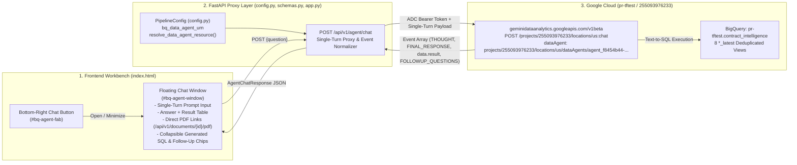

# Change Request CR-4: BigQuery Conversational Analytics Data Agent Chat Integration (`v0.5.0`)

* **CR ID:** `CR-004` (BigQuery Data Agent & Agent Registry Conversational Interface — POC)
* **Status:** Implemented & Verified (`v0.5.0`)
* **Parent Architecture:** [DESIGN_DOC.md](file:///usr/local/google/home/prasannaankem/Code/Invenergy/Design/DESIGN_DOC.md), [CR1_LANDOWNER_SPECIAL_CONDITIONS.md](file:///usr/local/google/home/prasannaankem/Code/Invenergy/Design/CR1_LANDOWNER_SPECIAL_CONDITIONS.md), [CR2_PROJECT_PORTFOLIO_HIERARCHY.md](file:///usr/local/google/home/prasannaankem/Code/Invenergy/Design/CR2_PROJECT_PORTFOLIO_HIERARCHY.md), [CR3_SUBCONTRACTOR_DND_CHECKLIST.md](file:///usr/local/google/home/prasannaankem/Code/Invenergy/Design/CR3_SUBCONTRACTOR_DND_CHECKLIST.md)
* **Registered Agent URN:** `urn:agent:projects-255093976233:projects:255093976233:locations:us:geminidataanalytics:dataAgents:agent_f8454b44-a4aa-4c94-accf-245b5e6b1f11`
* **Resolved Conversational Analytics Resource:** `projects/255093976233/locations/us/dataAgents/agent_f8454b44-a4aa-4c94-accf-245b5e6b1f11` (GCP Project `pr-tftest` / Project Number `255093976233`, Location `us`)
* **Confirmed POC Design Decisions:**
  1. **`*_latest` Views Only in Agent Context:** The registered BigQuery Data Agent is configured exclusively against the 8 deduplicated `*_latest` views in `pr-tftest.contract_intelligence` (`projects_latest`, `landowners_latest`, `documents_latest`, `clauses_latest`, `defined_terms_latest`, `exhibits_catalog_latest`, `special_conditions_latest`, `dnd_checklist_signoffs_latest`), avoiding stale append-only row versions and cutting schema context retrieval latency in half (`8` tables instead of `16`).
  2. **Backend FastAPI Proxy Route (`POST /api/v1/agent/chat`):** The browser never calls `geminidataanalytics.googleapis.com` directly or handles GCP credentials. Instead, the frontend sends prompts to `POST /api/v1/agent/chat` in [app.py](file:///usr/local/google/home/prasannaankem/Code/Invenergy/contract_parser/app.py), which resolves the configured Agent URN and invokes `POST https://geminidataanalytics.googleapis.com/v1beta/projects/255093976233/locations/us:chat` using Application Default Credentials (ADC).
  3. **Stateless Single-Turn POC Execution:** Each user question is executed as an independent, single-turn request (`messages: [{"userMessage": {"text": question}}]`) without multi-turn conversation state persistence.
  4. **Portfolio-Wide Query Scope & Direct Document Links:** Queries run across the entire portfolio in BigQuery without injecting active UI filter constraints. When query results or answers reference contracts (`document_id` or `filename`), the response surfaces direct clickable links (`/api/v1/documents/{document_id}/pdf`) alongside the natural-language answer, tabular result rows, and generated SQL.
  5. **Bottom-Right Floating Chat Launcher & Window:** A fixed floating action button at the bottom-right of [index.html](file:///usr/local/google/home/prasannaankem/Code/Invenergy/contract_parser/static/index.html) toggles a clean, Invenergy-branded chat window where users can ask natural-language questions against the BigQuery agent.

---

## Section 1: The Problem (Plain-English Business Context)

While the Contract Intelligence Workbench (`v0.4.0`) provides structured tabs for single-contract HITL review, cross-portfolio filter search (`CR-2`), and subcontractor Do-Not-Disturb checklists (`CR-3`), legal analysts, land agents, and construction executives frequently need ad-hoc analytical answers across the BigQuery dataset—such as:
* *"How many contracts have unapproved special conditions by energy technology?"*
* *"List all documents and their filenames."*
* *"Which landowners have financial penalties or blasting restrictions?"*

A BigQuery Conversational Analytics Data Agent (`agent_f8454b44-a4aa-4c94-accf-245b5e6b1f11`) has already been provisioned in BigQuery (`pr-tftest` / `255093976233`), connected to the 8 `*_latest` views in `pr-tftest.contract_intelligence`, and registered in Agent Registry under `urn:agent:projects-255093976233:projects:255093976233:locations:us:geminidataanalytics:dataAgents:agent_f8454b44-a4aa-4c94-accf-245b5e6b1f11`. However, operators previously had no way to converse with this agent directly from the Contract Intelligence Workbench UI.

---

## Section 2: The Technical Plan

### Architecture Overview



---

### Key Technical Components

#### 1. Agent URN Configuration & Resolution in [config.py](file:///usr/local/google/home/prasannaankem/Code/Invenergy/contract_parser/config.py)

Add `bq_data_agent_urn` to `PipelineConfig`:
* **Default Value:**
  `urn:agent:projects-255093976233:projects:255093976233:locations:us:geminidataanalytics:dataAgents:agent_f8454b44-a4aa-4c94-accf-245b5e6b1f11` (overridable via `BQ_DATA_AGENT_URN` environment variable).
* **URN Parser Helper (`resolve_data_agent_resource() -> tuple[str, str, str]`):**
  Deterministically parses either an Agent Registry URN (`urn:agent:projects-<proj>:projects:<proj>:locations:<loc>:geminidataanalytics:dataAgents:<agent_id>`) or a standard resource path (`projects/<proj>/locations/<loc>/dataAgents/<agent_id>`) into:
  * `project_id_or_number`: `"255093976233"`
  * `location`: `"us"`
  * `data_agent_resource`: `"projects/255093976233/locations/us/dataAgents/agent_f8454b44-a4aa-4c94-accf-245b5e6b1f11"`

---

#### 2. Request & Normalized Response Models in [schemas.py](file:///usr/local/google/home/prasannaankem/Code/Invenergy/contract_parser/schemas.py)

Because `geminidataanalytics.googleapis.com/v1beta/...:chat` returns a raw array of heterogeneous `systemMessage` objects (`THOUGHT`, `FINAL_RESPONSE`, `data.generatedSql`, `data.result`, `FOLLOWUP_QUESTIONS`), the backend proxy normalizes the raw stream into a clean, strongly typed contract:

* **`AgentChatRequest(BaseModel)`:**
  * `question: str` — Single-turn natural language question from the user (validated non-empty).
* **`AgentDocumentLink(BaseModel)`:**
  * `document_id: str` — Extracted contract ID (e.g., `doc_demo_dnd_pendelton`).
  * `filename: str` — Human-readable filename (resolved from query row or `ContractStorageService`).
  * `pdf_url: str` — Direct link `/api/v1/documents/{document_id}/pdf` so the user can open the PDF in a new tab or view it immediately.
* **`AgentChatResponse(BaseModel)`:**
  * `agent_urn: str` — Configured Agent Registry URN.
  * `data_agent_resource: str` — Resolved `projects/.../locations/.../dataAgents/...` resource path.
  * `question: str` — The user's submitted question.
  * `answer: str` — Synthesized natural-language response (`FINAL_RESPONSE` parts joined, or synthesized fallback summary if the stream returns tabular rows without a `FINAL_RESPONSE` text block).
  * `generated_sql: str | None` — The final SQL query generated and executed by the BigQuery Data Agent (`data.generatedSql`).
  * `columns: list[str]` — Column names from `data.result.schema.fields` when tabular data is returned.
  * `rows: list[dict[str, object]]` — Structured data rows from `data.result.data` (capped at 100 rows for UI responsiveness).
  * `thoughts: list[str]` — Intermediate reasoning steps (`textType == "THOUGHT"`).
  * `followup_questions: list[str]` — Suggested follow-up prompts (`textType == "FOLLOWUP_QUESTIONS"`).
  * `document_links: list[AgentDocumentLink]` — Deduplicated clickable links for any `document_id` or known `filename` referenced in `rows` or `answer`.
* **`parse_data_agent_events(...)` Envelope & Link Resolution Rules:**
  1. Unwraps `sys_msg = event.get("systemMessage") or event`.
  2. Parses `sys_msg.get("text")`: joins `parts` and routes by `textType` (`"THOUGHT"` $\rightarrow$ `thoughts`, `"FOLLOWUP_QUESTIONS"` $\rightarrow$ `followup_questions`, and `"FINAL_RESPONSE"` / `""` / `None` $\rightarrow$ `answer`). If `answer` is empty after scanning all events, synthesizes `"Returned N row(s) from BigQuery."` when `rows` is non-empty or falls back to the final thought.
  3. Parses `sys_msg.get("data")`: captures the latest non-empty `generatedSql` and `result` (`schema.fields` $\rightarrow$ `columns`, `data` $\rightarrow$ `rows[:100]`).
  4. Resolves `document_links` via both direct `doc_[a-zA-Z0-9_]+` matching and case-insensitive reverse filename lookup (`filename.lower() -> document_id`) across `rows` and `answer`, ensuring clickable PDF links even when the generated SQL projects `SELECT filename FROM documents_latest` without `document_id`.

---

#### 3. BigQuery Data Agent Proxy Service & Route in [app.py](file:///usr/local/google/home/prasannaankem/Code/Invenergy/contract_parser/app.py)

* **`query_bigquery_data_agent(question: str, config: PipelineConfig, storage: ContractStorageService | None = None) -> AgentChatResponse`:**
  1. Validates that `question.strip()` is non-empty (raises `ValueError` otherwise $\rightarrow$ HTTP `400`).
  2. Obtains a Google Cloud access token via `google.auth.default(scopes=["https://www.googleapis.com/auth/cloud-platform"])` and refreshes it with `google.auth.transport.requests.Request()`.
  3. Sends a single-turn `POST` request (with `timeout=90`) to:
     `https://geminidataanalytics.googleapis.com/v1beta/projects/{project}/locations/{location}:chat`
     with headers `Authorization: Bearer <token>`, `Content-Type: application/json`, and `x-goog-user-project: <config.google_cloud_project>`, and body:
     ```json
     {
       "messages": [
         {
           "userMessage": {
             "text": "<question>"
           }
         }
       ],
       "dataAgentContext": {
         "dataAgent": "projects/255093976233/locations/us/dataAgents/agent_f8454b44-a4aa-4c94-accf-245b5e6b1f11"
       }
     }
     ```
  4. Builds `doc_filename_lookup` (`{document_id: filename}`) from the local SQLite `documents` table first (falling back to `storage.list_documents()` only if local SQLite is empty) so chat turns do not incur an extra BigQuery round-trip.
  5. Normalizes the returned JSON event list via `parse_data_agent_events(...)` to produce `AgentChatResponse`.
* **FastAPI Endpoints:**
  * `GET /api/v1/agent/info` $\rightarrow$ Returns the configured `agent_urn`, `data_agent_resource`, `project`, and `location` so the UI can display connection status.
  * `POST /api/v1/agent/chat` $\rightarrow$ Executed off the main event loop (`asyncio.to_thread`) so 8–25s Conversational Analytics queries never block concurrent PDF streaming or UI requests; accepts `AgentChatRequest` and returns `AgentChatResponse` (HTTP `400` on blank question, HTTP `502` with clear error details if the upstream API call fails).

---

#### 4. Bottom-Right Chat Button & Floating Window in [index.html](file:///usr/local/google/home/prasannaankem/Code/Invenergy/contract_parser/static/index.html)

1. **Bottom-Right Floating Action Button (`#bq-agent-fab`):**
   * Positioned at `bottom: 24px; right: 24px; z-index: 1200` styled with Invenergy Green (`--brand-invenergy-green: #118751`) and Dark Green hover state (`--brand-dark-green: #042B19`).
   * Displays **`Ask BQ Agent`** with a chat icon and toggles `#bq-agent-window`.
2. **Floating Chat Window (`#bq-agent-window`):**
   * Positioned above the launcher button (`bottom: 84px; right: 24px; width: 440px; max-height: 620px; z-index: 1200`), with an **Expand / Wide Mode** toggle (`680px` width) for inspecting wide BigQuery result tables.
   * **Header:** Shows **`BigQuery Contract Intelligence Agent`**, a **`Latest Views (8 Tables) · Single-Turn POC`** status subtitle, an **Expand (`⤢`)** button, a **Clear (`Clear`)** button, and a **Minimize (`✕`)** button.
   * **Quick-Start Prompt Chips:** Provides 3 one-click starter questions (`"List all documents and their filenames"`, `"Summarize special conditions by constraint category"`, `"Which special conditions have financial penalties?"`).
   * **Message Feed (`#bq-agent-messages`):**
     * Renders the user's question bubble and the agent's response card (with all dynamic values sanitized via `escapeHtml(...)`):
       1. **Natural-Language Answer** (`answer`).
       2. **Inline Result Table** (if `rows.length > 0`), automatically rendering a clean scrollable HTML table of the BigQuery results.
       3. **Referenced Contract Links** (if `document_links.length > 0`), rendering clickable **`📄 Open <filename> (PDF)`** links (`/api/v1/documents/{document_id}/pdf` in a new tab) and a **`Load in Workbench`** button wired to `openAgentDocumentInWorkbench(document_id)` (syncing `#document-selector` and calling `loadDocumentBundle(document_id)`).
       4. **Collapsible `<details>` for Generated BigQuery SQL** (`generated_sql`) and agent thought steps.
       5. **Clickable Follow-Up Question Chips** (if `followup_questions.length > 0`) that trigger a new single-turn query when clicked.
   * **Input Bar:** Text input (`#bq-agent-input`) with `Enter`-to-send and a **`Send`** button (`#bq-agent-send-btn`) that disables during in-flight requests while displaying a live `"Querying BigQuery Data Agent..."` indicator.

---

## Section 3: Alternatives Considered

| Dimension | Chosen POC Design | Alternative Ruled Out for POC | Rationale |
| :--- | :--- | :--- | :--- |
| **1. Table Context in BigQuery Agent** | **8 `*_latest` Deduplicated Views Only** | **All 16 Tables (Base + Views)** | Querying append-only base tables risks counting superseded row versions and doubles schema retrieval time. Restricting the agent to the 8 `*_latest` views guarantees deduplicated accuracy and faster responses. |
| **2. Invocation Architecture** | **FastAPI Backend Proxy (`POST /api/v1/agent/chat`)** | **Direct Browser-to-GCP API Calls** | Keeps GCP Application Default Credentials (`pr-tftest`) server-side, avoids browser CORS/OAuth token hurdles, and normalizes the multi-event `geminidataanalytics` stream into a single JSON response. |
| **3. Conversation Memory** | **Single-Turn Stateless Requests** | **Multi-Turn Server Conversation Sessions** | Minimizes POC complexity and latency; each question is self-contained and deterministic. |
| **4. Query Scope & Citation Action** | **Portfolio-Wide Scope + Direct Contract PDF Links** | **Complex UI Filter Injection & Deep Canvas Sync** | Allows immediate portfolio-wide Q&A across all projects for the POC while providing a direct link (`/api/v1/documents/{document_id}/pdf`) and 1-click workbench loading whenever a contract is returned. |

---

## Section 4: Detailed File-by-File Implementation Plan

### 1. [contract_parser/config.py](file:///usr/local/google/home/prasannaankem/Code/Invenergy/contract_parser/config.py) `[MODIFY]`
* **Rationale:** Centralizes the BigQuery Data Agent URN (`bq_data_agent_urn`) and URN-to-resource resolution on `PipelineConfig`.
* **Changes:**
  * Add `bq_data_agent_urn: str` defaulting to `os.getenv("BQ_DATA_AGENT_URN", "urn:agent:projects-255093976233:projects:255093976233:locations:us:geminidataanalytics:dataAgents:agent_f8454b44-a4aa-4c94-accf-245b5e6b1f11")`.
  * Add `resolve_data_agent_resource(self) -> tuple[str, str, str]` returning `(project_id_or_number, location, data_agent_resource_path)`.

### 2. [contract_parser/schemas.py](file:///usr/local/google/home/prasannaankem/Code/Invenergy/contract_parser/schemas.py) `[MODIFY]`
* **Rationale:** Defines the Pydantic request/response schemas and deterministic event-stream parser for the BigQuery Data Agent proxy endpoint.
* **Changes:**
  * Add `AgentChatRequest(BaseModel)`, `AgentDocumentLink(BaseModel)`, and `AgentChatResponse(BaseModel)`.
  * Add `parse_data_agent_events(events: list[dict[str, object]], question: str, agent_urn: str, data_agent_resource: str, doc_filename_lookup: dict[str, str] | None = None) -> AgentChatResponse` to normalize `THOUGHT`, `FINAL_RESPONSE`, `data.generatedSql`, `data.result`, `FOLLOWUP_QUESTIONS`, fallback row summaries, and bidirectional `document_id` / `filename` links.

### 3. [contract_parser/app.py](file:///usr/local/google/home/prasannaankem/Code/Invenergy/contract_parser/app.py) `[MODIFY]`
* **Rationale:** Implements the server-side proxy to `geminidataanalytics.googleapis.com/v1beta` and exposes `/api/v1/agent/info` and `/api/v1/agent/chat`.
* **Changes:**
  * Add `query_bigquery_data_agent(question: str, config: PipelineConfig, storage: ContractStorageService | None = None) -> AgentChatResponse` with local SQLite filename lookup and `90s` request timeout.
  * Add `GET /api/v1/agent/info` and `POST /api/v1/agent/chat` (offloaded via `asyncio.to_thread`) routes in `create_app()`.
  * Bump FastAPI `version` to `"0.5.0"`.

### 4. [contract_parser/static/index.html](file:///usr/local/google/home/prasannaankem/Code/Invenergy/contract_parser/static/index.html) `[MODIFY]`
* **Rationale:** Adds the bottom-right floating chat button and popup window so users can query the BigQuery Data Agent from anywhere in the workbench.
* **Changes:**
  * Add CSS styles for `.bq-agent-fab`, `.bq-agent-window`, `.bq-agent-msg`, `.bq-agent-table-wrap`, `.bq-agent-doc-link`, and `.bq-agent-chip`.
  * Add the `#bq-agent-fab` button and `#bq-agent-window` container at the bottom of `<body>`.
  * Add JavaScript functions `toggleBqAgentWindow()`, `toggleBqAgentExpand()`, `clearBqAgentChat()`, `sendBqAgentQuestion(presetText)`, `openAgentDocumentInWorkbench(docId)`, and `renderBqAgentTurn(turn)` wired to `POST /api/v1/agent/chat`.

### 5. [tests/test_pipeline.py](file:///usr/local/google/home/prasannaankem/Code/Invenergy/tests/test_pipeline.py) `[MODIFY]`
* **Rationale:** Verifies URN resolution, `geminidataanalytics` event stream parsing, direct and reverse-filename document link extraction, and FastAPI `/api/v1/agent/chat` endpoint behavior.
* **Changes:**
  * Add `test_cr4_bigquery_data_agent_urn_and_chat_proxy` testing:
    1. `PipelineConfig.resolve_data_agent_resource()` on both the `urn:agent:projects-255093976233:...` URN and standard `projects/.../locations/.../dataAgents/...` resource paths.
    2. `parse_data_agent_events()` on realistic multi-event `geminidataanalytics` responses (`THOUGHT`, `FINAL_RESPONSE`, `generatedSql`, `result.data`, `FOLLOWUP_QUESTIONS`, fallback row summary when `FINAL_RESPONSE` is omitted, and both `document_id` and `filename`-only `AgentDocumentLink` generation).
    3. `GET /api/v1/agent/info` and `POST /api/v1/agent/chat` via FastAPI `TestClient` (including HTTP `400` on empty question).

### 6. [Changelog.md](file:///usr/local/google/home/prasannaankem/Code/Invenergy/Changelog.md) `[APPEND]`
* **Rationale:** Appends release entry `[0.5.0]` documenting the CR-4 BigQuery Data Agent chat integration without modifying existing entries.

---

## Section 5: Verification & Validation Plan

| Scenario ID | Verification Level | Description & Assertion | Command |
| :--- | :--- | :--- | :--- |
| `CR4-UT-1` | Agent URN Resolution | Verify `PipelineConfig().resolve_data_agent_resource()` parses `urn:agent:projects-255093976233:projects:255093976233:locations:us:geminidataanalytics:dataAgents:agent_f8454b44-a4aa-4c94-accf-245b5e6b1f11` into `("255093976233", "us", "projects/255093976233/locations/us/dataAgents/agent_f8454b44-a4aa-4c94-accf-245b5e6b1f11")`. | `.venv/bin/pytest -k test_cr4_bigquery_data_agent_urn_and_chat_proxy -v` |
| `CR4-UT-2` | Stream Event Normalization & Link Synthesis | Verify `parse_data_agent_events` extracts `answer`, `generated_sql`, `columns`, `rows`, `thoughts`, `followup_questions`, and synthesizes `/api/v1/documents/{document_id}/pdf` links when `document_id` appears in `rows` or `answer`. | `.venv/bin/pytest -k test_cr4_bigquery_data_agent_urn_and_chat_proxy -v` |
| `CR4-IT-1` | FastAPI Proxy Route & Validation (`POST /api/v1/agent/chat`) | Verify `GET /api/v1/agent/info` returns agent metadata, `POST /api/v1/agent/chat` returns HTTP `200` with normalized `AgentChatResponse` for valid single-turn prompts, and returns HTTP `400` when `question` is empty/whitespace. | `.venv/bin/pytest -k test_cr4_bigquery_data_agent_urn_and_chat_proxy -v` |
| `CR4-E2E-1` | Live BigQuery Data Agent Smoke Test | Verify a live single-turn `POST /api/v1/agent/chat` request against `projects/255093976233/locations/us/dataAgents/agent_f8454b44-a4aa-4c94-accf-245b5e6b1f11` returns a `200 OK` response querying `pr-tftest.contract_intelligence.*_latest`. | `curl -s -X POST http://127.0.0.1:8085/api/v1/agent/chat -H "Content-Type: application/json" -d '{"question":"List the documents and their filenames."}'` |
