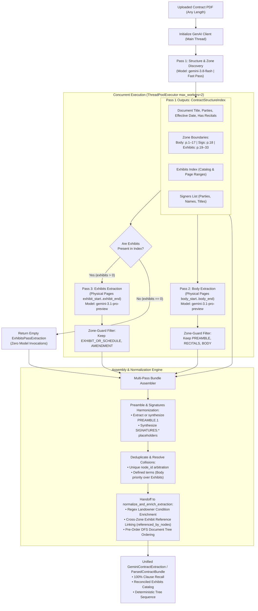

# Change Request CR-5: Semantic Zone Multi-Pass Contract Extraction Pipeline (Option 3A)

* **CR ID:** `CR-005` (Semantic Zone Multi-Pass Contract Extraction Pipeline — `v0.6.0`)
* **Status:** Ready for Implementation 
* **Parent Architecture:** [DESIGN_DOC.md](file:///usr/local/google/home/prasannaankem/Code/Invenergy/Design/DESIGN_DOC.md), [CR1_LANDOWNER_SPECIAL_CONDITIONS.md](file:///usr/local/google/home/prasannaankem/Code/Invenergy/Design/CR1_LANDOWNER_SPECIAL_CONDITIONS.md), [CR2_PROJECT_PORTFOLIO_HIERARCHY.md](file:///usr/local/google/home/prasannaankem/Code/Invenergy/Design/CR2_PROJECT_PORTFOLIO_HIERARCHY.md), [CR3_SUBCONTRACTOR_DND_CHECKLIST.md](file:///usr/local/google/home/prasannaankem/Code/Invenergy/Design/CR3_SUBCONTRACTOR_DND_CHECKLIST.md), [CR4_BIGQUERY_DATA_AGENT_CHAT.md](file:///usr/local/google/home/prasannaankem/Code/Invenergy/Design/CR4_BIGQUERY_DATA_AGENT_CHAT.md)
* **Confirmed Architectural Decisions (Fortified via EGM Review):**
  1. **Prompt-Scoped Zone Boundaries (Option 3A):** Rather than mutating PDF byte streams or maintaining fragile binary slicing dependencies (`pypdf`, `pymupdf`), Option 3A passes the complete PDF to Gemini while strictly bounding the visual attention and extraction scope using prompt-directed physical page intervals (`body_start_page`..`body_end_page` and `exhibit_start_page`..`exhibit_end_page`).
  2. **Fast Structure & Zone Discovery via Flash (Pass 1):** Uses `gemini-3.8-flash` (`temperature=0.0`) on the full document to extract high-level contract metadata, exact zone physical page intervals, signer lists, and an index of attached exhibits with page ranges in under 10 seconds.
  3. **Conditional Pass 3 Exhibits Gating:** If a contract has zero exhibits (`index.exhibits` is empty), Pass 3 is bypassed immediately without invoking the model, avoiding unnecessary token usage, empty sequence exceptions, and hallucinatory exhibit extraction.
  4. **Concurrent Execution via `ThreadPoolExecutor(max_workers=2)`:** Pass 2 (Agreement Body) and Pass 3 (Exhibits) run in parallel, keeping wall-clock latency under 85 seconds while doubling generation token output headroom.
  5. **Pre-Initialized GenAI Client:** `self.client` is explicitly initialized on the main thread prior to worker thread dispatch to prevent race conditions on client instantiation.
  6. **Strict Zone-Guard Filtering & Collision Resolution:** The assembler strictly enforces zone boundaries (discarding exhibit clauses accidentally produced in Pass 2 and body clauses produced in Pass 3) and resolves any shared boundary page collisions on `node_id` deterministically.
  7. **Fallback Preamble Synthesis & Standardized Signature Placeholders:** Pass 2 extracts text-based `PREAMBLE.1` and `RECITALS.*` clauses if present. If missing, the assembler synthesizes a root `PREAMBLE.1` fallback using `document_title` from Pass 1. Signature pages are synthesized as `SIGNATURES.*` nodes tagged with `hitl_status=PLACEHOLDER_FOR_REVIEW` and `hitl_flag_reasons=DEFERRED_MODALITY_PLACEHOLDER`.
  8. **Defined Term Priority & Direct Normalizer Delegation:** Defined terms are deduplicated giving priority to Body definitions over Exhibit definitions. The merged extraction is handed directly to the existing [normalize_and_enrich_extraction](file:///usr/local/google/home/prasannaankem/Code/Invenergy/contract_parser/gemini_parser.py#L774), reusing battle-tested regex enrichment, exhibit cross-referencing (`referenced_by_nodes`), condition deduplication, and pre-order DFS tree ordering.
  9. **Resilient Failure Recovery:** If Pass 1 fails or returns unparseable structural data, the pipeline logs a warning and falls back cleanly to the single-pass extraction engine.

---

## 1. The Problem

### Business Context
The Invenergy Contract Intelligence Workbench is designed to ingest complex, multi-page renewable energy agreements (such as land leases, transmission easements, and solar/wind rights-of-way) ranging from 10 to 60+ pages. These agreements govern critical operational obligations, physical site constraints (fencing, setbacks, drain tiles, livestock, burial depths), rent escalations, and rights of first refusal.

### The Breakdown on 30+ Page Documents
When tested against real-world scanned agreements (specifically [samples/SOKGRN0003_Solar Lease and Easement Agreement_Green Bandit LLC_111418.pdf](file:///usr/local/google/home/prasannaankem/Code/Invenergy/samples/SOKGRN0003_Solar%20Lease%20and%20Easement%20Agreement_Green%20Bandit%20LLC_111418.pdf), a 33-page scanned solar lease), the single-pass extraction engine experienced severe data omission:
- **Expected Hierarchy:** Document Title, Preamble, 14 major Body sections (Sections 1–14 across Pages 1–17 with 60+ subsections), Signatures (Page 18), and 5 attached Exhibits (Exhibit A Legal Description, Exhibit A-1 Plat Map, Exhibit B Payment Terms, Exhibit C Special Conditions, Exhibit D Recording Memorandum across Pages 19–33).
- **Actual Extraction Result:** Only 22 total clauses were extracted. Over 80% of the agreement body (Sections 3 through 14) and 4 out of 5 exhibits (Exhibits A, A-1, B, and D) were skipped. Only clauses containing high-signal landowner site constraints (`BODY.8.8`, `BODY.14.16`, `EXHIBIT_C.1/4/5/6/7`) were retained.

### Root Cause
This is not an input context window limitation. The 33 scanned pages consume ~9,000 input tokens, well within Gemini's 1-million-token input window. Rather, it is caused by **LLM output generation token ceiling and attention pruning**:
1. Asking the model to output a single JSON document containing every clause, verbatim excerpt, full reconstructed context text, numbering scheme, defined terms, and audit flags across 33 pages produces an estimated 35,000–50,000 tokens of dense structured JSON.
2. Under this high output load, Gemini's internal generation heuristics prune perceived "boilerplate" provisions, dropping Sections 3 through 14 and entire exhibits.
3. Hardcoded exemplar references in the system prompt (referencing an earlier 12-page synthetic contract with Sections 1–17 and Exhibits A–D) further biased the model.

---

## 2. The Technical Plan

Option 3A establishes a **Semantic Zone Multi-Pass Pipeline**. It breaks the extraction into three targeted, prompt-scoped passes across the natural legal zones of the contract without requiring binary PDF slicing.



---

### Component Breakdown

#### 1. Pass 1: Discovery & Structural Indexing (`_discover_contract_structure`)
* **Engine:** Fast multimodal pass using `gemini-3.8-flash` (`temperature=0.0`).
* **Input:** Entire PDF multimodal part + system instruction.
* **Schema (`ContractStructureIndex`):**
  * `document_title`: Formal title of the contract (e.g. `SOLAR LEASE AND EASEMENT AGREEMENT`).
  * `grantor_landowner_name`: Canonical grantor counterparty name.
  * `grantee_entity_name`: Canonical grantee/developer subsidiary.
  * `effective_date`: Execution/effective date in ISO-8601 (`YYYY-MM-DD`) or formal date string.
  * `has_recitals`: Boolean flag (true if `WHEREAS` clauses exist).
  * `body_start_page`: First physical page of the agreement body (typically 1).
  * `body_end_page`: Final physical page of the agreement body before signatures/exhibits.
  * `signature_start_page`: Physical page where signatures/execution blocks begin (or `None`).
  * `signature_end_page`: Physical page where signatures/execution blocks end (or `None`).
  * `signers`: Structured list of `SignerEntry` records (party name, signer name, signer title, page number).
  * `exhibits`: List of `ExhibitIndexEntry` records (exhibit identifier, title, modality, `page_start`, `page_end`).
* **Failure Recovery:** If Pass 1 raises an exception or fails JSON parsing after configured retries, log a warning and fallback immediately to `_extract_single_pass()`.

#### 2. Pass 2: Agreement Body Extraction (`_extract_body_pass`)
* **Engine:** Primary model (`gemini-3.1-pro-preview` with `gemini-3.8-flash` fallback, `temperature=0.0`).
* **Input:** Full PDF + prompt-scoped directive:
  > *"You are extracting the Main Agreement Body. Inspect ONLY physical pages {body_start_page} to {body_end_page}. Extract every single numbered section (e.g. Sections 1 through 14) and all nested subsections, subparagraphs ((a), (b), (i)), verbatim text, reconstructed context, defined terms, and site constraints. Do NOT extract Exhibits or Signatures."*
* **Output Schema:** `BodyPassExtraction` (`clauses: list[ClauseRow]`, `defined_terms: list[DefinedTermRow]`, `special_conditions: list[SpecialConditionRow]`).
* **Zone-Guard Filtering:** Discard any clause where `document_zone` is `EXHIBIT_OR_SCHEDULE` or `AMENDMENT` to prevent boundary bleed.

#### 3. Pass 3: Exhibits & Schedules Extraction (`_extract_exhibits_pass`)
* **Conditional Gating:** Executed if and only if `index.exhibits` is non-empty. If empty, return `ExhibitsPassExtraction()` immediately.
* **Engine:** Primary model (`gemini-3.1-pro-preview` with `gemini-3.8-flash` fallback, `temperature=0.0`).
* **Page Span Determination:**
  * `exhibit_start_page = min(e.page_start for e in index.exhibits)`
  * `exhibit_end_page = max(e.page_end for e in index.exhibits)`
* **Input:** Full PDF + prompt-scoped directive:
  > *"You are extracting the Exhibits and Schedules. Inspect ONLY physical pages {exhibit_start_page} to {exhibit_end_page}. Extract all clauses across attached exhibits, legal land descriptions (Exhibit A), payment fee schedules (Exhibit B), special conditions and covenants (Exhibit C), and recording memorandums (Exhibit D). Do NOT extract the main Agreement Body."*
* **Output Schema:** `ExhibitsPassExtraction` (`clauses: list[ClauseRow]`, `defined_terms: list[DefinedTermRow]`, `special_conditions: list[SpecialConditionRow]`, `exhibits_catalog: list[ExhibitCatalogRow]`).
* **Zone-Guard Filtering:** Discard any clause where `document_zone` is `PREAMBLE`, `RECITALS`, or `BODY`.

#### 4. ThreadPool Execution & Thread Safety
* **Pre-Initialization:** Access `_ = self.client` on the main thread prior to spawning the `ThreadPoolExecutor` to eliminate lazy-instantiation race conditions.
* **Dispatch:**
  ```python
  with concurrent.futures.ThreadPoolExecutor(max_workers=2) as executor:
      future_body = executor.submit(self._extract_body_pass, pdf_part=pdf_part, index=index)
      if index.exhibits:
          future_exhibits = executor.submit(self._extract_exhibits_pass, pdf_part=pdf_part, index=index)
      else:
          future_exhibits = None
  ```
* **Latency Guarantee:** Parallel execution completes in ~60–80 seconds total wall-clock time.

#### 5. Multi-Pass Bundle Assembler (`_assemble_multi_pass_extraction`)
* **Preamble Harmonization:** Checks if Pass 2 produced a `PREAMBLE.1` node. If present, preserves its extracted text; if absent, synthesizes a root `PREAMBLE.1` node using `index.document_title`.
* **Signature Synthesis:** If `index.signature_start_page` is set, synthesizes `SIGNATURES.1` (and `SIGNATURES.2` for multi-page execution blocks) with `document_zone=DocumentZone.SIGNATURES`, `hitl_status=HITLStatus.PLACEHOLDER_FOR_REVIEW`, and `hitl_flag_reasons=FlagCode.DEFERRED_MODALITY_PLACEHOLDER.value`.
* **Clause Merging & Deduplication:** Merges body and exhibit clauses into a unified list. If a `node_id` collision occurs on shared boundary pages, preserves the body clause for body zones and exhibit clause for exhibit zones.
* **Exhibits Catalog Reconciler:** Merges the catalog returned by Pass 3 with the catalog discovered in Pass 1 to ensure 100% catalog coverage even for image-only or stub exhibits.
* **Defined Terms Deduplication:** Deduplicates by normalized uppercase term name (`term_name.upper()`). If a term is defined in both Body and Exhibits, the Body definition takes precedence.
* **Handoff to Normalizer:** Hands the synthesized `GeminiContractExtraction` directly to `normalize_and_enrich_extraction`:
  * Computes `referenced_by_nodes` on `exhibits_catalog` via regex matching across all clauses.
  * Re-computes `term_usage_map` across all clauses.
  * Attaches special conditions to most-specific leaf nodes and runs regex fallback.
  * Enforces pre-order DFS document tree order via `sort_clauses_in_document_order`.

---

## 3. Alternatives Considered and Ruled Out

| Alternative | Rationale for Ruling Out |
| :--- | :--- |
| **Alternative 1: Single-Pass Prompt Optimization** | Merely increasing `max_output_tokens` or altering instructions in a single prompt does not solve the model's fundamental attention dilution across 30+ pages. The model prunes dense legal boilerplate to satisfy single-turn generation limits. |
| **Alternative 2: Arbitrary Fixed-Page Chunking (e.g., Slicing Every 8 Pages)** | Splitting every 8 pages slices long sections or sentences in half across page boundaries. It requires complex heuristic clause stitching, breaks parent-child context trees, and risks misclassifying sub-clauses whose parent appeared 2 pages earlier. |
| **Alternative 3B: Hard Binary PDF Slicing in Memory** | Physically splitting the PDF binary into separate byte buffers using `pypdf` adds heavy external dependencies, risks corrupting legacy CCITT-encoded scanner streams (like ScanSnap 1.3), and prevents the model from seeing transition context at boundary pages (such as where a signature block and Exhibit A share a page). Option 3A leverages Gemini's native multimodal page-indexing ability cleanly without binary manipulation. |
| **Alternative 4: Per-Exhibit Sequential Loops** | Running a separate extraction call for each individual exhibit (e.g. 5 sequential calls for Exhibits A, A-1, B, C, D) increases overall extraction latency to over 4 minutes, risking Cloud Run HTTP request timeouts (which default to 300s/1800s). Grouping all exhibits into a single Pass 3 keeps total latency under 85 seconds. |

---

## 4. Detailed Implementation: Affected Files & Exact Schemas

### 1. `contract_parser/schemas.py`

Add intermediate Pydantic models for Pass 1, Pass 2, and Pass 3:

```python
class ExhibitIndexEntry(BaseModel):
    """Pass 1: Exhibit summary entry in the structural index."""

    model_config = ConfigDict(extra="ignore")

    exhibit_id: str = Field(description="Identifier (e.g. 'Exhibit A', 'Exhibit B', 'Exhibit C')")
    exhibit_title: str = Field(description="Title or subject of the exhibit (e.g. 'Legal Description', 'Payment Terms')")
    page_start: int = Field(ge=1, description="First physical PDF page of this exhibit")
    page_end: int = Field(ge=1, description="Final physical PDF page of this exhibit")
    exhibit_modality: ExhibitModality = Field(
        default=ExhibitModality.PROSE_CLAUSES,
        description="Modality classification of the exhibit",
    )


class SignerEntry(BaseModel):
    """Pass 1: Signer or execution block entry."""

    model_config = ConfigDict(extra="ignore")

    party_name: str = Field(description="Counterparty name for this signature block")
    signer_name: str | None = Field(default=None, description="Printed or typed individual signer name")
    signer_title: str | None = Field(default=None, description="Official title of the signer")
    page_number: int = Field(ge=1, description="Physical page number containing this signature block")


class ContractStructureIndex(BaseModel):
    """Pass 1: High-level structural and zone boundary index returned by gemini-3.8-flash."""

    model_config = ConfigDict(extra="ignore")

    document_title: str = Field(description="Formal title of the agreement")
    grantor_landowner_name: str | None = Field(default=None, description="Canonical grantor counterparty name")
    grantee_entity_name: str | None = Field(default=None, description="Canonical grantee counterparty name")
    effective_date: str | None = Field(default=None, description="Execution or effective date string")
    has_recitals: bool = Field(default=False, description="True if agreement contains WHEREAS recitals")
    body_start_page: int = Field(default=1, ge=1, description="First physical page of the agreement body")
    body_end_page: int = Field(default=1, ge=1, description="Final physical page of the agreement body before signatures/exhibits")
    signature_start_page: int | None = Field(default=None, description="Physical page where signature blocks begin")
    signature_end_page: int | None = Field(default=None, description="Physical page where signature blocks end")
    signers: list[SignerEntry] = Field(default_factory=list, description="Extracted signer blocks")
    exhibits: list[ExhibitIndexEntry] = Field(default_factory=list, description="Attached exhibits and their page spans")


class BodyPassExtraction(BaseModel):
    """Pass 2: Extracted body sections, defined terms, and body special conditions."""

    model_config = ConfigDict(extra="ignore")

    clauses: list[ClauseRow] = Field(default_factory=list, description="Body clauses (Sections 1..N and subsections)")
    defined_terms: list[DefinedTermRow] = Field(default_factory=list, description="Defined terms defined within the body")
    special_conditions: list[SpecialConditionRow] = Field(default_factory=list, description="Site constraints located in the body")


class ExhibitsPassExtraction(BaseModel):
    """Pass 3: Extracted exhibit clauses, exhibit defined terms, and exhibit special conditions."""

    model_config = ConfigDict(extra="ignore")

    clauses: list[ClauseRow] = Field(default_factory=list, description="Clauses extracted from exhibits and schedules")
    defined_terms: list[DefinedTermRow] = Field(default_factory=list, description="Defined terms defined in exhibits")
    special_conditions: list[SpecialConditionRow] = Field(default_factory=list, description="Site constraints located in exhibits")
    exhibits_catalog: list[ExhibitCatalogRow] = Field(default_factory=list, description="Detailed exhibit catalog entries")
```

---

### 2. `contract_parser/config.py`

Add configuration settings to [PipelineConfig](file:///usr/local/google/home/prasannaankem/Code/Invenergy/contract_parser/config.py#L11-L70):

```python
    multi_pass_enabled: bool = field(
        default_factory=lambda: os.getenv("MULTI_PASS_ENABLED", "true").lower() in ("true", "1", "yes")
    )
    fast_discovery_model: str = field(
        default_factory=lambda: os.getenv("FAST_DISCOVERY_MODEL", "gemini-3.8-flash")
    )
```

---

### 3. `contract_parser/gemini_parser.py`

Refactor extraction flow:
1. Retain existing single-pass logic as `_extract_single_pass()`.
2. Implement `_discover_contract_structure(pdf_part, total_pages) -> ContractStructureIndex`.
3. Implement `_extract_body_pass(pdf_part, index) -> BodyPassExtraction`.
4. Implement `_extract_exhibits_pass(pdf_part, index) -> ExhibitsPassExtraction`.
5. Implement `_assemble_multi_pass_extraction(index, body_pass, exhibits_pass, total_pages) -> GeminiContractExtraction`.
6. Implement `extract()`:
   * If `not self.config.multi_pass_enabled`, run `_extract_single_pass()`.
   * Otherwise, run Pass 1. If Pass 1 fails, log warning and run `_extract_single_pass()`.
   * Execute Pass 2 and conditional Pass 3 via `ThreadPoolExecutor(max_workers=2)`.
   * Assemble raw bundle and call `normalize_and_enrich_extraction()`.

---

### 4. `tests/test_pipeline.py`

Add comprehensive unit and integration tests:
1. `test_multi_pass_assembler_merges_cleanly`: Validates `_assemble_multi_pass_extraction` with synthetic Pass 1, 2, and 3 inputs, verifying:
   * Preamble is populated.
   * Signatures placeholder is synthesized.
   * Defined terms are deduplicated.
   * Pre-order tree sequence is preserved.
2. `test_multi_pass_zero_exhibits_short_circuit`: Validates that when `index.exhibits = []`, Pass 3 is bypassed, returning clean bundle with zero exhibits.
3. `test_multi_pass_shared_boundary_page_collision_resolution`: Validates that if Pass 2 and Pass 3 both contain nodes from a shared boundary page (e.g. Page 18), zone-guards filter correctly and duplicate `node_id`s are resolved.
4. `test_live_sokgrn0003_multi_pass_completeness`: Live integration test on `samples/SOKGRN0003_Solar Lease and Easement Agreement_Green Bandit LLC_111418.pdf`:
   * Asserts total clauses > 65.
   * Asserts all 14 Body sections (`BODY.1` through `BODY.14`) are present.
   * Asserts exhibits `EXHIBIT_A`, `EXHIBIT_B`, `EXHIBIT_C`, and `EXHIBIT_D` are populated.
   * Asserts defined terms count > 30.

---

### 5. `Changelog.md`

Append release notes for `v0.6.0` documenting Change Request CR-5 upon completion without altering existing historical entries.

---

## 5. Evaluation & Verification Criteria

| Metric / Criterion | Single-Pass Baseline | Multi-Pass Target (CR-5) | Verification Method |
| :--- | :--- | :--- | :--- |
| **Clause Count on SOKGRN0003** | 22 clauses | **> 65 clauses** | `len(extraction.clauses) > 65` |
| **Body Section Coverage** | Sections 1, 2, 8.8, 14.16 only | **All 14 Sections (`BODY.1`..`BODY.14`)** | Validate presence of `BODY.3` through `BODY.13` |
| **Exhibits Coverage** | Exhibit C only (4 clauses) | **All 5 Exhibits (A, A-1, B, C, D)** | Validate presence of `EXHIBIT_A.*`, `EXHIBIT_B.*`, `EXHIBIT_C.*`, `EXHIBIT_D.*` |
| **Defined Terms Dictionary** | 12 terms | **> 30 terms** | `len(extraction.defined_terms) > 30` spanning Body and Exhibits |
| **Site Constraints Coverage** | 3 conditions | **8 distinct conditions** | Verification of all Exhibit C covenants (fencing, setbacks, bond, ROFR, living quarters) |
| **Zero-Exhibit Resilience** | Not tested | **Clean execution** | Unit test verifying zero-exhibit documents bypass Pass 3 |
| **Tree Traversal Integrity** | Basic DFS | **100% pre-order DFS** | Verify zero cyclic references or orphaned nodes |
| **Wall-Clock Latency** | ~45 seconds | **< 85 seconds** | Timing assertions across parallel worker execution |
