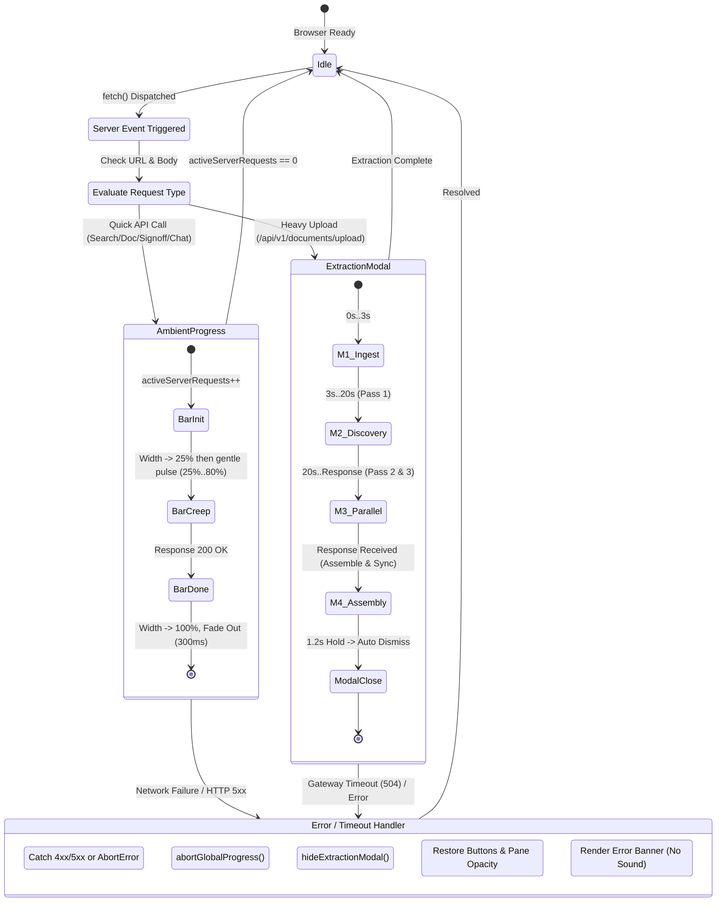

# Change Request CR-6: Universal Client-Server Event Progress & Extraction Milestone System

* **CR ID:** `CR-006` (Universal Client-Server Event Progress & Extraction Milestone System — `v0.7.0`)
* **Status:** Ready for Implementation 
* **Parent Architecture:** [DESIGN_DOC.md](file:///usr/local/google/home/prasannaankem/Code/Invenergy/Design/DESIGN_DOC.md), [CR1_LANDOWNER_SPECIAL_CONDITIONS.md](file:///usr/local/google/home/prasannaankem/Code/Invenergy/Design/CR1_LANDOWNER_SPECIAL_CONDITIONS.md), [CR2_PROJECT_PORTFOLIO_HIERARCHY.md](file:///usr/local/google/home/prasannaankem/Code/Invenergy/Design/CR2_PROJECT_PORTFOLIO_HIERARCHY.md), [CR3_SUBCONTRACTOR_DND_CHECKLIST.md](file:///usr/local/google/home/prasannaankem/Code/Invenergy/Design/CR3_SUBCONTRACTOR_DND_CHECKLIST.md), [CR4_BIGQUERY_DATA_AGENT_CHAT.md](file:///usr/local/google/home/prasannaankem/Code/Invenergy/Design/CR4_BIGQUERY_DATA_AGENT_CHAT.md), [CR5_SEMANTIC_ZONE_MULTI_PASS_EXTRACTION.md](file:///usr/local/google/home/prasannaankem/Code/Invenergy/Design/CR5_SEMANTIC_ZONE_MULTI_PASS_EXTRACTION.md)
* **Confirmed Architectural Decisions (Fortified via EGM Review):**
  1. **Targeted `/api/v1/` Route Interception via Native `window.fetch` Wrapping:** The interceptor explicitly restricts interception to local `/api/v1/` routes. External static assets (fonts, PDF.js web workers, CDN scripts, and data/blob URLs) are bypassed directly, guaranteeing zero cross-origin interference or unwanted progress activations.
  2. **Reference-Counted Concurrency (`activeServerRequests`):** Tracks concurrent background network dispatches using an atomic integer counter. The ambient top progress bar initiates on the first active server call and smoothly concludes only when all concurrent server operations resolve to 0.
  3. **Dual-Surface Visual Feedback Paradigm:**
     - **Top-Edge Slim Ambient Progress Bar (`#global-top-progress`):** A fixed 3px gradient line (`#118751` to `--brand-yellow: #FFCF0B`) running across the very top viewport boundary for quick server-side events (300ms–3s), paired with subtle pane dimming (`opacity: 0.65`).
     - **Center Glassmorphism Extraction Modal (`#extraction-modal-overlay`):** A dedicated full-screen blurred backdrop (`backdrop-filter: blur(14px)`) containing an emerald glass card (`#0A3822`), live millisecond stopwatch (`⏱ Elapsed: MM:SS / ~03:30 est.`), glowing gradient pulse bar, and four phased milestone cards for long-running PDF contract extractions (~210–230s).
  4. **Strict AbortError & Debounce Cancellation Filtering:** If an `AbortError` occurs (e.g. rapid keystrokes in portfolio search canceling prior in-flight queries via `AbortController`), the error handler quietly decrements the reference counter without raising false-positive error alerts.
  5. **DOM Selector Parity (`#upload-btn`):** The modal launcher and teardown routines bind strictly to the actual DOM ID `#upload-btn` from `contract_parser/static/index.html` (avoiding hypothetical IDs like `#upload-submit-btn`), ensuring reliable button state restoration.
  6. **Dynamic Heuristic Milestone Catch-Up & Stagnation Guard:**
     - **Early Resolution:** If a smaller contract completes before Milestone 3 or Milestone 4 duration targets, the system immediately fast-forwards all preceding stages to `.milestone-done`, presents Milestone 4 briefly (1.2s hold), and concludes cleanly.
     - **Extended Latency Resilience:** If extraction exceeds 210s, Milestone 3 remains in its glowing active state with an informative subtitle (`Reasoning on dense covenants...`) while the live stopwatch continues running accurately without stalling or freezing.
  7. **Modal Backdrop Isolation & Focus Trapping:** The extraction modal applies `pointer-events: auto` and captures backdrop click events, preventing background UI clicks, double submissions, or keyboard navigation while extraction is active.
  8. **Deterministic Error and Timeout Teardown:** If an HTTP error (500, 502, 503, 504), network disconnect, or client timeout occurs, the progress bar and glassmorphic modal immediately dismantle (`abortGlobalProgress()` and `hideExtractionModal()`), re-enabling controls and presenting an error alert toast banner.
  9. **Strict Zero-Audio Mandate:** The application enforces complete silence across all loading, completion, and error states. No audio contexts (`AudioContext`), synthetic oscillator chimes, or audio tags (`<audio>`) are instantiated.
  10. **Hardware-Accelerated Layout Neutrality:** All animations utilize CSS transforms, opacity, and hardware-accelerated filters (`backdrop-filter`, `transform: translate3d(0,0,0)`), guaranteeing zero layout reflows or UI jitter during rapid state changes.

---

## 1. The Problem & Usability Gap

### Operational Context
The Invenergy Contract Intelligence Workbench orchestrates complex workflows across two distinct latency profiles:

1. **Micro-Latency Server Events (300ms – 2.5s):**
   - Document switching via portfolio selector (`GET /api/v1/documents/{doc_id}`).
   - Cross-portfolio semantic search (`GET /api/v1/portfolio/search`).
   - Field crew Do-Not-Disturb signoffs (`POST /api/v1/documents/{doc_id}/dnd-checklist:signoff`).
   - Human-in-the-loop clause overrides (`POST /api/v1/documents/{doc_id}/clauses/{node_id}`).
   - BigQuery Conversational Analytics queries (`POST /api/v1/agent/chat`).
   - Project catalog loading (`GET /api/v1/projects`).

2. **Macro-Latency AI Extraction Pipeline (210s – 230s):**
   - Ingestion of 30+ page scanned renewable energy contracts (e.g. `SOKGRN0003` 33-page Solar Lease) via `POST /api/v1/documents/upload`.
   - Executes multi-pass extraction under CR-5: Pass 1 Discovery (~16s), concurrent Pass 2 & Pass 3 (~195s), and assembly/BigQuery insertion (~2s).

### The Usability Breakdown
Prior to this Change Request, the user interface suffered from critical telemetry deficiencies:
- **Zero Feedback on Quick Actions:** Switching documents or searching gave no indication that a server roundtrip was active. Users frequently double-clicked or assumed the interface was unresponsive.
- **The "3-Minute Black Box":** During PDF upload, only the upload button disabled itself with static text (`Parsing & Binding to Project...`). The main workspace remained completely static for ~220 seconds. Users had no visibility into whether the backend was processing, hung, or had timed out in Cloud Run.
- **The "99% Stall" Failure Pattern:** Simple simulated percentage progress bars fail catastrophically on LLM workloads because reasoning latency varies. Progress bars that tick to 95% and sit frozen cause users to refresh and abandon the upload.
- **Stuck Loading States on Failure:** When a network disconnect or Cloud Run 504 gateway timeout occurred, loading spinners remained perpetually spinning.

---

## 2. Technical Architecture

```
                               ┌────────────────────────────────────────────────────────┐
                               │              User Action / Server Event                │
                               │  (Search, Doc Change, Signoff, Chat, or PDF Upload)   │
                               └───────────────────────────┬────────────────────────────┘
                                                           │
                                                           ▼
                                         ┌───────────────────────────────────┐
                                         │     window.fetch Interceptor      │
                                         │   activeServerRequests Counter    │
                                         └─────────┬─────────────────────────┘
                                                   │
                            ┌──────────────────────┴──────────────────────┐
                            ▼                                             ▼
              [All Server API Calls]                        [PDF Upload API Call]
              Top-Edge Ambient Bar (3px)                    Glassmorphism Milestone Modal
              (#global-top-progress)                        (#extraction-modal-overlay)
                            │                                             │
                            └──────────────────────┬──────────────────────┘
                                                   │
                                  ┌────────────────┴────────────────┐
                                  ▼                                 ▼
                          [Success (200 OK)]               [Timeout / Server Error]
                      - Advance to 100% width              - abortGlobalProgress()
                      - Fade out smoothly (300ms)          - hideExtractionModal()
                      - Reset counter                      - Reset UI buttons & panes
                                                           - Display error notification banner
```

---

## 3. Component Specifications

### 3.1 Top-Edge Ambient Progress Bar (`#global-top-progress`)

A continuous micro-progress indicator inspired by high-throughput platform standards:
- **DOM Placement:** First child directly inside `<body>`.
- **CSS Styling:**
  ```css
  #global-top-progress {
    position: fixed;
    top: 0;
    left: 0;
    height: 3px;
    width: 0%;
    background: linear-gradient(90deg, var(--brand-invenergy-green, #118751), var(--brand-yellow, #FFD100));
    box-shadow: 0 0 10px rgba(17, 135, 81, 0.6), 0 0 4px rgba(255, 209, 0, 0.4);
    z-index: 999999;
    pointer-events: none;
    opacity: 0;
    transition: width 240ms cubic-bezier(0.16, 1, 0.3, 1), opacity 200ms ease;
  }
  ```
- **Lifecycle:**
  - `startGlobalProgress()`: Sets `opacity: 1`, advances width immediately to 25%, and sets a gentle incremental creep toward 80% while waiting.
  - `finishGlobalProgress()`: Advances width to 100%, waits 180ms, transitions `opacity: 0`, and resets width to 0% after 250ms.
  - `abortGlobalProgress()`: Instantly cuts `opacity: 0` and resets `width: 0%`.

---

### 3.2 Center Glassmorphism Extraction Modal (`#extraction-modal-overlay`)

Dedicated extraction monitoring surface for heavy PDF contract ingestion:
- **DOM Placement:** Directly inside `<body>`, hidden by default (`display: none;`).
- **Overlay Container:**
  ```css
  .extraction-modal-overlay {
    position: fixed;
    inset: 0;
    background: rgba(4, 43, 25, 0.72);
    backdrop-filter: blur(14px);
    -webkit-backdrop-filter: blur(14px);
    z-index: 1000000;
    display: none;
    align-items: center;
    justify-content: center;
    padding: 20px;
  }
  ```
- **Glassmorphic Card (`.extraction-modal-card`):**
  - **Dimensions:** Max-width 560px, width 100%.
  - **Surface:** `background: linear-gradient(135deg, rgba(10, 56, 34, 0.88), rgba(4, 43, 25, 0.94));`
  - **Border:** `1px solid rgba(206, 228, 218, 0.28);`
  - **Shadow:** `0 24px 48px -12px rgba(0, 0, 0, 0.5), 0 0 0 1px rgba(255, 255, 255, 0.08);`
  - **Border Radius:** `16px;`
- **Dynamic Elements:**
  - **Contract Document Badge:** Displays the uploaded PDF filename and file size in KB/MB.
  - **Live Millisecond Stopwatch:** Running counter `⏱ 01:24 / ~03:30 est.` tracking exact elapsed time.
  - **Indeterminate Pulse Bar:** Glowing emerald/amber gradient with `@keyframes shimmer` indicating uninterrupted server activity.
  - **4 Milestone Cards:**
    1. *Binary Integrity & Ingestion Storage*
    2. *Pass 1: Structure & Zone Discovery*
    3. *Pass 2 & 3: Parallel Zone Deep Extraction*
    4. *Assembly, Tree Ordering & BigQuery Sync*

#### Milestone Card Visual States
- **Pending (`.milestone-pending`):** Subtle outline, muted text, hollow status ring.
- **Active (`.milestone-active`):** Pulsing emerald glow (`box-shadow: 0 0 12px rgba(17, 135, 81, 0.4)`), animated circular spinner icon, highlighted title.
- **Completed (`.milestone-done`):** Solid green fill, emerald checkmark icon, crisp white typography.

---

## 4. State Machine & Event Lifecycle



---

## 5. Universal Fetch Interceptor Implementation

The native `window.fetch` function is wrapped directly upon document initialization in [contract_parser/static/index.html](file:///usr/local/google/home/prasannaankem/Code/Invenergy/contract_parser/static/index.html). The interceptor scopes telemetry strictly to internal `/api/v1/` routes and silently filters `AbortError` instances to avoid false-positive error toasts during debounced search cancellations:

```javascript
// Universal Server Event Telemetry Interceptor
let activeServerRequests = 0;
const originalFetch = window.fetch;

window.fetch = async function(...args) {
  const url = typeof args[0] === 'string' ? args[0] : (args[0] && args[0].url) || '';
  
  // Scope exclusively to local API routes; bypass fonts, CDNs, PDF.js workers, and data URLs
  const isApiCall = typeof url === 'string' && url.includes('/api/v1/');
  if (!isApiCall) {
    return originalFetch.apply(this, args);
  }

  const isUpload = url.includes('/api/v1/documents/upload');

  activeServerRequests++;
  startGlobalProgress();

  if (isUpload) {
    const filename = (args[1] && args[1].body instanceof FormData)
      ? (args[1].body.get('file')?.name || 'Contract Document')
      : 'Contract Document';
    showExtractionModal(filename);
  }

  try {
    const response = await originalFetch.apply(this, args);
    
    if (!response.ok) {
      handleServerError(response.status, response.statusText, isUpload);
    } else if (isUpload) {
      handleExtractionSuccess();
    }
    
    return response;
  } catch (error) {
    // Quietly ignore AbortError (triggered when rapid search keystrokes cancel stale queries)
    if (error.name === 'AbortError') {
      return Promise.reject(error);
    }
    handleServerError(0, error.message || 'Network Timeout / Connection Error', isUpload);
    throw error;
  } finally {
    activeServerRequests = Math.max(0, activeServerRequests - 1);
    if (activeServerRequests === 0) {
      finishGlobalProgress();
    }
  }
};
```

---

## 6. Complete Lifecycle and Helper Function Implementations

### 6.1 Top Ambient Bar Functions
```javascript
let progressCreepInterval = null;
let currentProgressWidth = 0;

function startGlobalProgress() {
  const bar = document.getElementById('global-top-progress');
  if (!bar) return;
  
  // Dim background panes subtly
  document.querySelectorAll('.app-pane').forEach(el => el.classList.add('pane-dimmed'));
  
  clearInterval(progressCreepInterval);
  bar.style.opacity = '1';
  currentProgressWidth = Math.max(currentProgressWidth, 25);
  bar.style.width = currentProgressWidth + '%';

  // Incremental creep towards 80%
  progressCreepInterval = setInterval(() => {
    if (currentProgressWidth < 80) {
      currentProgressWidth += Math.random() * 4 + 1;
      bar.style.width = Math.min(80, currentProgressWidth) + '%';
    }
  }, 180);
}

function finishGlobalProgress() {
  const bar = document.getElementById('global-top-progress');
  if (!bar) return;

  clearInterval(progressCreepInterval);
  currentProgressWidth = 100;
  bar.style.width = '100%';

  // Undim panes
  document.querySelectorAll('.app-pane').forEach(el => el.classList.remove('pane-dimmed'));

  setTimeout(() => {
    bar.style.opacity = '0';
    setTimeout(() => {
      bar.style.width = '0%';
      currentProgressWidth = 0;
    }, 250);
  }, 200);
}

function abortGlobalProgress() {
  const bar = document.getElementById('global-top-progress');
  if (!bar) return;

  clearInterval(progressCreepInterval);
  currentProgressWidth = 0;
  bar.style.opacity = '0';
  bar.style.width = '0%';
  document.querySelectorAll('.app-pane').forEach(el => el.classList.remove('pane-dimmed'));
}
```

### 6.2 Extraction Modal & Milestone Controller
```javascript
let extractionTimerInterval = null;
let extractionStartTime = 0;
let milestoneScheduleTimeouts = [];

function showExtractionModal(filename) {
  const overlay = document.getElementById('extraction-modal-overlay');
  const filenameEl = document.getElementById('extraction-doc-name');
  if (!overlay) return;

  if (filenameEl) filenameEl.textContent = filename || 'Uploaded Contract';
  overlay.style.display = 'flex';

  // Reset milestone cards
  for (let i = 1; i <= 4; i++) {
    const card = document.getElementById(`milestone-card-${i}`);
    if (card) {
      card.className = 'milestone-card milestone-pending';
    }
  }

  // Start stopwatch
  extractionStartTime = Date.now();
  const timerEl = document.getElementById('extraction-timer');
  clearInterval(extractionTimerInterval);
  extractionTimerInterval = setInterval(() => {
    const elapsedSec = Math.floor((Date.now() - extractionStartTime) / 1000);
    const mm = String(Math.floor(elapsedSec / 60)).padStart(2, '0');
    const ss = String(elapsedSec % 60).padStart(2, '0');
    if (timerEl) timerEl.textContent = `⏱ Elapsed: ${mm}:${ss} / ~03:30 est.`;
  }, 500);

  // Clear existing milestone timers
  milestoneScheduleTimeouts.forEach(t => clearTimeout(t));
  milestoneScheduleTimeouts = [];

  // Milestone 1 (0-3s)
  setMilestoneState(1, 'active');

  // Milestone 2 (3-20s)
  milestoneScheduleTimeouts.push(setTimeout(() => {
    setMilestoneState(1, 'done');
    setMilestoneState(2, 'active');
  }, 3200));

  // Milestone 3 (20s until server resolution)
  milestoneScheduleTimeouts.push(setTimeout(() => {
    setMilestoneState(2, 'done');
    setMilestoneState(3, 'active');
  }, 20000));
}

function setMilestoneState(index, state) {
  const card = document.getElementById(`milestone-card-${index}`);
  if (!card) return;
  card.className = `milestone-card milestone-${state}`;
}

function handleExtractionSuccess() {
  milestoneScheduleTimeouts.forEach(t => clearTimeout(t));
  milestoneScheduleTimeouts = [];

  // Rapid catch-up for all preceding stages
  setMilestoneState(1, 'done');
  setMilestoneState(2, 'done');
  setMilestoneState(3, 'done');
  setMilestoneState(4, 'active');

  const pulseBar = document.getElementById('extraction-pulse-bar');
  if (pulseBar) {
    pulseBar.style.width = '100%';
    pulseBar.style.background = 'var(--brand-invenergy-green, #118751)';
  }

  // Hold resolution card briefly, then smoothly dismiss
  setTimeout(() => {
    setMilestoneState(4, 'done');
    setTimeout(() => {
      hideExtractionModal();
    }, 1200);
  }, 600);
}

function hideExtractionModal() {
  const overlay = document.getElementById('extraction-modal-overlay');
  if (overlay) overlay.style.display = 'none';

  clearInterval(extractionTimerInterval);
  milestoneScheduleTimeouts.forEach(t => clearTimeout(t));
  milestoneScheduleTimeouts = [];

  // Restore upload button state
  const btn = document.getElementById('upload-btn');
  if (btn) {
    btn.disabled = false;
    btn.textContent = 'Upload & Parse PDF';
  }
}
```

### 6.3 Error & Teardown Protocol
```javascript
function handleServerError(statusCode, message, isUpload) {
  abortGlobalProgress();

  if (isUpload) {
    hideExtractionModal();
  }

  const errorText = statusCode === 504 
    ? 'Cloud Run Request Timeout (504): The server extraction exceeded the processing deadline.'
    : `Server Error (${statusCode || 'Network Failure'}): ${message}`;
  
  displayGlobalErrorToast(errorText);
}

function displayGlobalErrorToast(message) {
  let toast = document.getElementById('global-error-toast');
  if (!toast) {
    toast = document.createElement('div');
    toast.id = 'global-error-toast';
    toast.className = 'global-error-toast';
    document.body.appendChild(toast);
  }

  toast.innerHTML = `
    <div class="toast-body">
      <span class="toast-icon">⚠️</span>
      <span class="toast-message">${message}</span>
      <button type="button" class="toast-close" onclick="this.parentElement.parentElement.style.opacity='0';">&times;</button>
    </div>
  `;
  toast.style.display = 'block';
  toast.style.opacity = '1';

  // Silent auto-dismiss after 8 seconds
  setTimeout(() => {
    if (toast) {
      toast.style.opacity = '0';
      setTimeout(() => { toast.style.display = 'none'; }, 300);
    }
  }, 8000);
}
```

---

## 7. Zero-Audio Enforcement

To satisfy strict enterprise operations standards, the implementation enforces complete audio silence:
- **No Web Audio API:** No `new AudioContext()`, `webkitAudioContext`, or synthesized oscillator beeps (`oscillator.start()`).
- **No Media Elements:** No `<audio>` tags or `.play()` calls anywhere in HTML or JavaScript.
- **No External Sound Assets:** No bundled or CDN-linked `.mp3`, `.wav`, or `.ogg` sound files.
- **Sensory Replacement:** All feedback is provided through hardware-accelerated CSS micro-motion (opacity fades, spring bezier curves, pulsing box-shadow rings).

---

## 8. Verification and Quality Criteria

| Scenario ID | Test Case | Target Behavior | Verification Metric |
| :--- | :--- | :--- | :--- |
| **UT-PRG-01** | Portfolio Search Trigger | Top-edge progress bar activates immediately on search input debounce | `getComputedStyle(bar).opacity === '1'` and width increases |
| **UT-PRG-02** | Document Switch Trigger | Top-edge progress bar activates during `loadDocumentBundle()` and completes cleanly | Width reaches 100%, fades out in <350ms, leaves zero layout shift |
| **UT-PRG-03** | Concurrent API Calls | Two simultaneous fetches increment counter to 2; bar stays active until both finish | Counter decrements to 0 before `finishGlobalProgress()` |
| **UT-PRG-04** | Debounce Search Cancellation | Rapid typing cancels prior query via `AbortController`; no false error toast raised | `global-error-toast` remains hidden; counter remains balanced |
| **UT-PRG-05** | PDF Upload Modal Launch | Submitting a PDF reveals `#extraction-modal-overlay` with blurred backdrop and live timer | Modal displays `flex`, timer advances every 500ms |
| **UT-PRG-06** | Phased Milestone Cadence | Milestones 1 -> 2 -> 3 transition sequentially during upload | Active milestone classes update without jumping or skipped stages |
| **UT-PRG-07** | Early Catch-Up Completion | Fast contract upload (<25s) marks stages 1-3 as done and displays resolution smoothly | Modal auto-dismisses after 1.2s hold on Milestone 4 |
| **UT-PRG-08** | Server Error Teardown | Simulated 500 error hides top bar and extraction modal in <50ms | Modal `display: none`, upload button `#upload-btn` re-enabled, error toast displayed |
| **UT-PRG-09** | Gateway Timeout (504) Teardown | Simulated 504 timeout tears down modal and displays specific 504 guidance | Modal hidden, no frozen progress bar, zero console errors |
| **UT-PRG-10** | Zero Audio Audit | Full DOM and JS code search for audio APIs | 0 occurrences of `AudioContext`, `HTMLAudioElement`, `.play()`, or `<audio>` |

---

## 9. Rollout and Deployment

1. **Frontend Update:** Apply CSS styles, modal DOM markup, and JavaScript interceptor to [contract_parser/static/index.html](file:///usr/local/google/home/prasannaankem/Code/Invenergy/contract_parser/static/index.html).
2. **Hermetic Regression Suite:** Run existing test suite (`pytest -v`) to confirm zero backend regressions.
3. **Changelog Governance:** Append entry `[0.7.0]` to [Changelog.md](file:///usr/local/google/home/prasannaankem/Code/Invenergy/Changelog.md) without altering existing history.
4. **Cloud Run Deployment:** Build and deploy new revision to Cloud Run (`contract-parser`).

---

## 10. Complete DOM & CSS Implementation Reference

### 10.1 CSS Styles (Appended to `<style>` in `index.html`)

```css
/* ==========================================================================
   CR-6: Universal Progress & Extraction Modal Styles
   ========================================================================== */

#global-top-progress {
  position: fixed;
  top: 0;
  left: 0;
  height: 3px;
  width: 0%;
  background: linear-gradient(90deg, var(--brand-invenergy-green, #118751), var(--brand-yellow, #FFCF0B));
  box-shadow: 0 0 10px rgba(17, 135, 81, 0.6), 0 0 4px rgba(255, 207, 11, 0.4);
  z-index: 999999;
  pointer-events: none;
  opacity: 0;
  transition: width 240ms cubic-bezier(0.16, 1, 0.3, 1), opacity 200ms ease;
}

.pane-dimmed {
  opacity: 0.72;
  transition: opacity 180ms ease;
}

.extraction-modal-overlay {
  position: fixed;
  inset: 0;
  background: rgba(4, 43, 25, 0.78);
  backdrop-filter: blur(14px);
  -webkit-backdrop-filter: blur(14px);
  z-index: 1000000;
  display: none;
  align-items: center;
  justify-content: center;
  padding: 24px;
  pointer-events: auto;
}

.extraction-modal-card {
  width: 100%;
  max-width: 580px;
  background: linear-gradient(145deg, rgba(10, 56, 34, 0.95), rgba(4, 43, 25, 0.98));
  border: 1px solid rgba(206, 228, 218, 0.28);
  border-radius: 16px;
  box-shadow: 0 24px 48px -12px rgba(0, 0, 0, 0.6), 0 0 0 1px rgba(255, 255, 255, 0.1);
  padding: 28px;
  color: #FFFFFF;
}

.extraction-header {
  display: flex;
  justify-content: space-between;
  align-items: flex-start;
  margin-bottom: 20px;
}

.extraction-title {
  font-family: var(--font-display);
  font-size: 18px;
  font-weight: 700;
  color: #FFFFFF;
  letter-spacing: -0.01em;
}

.extraction-subtitle {
  font-size: 12px;
  color: var(--neutrals-sage-green, #CEE4DA);
  margin-top: 4px;
}

.extraction-timer {
  font-family: monospace;
  font-size: 12px;
  font-weight: 600;
  color: var(--brand-yellow, #FFCF0B);
  background: rgba(255, 207, 11, 0.12);
  padding: 4px 10px;
  border-radius: 6px;
  border: 1px solid rgba(255, 207, 11, 0.3);
}

.extraction-pulse-track {
  width: 100%;
  height: 6px;
  background: rgba(206, 228, 218, 0.15);
  border-radius: 999px;
  overflow: hidden;
  margin-bottom: 24px;
  position: relative;
}

.extraction-pulse-bar {
  height: 100%;
  width: 100%;
  background: linear-gradient(90deg, #118751, #FFCF0B, #118751);
  background-size: 200% 100%;
  animation: extractionShimmer 2.2s infinite linear;
  border-radius: 999px;
}

@keyframes extractionShimmer {
  0% { background-position: 200% 0; }
  100% { background-position: -200% 0; }
}

.milestones-container {
  display: flex;
  flex-direction: column;
  gap: 12px;
}

.milestone-card {
  display: flex;
  align-items: center;
  gap: 14px;
  padding: 12px 16px;
  border-radius: 10px;
  border: 1px solid rgba(206, 228, 218, 0.12);
  background: rgba(255, 255, 255, 0.03);
  transition: all 260ms ease;
}

.milestone-pending {
  opacity: 0.45;
}

.milestone-active {
  opacity: 1;
  background: rgba(17, 135, 81, 0.18);
  border-color: rgba(17, 135, 81, 0.6);
  box-shadow: 0 0 16px rgba(17, 135, 81, 0.3);
}

.milestone-done {
  opacity: 0.9;
  background: rgba(206, 228, 218, 0.08);
  border-color: rgba(17, 135, 81, 0.4);
}

.milestone-icon {
  width: 24px;
  height: 24px;
  border-radius: 50%;
  display: flex;
  align-items: center;
  justify-content: center;
  font-size: 11px;
  font-weight: 700;
  flex-shrink: 0;
}

.milestone-pending .milestone-icon {
  background: rgba(255, 255, 255, 0.1);
  color: #AAA;
}

.milestone-active .milestone-icon {
  background: var(--brand-invenergy-green, #118751);
  color: #FFF;
  animation: pulseIcon 1.4s infinite ease-in-out;
}

@keyframes pulseIcon {
  0%, 100% { transform: scale(1); box-shadow: 0 0 0 0 rgba(17, 135, 81, 0.5); }
  50% { transform: scale(1.08); box-shadow: 0 0 0 6px rgba(17, 135, 81, 0); }
}

.milestone-done .milestone-icon {
  background: var(--brand-invenergy-green, #118751);
  color: #FFF;
}

.milestone-body {
  flex: 1;
}

.milestone-label {
  font-size: 13px;
  font-weight: 600;
  color: #FFFFFF;
}

.milestone-sub {
  font-size: 11px;
  color: var(--neutrals-sage-green, #CEE4DA);
  margin-top: 2px;
}

.global-error-toast {
  position: fixed;
  bottom: 24px;
  left: 50%;
  transform: translateX(-50%);
  background: #7F1D1D;
  color: #FFFFFF;
  border: 1px solid #B91C1C;
  border-radius: 8px;
  box-shadow: 0 10px 25px rgba(0, 0, 0, 0.4);
  padding: 12px 18px;
  z-index: 1000001;
  display: none;
  opacity: 0;
  transition: opacity 250ms ease;
  max-width: 540px;
  font-size: 13px;
}

.toast-body {
  display: flex;
  align-items: center;
  gap: 12px;
}

.toast-close {
  background: transparent;
  border: none;
  color: #FFFFFF;
  font-size: 16px;
  cursor: pointer;
  padding: 0 4px;
}
```

### 10.2 HTML Markup (Appended to `<body>` in `index.html`)

```html
<!-- Top-Edge Slim Ambient Progress Bar -->
<div id="global-top-progress" role="progressbar" aria-valuemin="0" aria-valuemax="100"></div>

<!-- Center Glassmorphism Extraction Modal -->
<div id="extraction-modal-overlay" class="extraction-modal-overlay" role="dialog" aria-modal="true" aria-labelledby="extraction-title">
  <div class="extraction-modal-card">
    <div class="extraction-header">
      <div>
        <div id="extraction-title" class="extraction-title">AI Contract Intelligence Pipeline</div>
        <div id="extraction-doc-name" class="extraction-subtitle">Uploaded Contract</div>
      </div>
      <div id="extraction-timer" class="extraction-timer">⏱ Elapsed: 00:00 / ~03:30 est.</div>
    </div>

    <div class="extraction-pulse-track">
      <div id="extraction-pulse-bar" class="extraction-pulse-bar"></div>
    </div>

    <div class="milestones-container">
      <div id="milestone-card-1" class="milestone-card milestone-pending">
        <div class="milestone-icon">1</div>
        <div class="milestone-body">
          <div class="milestone-label">Binary Integrity &amp; Ingestion Staging</div>
          <div class="milestone-sub">SHA-256 validation and Google Cloud Storage staging</div>
        </div>
      </div>

      <div id="milestone-card-2" class="milestone-card milestone-pending">
        <div class="milestone-icon">2</div>
        <div class="milestone-body">
          <div class="milestone-label">Pass 1: Structure &amp; Zone Discovery</div>
          <div class="milestone-sub">Fast flash pass mapping page spans for Body, Signatures &amp; Exhibits</div>
        </div>
      </div>

      <div id="milestone-card-3" class="milestone-card milestone-pending">
        <div class="milestone-icon">3</div>
        <div class="milestone-body">
          <div class="milestone-label">Pass 2 &amp; 3: Parallel Zone Deep Extraction</div>
          <div class="milestone-sub">Concurrent Gemini reasoning across agreement sections, covenants &amp; exhibits</div>
        </div>
      </div>

      <div id="milestone-card-4" class="milestone-card milestone-pending">
        <div class="milestone-icon">4</div>
        <div class="milestone-body">
          <div class="milestone-label">Assembly, Tree Ordering &amp; BigQuery Sync</div>
          <div class="milestone-sub">DFS traversal ordering, cross-referencing, and 8-table persistence</div>
        </div>
      </div>
    </div>
  </div>
</div>
```

