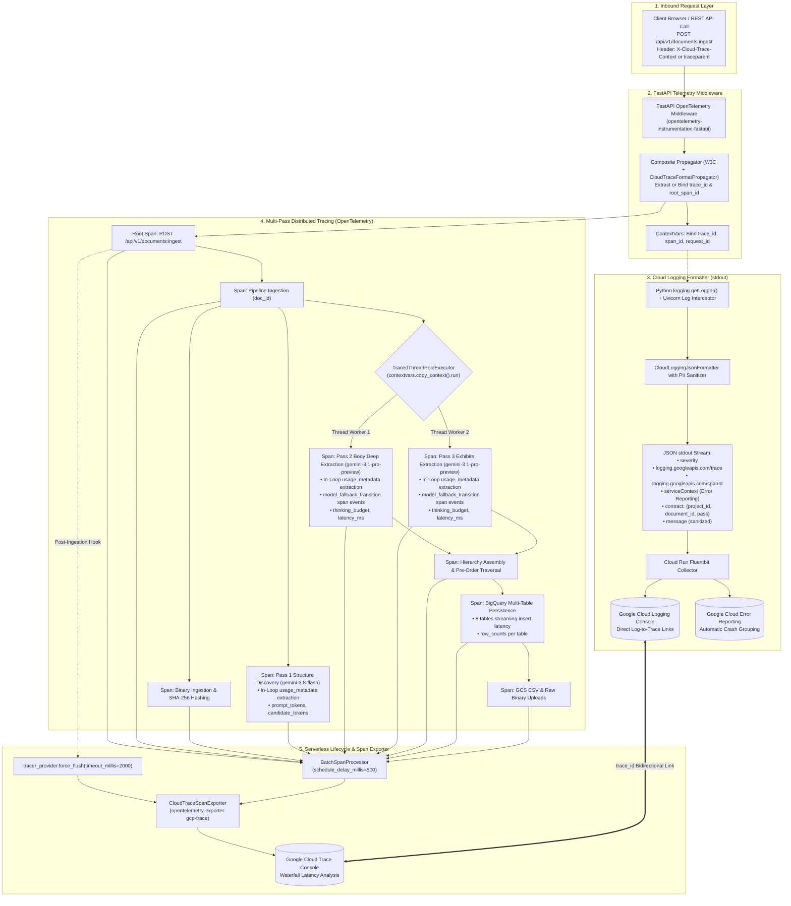

# Change Request CR-8: Enterprise Observability, Structured Cloud Logging & Distributed Tracing Architecture

* **CR ID:** `CR-008` (Enterprise Observability, Structured Cloud Logging & Distributed Tracing — `v0.9.0`)
* **Status:** Fortified per `/egm-review` Architecture Audit & Critique
* **Parent Architecture:** [DESIGN_DOC.md](file:///usr/local/google/home/prasannaankem/Code/Invenergy/Design/DESIGN_DOC.md), [CR5_SEMANTIC_ZONE_MULTI_PASS_EXTRACTION.md](file:///usr/local/google/home/prasannaankem/Code/Invenergy/Design/CR5_SEMANTIC_ZONE_MULTI_PASS_EXTRACTION.md), [CR6_UNIVERSAL_CLIENT_SERVER_PROGRESS_SYSTEM.md](file:///usr/local/google/home/prasannaankem/Code/Invenergy/Design/CR6_UNIVERSAL_CLIENT_SERVER_PROGRESS_SYSTEM.md), [CR7_ENTERPRISE_EMAIL_LINK_AUTH.md](file:///usr/local/google/home/prasannaankem/Code/Invenergy/Design/CR7_ENTERPRISE_EMAIL_LINK_AUTH.md)
* **Confirmed Architectural Decisions (Fortified via EGM Review):**
  1. **Google Cloud Logging Structured stdout JSON Formatter (`CloudLoggingJsonFormatter`):**
     Replaces unstructured string formatting with a high-performance `logging.Formatter` emitting single-line JSON directly to `stdout`. Automatically adheres to the official Google Cloud Logging schema (`severity`, `time`, `logging.googleapis.com/trace`, `logging.googleapis.com/spanId`, `logging.googleapis.com/trace_sampled`, `component`). Intercepts both the application root logger and Uvicorn access/error loggers (`uvicorn`, `uvicorn.access`, `uvicorn.error`) to eliminate interleaved unformatted stdout streams in Cloud Run.
  2. **GCP Project ID vs. ERP Project ID Namespace Isolation:**
     Eliminates metadata collisions between the Google Cloud Project ID (`pr-tftest`, used for `projects/{gcp_project_id}/traces/{trace_id}`) and the Invenergy ERP Project ID (`prj_cedar_lantern_wind`). Business contract metadata is isolated under a dedicated `contract` sub-dictionary (`contract.project_id`, `contract.document_id`, `contract.pass_name`), ensuring operational searches in Google Cloud Logging remain clean and unambiguous.
  3. **Google Cloud Error Reporting Automatic Detection:**
     Formats log exceptions so that Google Cloud Error Reporting natively groups and tracks application crashes. Formatted tracebacks are appended directly to the top-level `message` payload string and accompanied by `serviceContext` (`service: contract-parser`, `version: 0.9.0`), conforming to Google Cloud Error Reporting ingestion standards.
  4. **OpenTelemetry Core with GCP Cloud Trace Exporter (`opentelemetry-exporter-gcp-trace`):**
     Instruments distributed traces using the standard OpenTelemetry Python SDK. The trace provider is configured with the official Google Cloud Trace exporter (`opentelemetry.exporter.cloud_trace.CloudTraceSpanExporter`), asynchronously streaming spans to Cloud Trace without introducing blocking HTTP latency to application routes.
  5. **Composite Propagators for Cloud Run Load Balancer Context (`opentelemetry-propagator-gcp`):**
     Configures a composite text map propagator combining W3C `TraceContextTextMapPropagator` with Google Cloud's `CloudTraceFormatPropagator`. Inbound HTTP requests bearing Google's proprietary `X-Cloud-Trace-Context` header from Cloud Run and Cloud Load Balancing seamlessly propagate their upstream trace identity into OpenTelemetry root spans, preserving 100% end-to-end trace continuity.
  6. **Serverless Lifecycle Management & Explicit Span Flushing:**
     Mitigates Cloud Run's CPU throttling freeze (where background export threads freeze once the HTTP response returns). Configures `BatchSpanProcessor` with an aggressive cloud schedule delay (`schedule_delay_millis=500`, `max_export_batch_size=64`) and executes `tracer_provider.force_flush(timeout_millis=2000)` upon document ingestion completion and FastAPI server shutdown.
  7. **Context-Preserving ThreadPool Propagation (`contextvars.copy_context().run`):**
     Resolves the multi-threading context gap where Python worker threads spawned inside `ThreadPoolExecutor` (used in `gemini_parser.py` for concurrent Pass 2 Body and Pass 3 Exhibits extraction) lose their parent trace context. Implements `TracedThreadPoolExecutor` leveraging `contextvars.copy_context().run`, ensuring multi-pass sub-threads nest cleanly under the document ingestion trace without redundant context attachment or detach leaks.
  8. **In-Loop Gemini LLM Token Accounting & Model Fallback Telemetry:**
     Captures token consumption directly from the raw `GenerateContentResponse.usage_metadata` object *before* schema validation (`prompt_token_count`, `candidates_token_count`, `total_token_count`, `cached_content_token_count`), resolving the defect where parsed Pydantic bundles lacked usage metadata. Stamps explicit `model_fallback_transition` span events on retry, quota exhaustion (`RESOURCE_EXHAUSTED` / HTTP 429), or model failover with reason metadata and backoff duration.
  9. **Programmatic PII Scrubbing & Pydantic Validation Error Redaction:**
     Enforces automated redaction filters in `CloudLoggingJsonFormatter` that truncate raw payloads and sanitize Pydantic `ValidationError` strings (which dump raw input dictionaries into exception messages), ensuring no confidential lease clauses, landowner identities, or payment schedules leak into Google Cloud Logging storage.
  10. **Hermetic In-Memory Testing & Verification Strategy:**
      Validates the entire observability pipeline without requiring live GCP credentials or active Cloud Trace backends. Uses OpenTelemetry's `InMemorySpanExporter` and standard `pytest` log capture to assert parent-child span hierarchy, composite header parsing, token attribute presence, fallback span events, and JSON schema formatting.

---

## 1. The Operational Problem & Observability Context

The Invenergy Contract Parser executes a multi-stage, multi-pass AI extraction pipeline processing complex 30–100+ page renewable energy land contracts. As demonstrated in production and customer demonstrations, an end-to-end contract ingestion involves:
- Validating and hashing multi-megabyte PDF binaries.
- Executing **Pass 1** structure and zone discovery using `gemini-3.8-flash`.
- Concurrently dispatching **Pass 2** (Body clauses and covenants) and **Pass 3** (Exhibits, plat maps, and schedules) using `gemini-3.1-pro-preview` across background worker threads.
- Merging and sorting the clause hierarchy tree via pre-order traversal.
- Persisting structured data across 8 append-only BigQuery tables and generating 5 localized CSV exports.

### Current Gaps & Failures in Existing Observability
1. **Unstructured Plain-Text Logging:** All logging currently uses `logging.basicConfig(format="%(asctime)s [%(levelname)s] %(name)s: %(message)s")`. When running in Cloud Run, Google Cloud Logging ingests stdout as unparsed plain-text messages. Cloud Logging cannot filter or query logs by specific fields (`document_id`, `project_id`, `pass_name`, or `error_code`) without inefficient full-text regex scanning.
2. **Missing Distributed Trace Correlation:** When an ingestion request fails or runs slowly (e.g., 219 seconds for a 33-page scanned lease), there is no visual trace waterfall showing where time was spent (e.g. Pass 1 discovery vs. Pass 2 reasoning vs. BigQuery ingestion). Cloud Logging entries are disconnected from Cloud Trace.
3. **Interleaved Multi-Thread Worker Logs:** Pass 2 and Pass 3 execute concurrently in `ThreadPoolExecutor`. Without correlation IDs or thread context propagation, logs from concurrent passes interleave in stdout with no way to isolate the lifecycle of a specific pass or document.
4. **Zero Token & Cost Visibility:** There is currently no programmatic tracking of token consumption (`prompt_tokens`, `candidate_tokens`, `cached_tokens`) across passes. The team cannot evaluate cost-per-contract, audit quota burn, or measure the financial efficiency of prompt optimizations.
5. **Silent Model Fallback Transitions:** When `gemini-3.1-pro-preview` fails due to quota limits or timeouts, the pipeline falls back to `gemini-3.8-flash`. Currently, this fallback is logged as an ad-hoc warning string, making it impossible to alert on fallback frequency or track model degradation metrics.
6. **Serverless CPU Freeze Drop Hazard:** Standard batch trace processors hold spans in memory for 5 seconds before exporting. In Cloud Run, container CPU is frozen when an HTTP request finishes, risking dropped or delayed telemetry when instances scale to zero.
7. **Cloud Run Header Disconnect:** Google Cloud Run ingress injects `X-Cloud-Trace-Context`. Without a dedicated GCP propagator, OpenTelemetry generates disconnected W3C trace identifiers, breaking linkability between Cloud Run access logs and application spans.

---

## 2. Fortified Technical Architecture



---

## 3. Detailed Component Design

### 3.1 Structured Cloud Logging Formatter & PII Sanitizer (`contract_parser/telemetry/logging_formatter.py`)

A custom `logging.Formatter` outputting single-line JSON formatted specifically for GCP Cloud Run environments with automatic PII sanitization and Error Reporting compliance:

```python
import json
import logging
import os
import re
import sys
from datetime import datetime, timezone
from typing import Any
from opentelemetry import trace

# Pattern to detect raw Pydantic validation dumps or large JSON structures
_PYDANTIC_DUMP_REGEX = re.compile(r"(\[input_value=\{.*?\}\])", re.DOTALL)
_SENSITIVE_KEY_REGEX = re.compile(r"(payment_schedule|grantor_name|account_number|ssn|tax_id)[\s:=]+([^\s,]+)", re.IGNORECASE)


class CloudLoggingJsonFormatter(logging.Formatter):
    """Formats standard Python logging records into GCP Cloud Logging structured JSON."""

    def __init__(
        self,
        gcp_project_id: str | None = None,
        service_name: str = "contract-parser",
        service_version: str = "0.9.0",
    ):
        super().__init__()
        self.gcp_project_id = (
            gcp_project_id
            or os.getenv("GOOGLE_CLOUD_PROJECT")
            or os.getenv("GCP_PROJECT")
            or ""
        )
        self.service_name = service_name
        self.service_version = service_version

    def _sanitize_message(self, message: str) -> str:
        """Strip raw JSON dumps, Pydantic validation payloads, and sensitive tokens from log messages."""
        if not message:
            return ""
        # Redact raw Pydantic input dumps
        cleaned = _PYDANTIC_DUMP_REGEX.sub("[INPUT_PAYLOAD_REDACTED]", message)
        # Redact sensitive keys
        cleaned = _SENSITIVE_KEY_REGEX.sub(r"\1=[REDACTED]", cleaned)
        # Cap message length to prevent giant stdout frames
        if len(cleaned) > 4096:
            return cleaned[:4096] + "... [TRUNCATED_AT_4KB]"
        return cleaned

    def format(self, record: logging.LogRecord) -> str:
        severity_map = {
            "DEBUG": "DEBUG",
            "INFO": "INFO",
            "WARNING": "WARNING",
            "ERROR": "ERROR",
            "CRITICAL": "CRITICAL",
        }
        severity = severity_map.get(record.levelname, "DEFAULT")

        # Format message and sanitize
        raw_msg = record.getMessage()
        sanitized_msg = self._sanitize_message(raw_msg)

        # Handle exception information for Google Cloud Error Reporting
        formatted_exc = None
        if record.exc_info:
            formatted_exc = self.formatException(record.exc_info)
            formatted_exc = self._sanitize_message(formatted_exc)
            # Cloud Error Reporting expects the traceback in the message field
            sanitized_msg = f"{sanitized_msg}\n{formatted_exc}"

        payload: dict[str, Any] = {
            "severity": severity,
            "time": datetime.fromtimestamp(record.created, tz=timezone.utc).isoformat(),
            "message": sanitized_msg,
            "component": record.name,
            "logging.googleapis.com/sourceLocation": {
                "file": record.pathname,
                "line": record.lineno,
                "function": record.funcName,
            },
            "serviceContext": {
                "service": self.service_name,
                "version": self.service_version,
            },
        }

        # Extract current OpenTelemetry trace & span context if active
        current_span = trace.get_current_span()
        span_context = current_span.get_span_context() if current_span else None

        if span_context and span_context.is_valid:
            trace_id_hex = trace.format_trace_id(span_context.trace_id)
            span_id_hex = trace.format_span_id(span_context.span_id)

            if self.gcp_project_id:
                payload["logging.googleapis.com/trace"] = f"projects/{self.gcp_project_id}/traces/{trace_id_hex}"
            else:
                payload["logging.googleapis.com/trace"] = trace_id_hex

            payload["logging.googleapis.com/spanId"] = span_id_hex
            payload["logging.googleapis.com/trace_sampled"] = span_context.trace_flags.sampled

        # Isolate InvEnergy ERP domain metadata under 'contract' sub-object
        contract_meta: dict[str, Any] = {}
        for field in ("document_id", "project_id", "landowner_id", "pass_name", "model", "latency_ms", "tokens"):
            val = getattr(record, field, None)
            if val is not None:
                contract_meta[field] = val
        if contract_meta:
            payload["contract"] = contract_meta

        # Pass HTTP request telemetry if present
        http_req = getattr(record, "httpRequest", None)
        if http_req and isinstance(http_req, dict):
            payload["httpRequest"] = http_req

        return json.dumps(payload, default=str)


def setup_structured_logging(gcp_project_id: str | None = None, log_level: str = "INFO") -> None:
    """Configures structured JSON logging for root logger and Uvicorn loggers."""
    formatter = CloudLoggingJsonFormatter(gcp_project_id=gcp_project_id)
    handler = logging.StreamHandler(sys.stdout)
    handler.setFormatter(formatter)

    root = logging.getLogger()
    root.handlers.clear()
    root.addHandler(handler)
    root.setLevel(getattr(logging, log_level.upper(), logging.INFO))

    # Intercept Uvicorn loggers to maintain uniform JSON stdout in Cloud Run
    for uvicorn_logger_name in ("uvicorn", "uvicorn.access", "uvicorn.error"):
        u_log = logging.getLogger(uvicorn_logger_name)
        u_log.handlers.clear()
        u_log.addHandler(handler)
        u_log.propagate = False
```

---

### 3.2 OpenTelemetry Setup, Composite Propagators & Cloud Run Lifecycle (`contract_parser/telemetry/tracing.py`)

Initializes the TracerProvider with composite GCP propagators, Cloud Trace exporter, and serverless flushing:

```python
import os
import logging
from opentelemetry import trace
from opentelemetry.propagate import set_global_textmap
from opentelemetry.propagators.composite import CompositePropagator
from opentelemetry.trace.propagation.tracecontext import TraceContextTextMapPropagator
from opentelemetry.exporter.cloud_trace.propagator import CloudTraceFormatPropagator
from opentelemetry.sdk.trace import TracerProvider
from opentelemetry.sdk.trace.export import BatchSpanProcessor
from opentelemetry.sdk.trace.sampling import TraceIdRatioBased
from opentelemetry.sdk.resources import Resource
from opentelemetry.exporter.cloud_trace import CloudTraceSpanExporter

logger = logging.getLogger(__name__)
_TRACER_PROVIDER: TracerProvider | None = None


def setup_telemetry(
    project_id: str,
    service_name: str = "contract-parser",
    service_version: str = "0.9.0",
    sample_rate: float = 1.0,
) -> TracerProvider:
    """Configures global OpenTelemetry TracerProvider with Cloud Trace export and composite propagators."""
    global _TRACER_PROVIDER
    if _TRACER_PROVIDER is not None:
        return _TRACER_PROVIDER

    # 1. Register Composite Propagators (W3C traceparent + Google Cloud Trace Context)
    set_global_textmap(
        CompositePropagator([
            TraceContextTextMapPropagator(),
            CloudTraceFormatPropagator(),
        ])
    )

    # 2. Resource Definition
    resource = Resource.create({
        "service.name": service_name,
        "service.version": service_version,
        "cloud.provider": "gcp",
        "cloud.platform": "gcp_cloud_run",
    })

    provider = TracerProvider(
        resource=resource,
        sampler=TraceIdRatioBased(sample_rate),
    )

    # 3. Cloud Trace Exporter with Serverless-Tuned Batch Processor
    cloud_trace_enabled = os.getenv("CLOUD_TRACE_ENABLED", "true").lower() in ("true", "1", "yes")
    
    if cloud_trace_enabled and project_id:
        try:
            cloud_exporter = CloudTraceSpanExporter(project_id=project_id)
            # Schedule delay tuned to 500ms to minimize buffering lag before container idle
            provider.add_span_processor(
                BatchSpanProcessor(
                    cloud_exporter,
                    schedule_delay_millis=500,
                    max_export_batch_size=64,
                )
            )
            logger.info("OpenTelemetry CloudTraceSpanExporter successfully initialized for project: %s", project_id)
        except Exception as e:
            logger.warning("Cloud Trace exporter initialization failed: %s. Telemetry running with in-memory provider.", e)

    trace.set_tracer_provider(provider)
    _TRACER_PROVIDER = provider
    return provider


def get_tracer(name: str = "contract_parser") -> trace.Tracer:
    """Retrieves an application tracer instance."""
    return trace.get_tracer(name)


def flush_telemetry(timeout_millis: int = 2000) -> None:
    """Forces immediate export of all queued spans before Cloud Run CPU throttling."""
    global _TRACER_PROVIDER
    if _TRACER_PROVIDER is not None:
        try:
            _TRACER_PROVIDER.force_flush(timeout_millis=timeout_millis)
        except Exception as exc:
            logger.debug("force_flush non-fatal exception: %s", exc)


def shutdown_telemetry() -> None:
    """Gracefully shuts down the global TracerProvider on application termination."""
    global _TRACER_PROVIDER
    if _TRACER_PROVIDER is not None:
        try:
            _TRACER_PROVIDER.shutdown()
        except Exception as exc:
            logger.debug("shutdown_telemetry exception: %s", exc)
        _TRACER_PROVIDER = None
```

---

### 3.3 Context-Preserving Multi-Thread Propagation (`contract_parser/telemetry/thread_propagation.py`)

Ensures background tasks dispatched to `ThreadPoolExecutor` safely inherit active trace and span contexts:

```python
import contextvars
from concurrent.futures import ThreadPoolExecutor
from typing import Callable, Any, Iterable


def wrap_with_context(func: Callable[..., Any]) -> Callable[..., Any]:
    """Wraps a callable so that Python contextvars (and active OpenTelemetry contexts) propagate across threads."""
    cv_ctx = contextvars.copy_context()

    def wrapped(*args: Any, **kwargs: Any) -> Any:
        return cv_ctx.run(func, *args, **kwargs)

    return wrapped


class TracedThreadPoolExecutor(ThreadPoolExecutor):
    """ThreadPoolExecutor that automatically propagates OpenTelemetry contextvars to worker threads."""

    def submit(self, fn: Callable[..., Any], *args: Any, **kwargs: Any):
        return super().submit(wrap_with_context(fn), *args, **kwargs)

    def map(self, fn: Callable[..., Any], *iterables: Iterable[Any], timeout: float | None = None, chunksize: int = 1):
        return super().map(wrap_with_context(fn), *iterables, timeout=timeout, chunksize=chunksize)
```

---

### 3.4 In-Loop Gemini LLM Observability & Fallback Telemetry (`contract_parser/gemini_parser.py`)

Instruments Gemini model extraction passes to extract token metrics directly from raw SDK responses and record fallback transitions:

```python
from opentelemetry import trace
from opentelemetry.trace import Status, StatusCode
from contract_parser.telemetry.tracing import get_tracer

tracer = get_tracer("contract_parser.gemini_parser")


def record_llm_response_telemetry(span: trace.Span, response: Any, model_name: str) -> None:
    """Extracts usage metadata and finish attributes directly from the raw GenAI response object."""
    if not span.is_recording():
        return

    span.set_attribute("gen_ai.system", "vertex_ai")
    span.set_attribute("gen_ai.response.model", getattr(response, "model_version", None) or model_name)

    usage = getattr(response, "usage_metadata", None)
    if usage:
        prompt_tokens = getattr(usage, "prompt_token_count", 0) or 0
        candidates_tokens = getattr(usage, "candidates_token_count", 0) or 0
        total_tokens = getattr(usage, "total_token_count", 0) or 0
        cached_tokens = getattr(usage, "cached_content_token_count", 0) or 0

        span.set_attribute("gen_ai.usage.prompt_tokens", prompt_tokens)
        span.set_attribute("gen_ai.usage.completion_tokens", candidates_tokens)
        span.set_attribute("gen_ai.usage.total_tokens", total_tokens)
        span.set_attribute("gen_ai.usage.cached_tokens", cached_tokens)


def record_model_fallback_event(
    span: trace.Span,
    failed_model: str,
    fallback_model: str,
    attempt: int,
    error: Exception,
) -> None:
    """Records an explicit span event when the extraction pipeline falls back between models."""
    if not span.is_recording():
        return

    span.add_event(
        "model_fallback_transition",
        attributes={
            "gen_ai.fallback.failed_model": failed_model,
            "gen_ai.fallback.target_model": fallback_model,
            "gen_ai.fallback.attempt": attempt,
            "gen_ai.fallback.error_type": error.__class__.__name__,
            "gen_ai.fallback.error_message": str(error)[:500],
        },
    )
```

In the multi-pass execution methods (`_discover_contract_structure`, `_extract_body_pass`, `_extract_exhibits_pass`):
1. Wrap each pass in `with tracer.start_as_current_span(span_name) as span:`.
2. Call `self.client.models.generate_content(...)`.
3. Call `record_llm_response_telemetry(span, response, model_name)`.
4. If an exception triggers failover from primary model to fallback model, call `record_model_fallback_event(span, model_name, next_model_name, attempt, exc)`.
5. Parse the Pydantic schema from `response.parsed` or `response.text`.

---

### 3.5 Storage & BigQuery Telemetry (`contract_parser/storage.py`)

Instruments BigQuery multi-table persistence and Cloud Storage operations:
- **Span `storage.bigquery.persist_bundle`:** Captures overall BigQuery sync latency, stamped with `contract.document_id`, `contract.project_id`, and `bigquery.table_count = 8`.
- **Child Spans for Table Ingestion:** Emits child spans for streaming inserts into `projects`, `landowners`, `documents`, `clauses`, `defined_terms`, `exhibits_catalog`, `special_conditions`, and `dnd_checklist_signoffs`, tracking row counts and insert error counts per table.
- **Span `storage.gcs.archive_pdf` & `storage.gcs.export_csvs`:** Records GCS upload latencies, byte sizes, and target `gs://` bucket paths.

---

## 4. Configuration & Deployment Specification

### Environment Variables
| Variable | Type | Default | Description |
|---|---|---|---|
| `LOG_FORMAT` | string | `json` | Logging format (`json` for Cloud Logging on Cloud Run, `text` for local development terminal). |
| `LOG_LEVEL` | string | `INFO` | Root logging level (`DEBUG`, `INFO`, `WARNING`, `ERROR`). |
| `CLOUD_TRACE_ENABLED` | bool | `true` | Enables OpenTelemetry span export to GCP Cloud Trace API. Set to `false` in test suites. |
| `CLOUD_TRACE_SCHEDULE_DELAY_MS` | int | `500` | BatchSpanProcessor export interval in milliseconds (tuned for serverless). |
| `TELEMETRY_SERVICE_NAME` | string | `contract-parser` | Service name stamped on all traces and Cloud Logging records. |
| `TELEMETRY_SERVICE_VERSION` | string | `0.9.0` | Application release version for telemetry and Error Reporting. |
| `TELEMETRY_SAMPLE_RATE` | float | `1.0` | Probabilistic sampling ratio for Cloud Trace spans (`1.0` = 100% trace capture). |

### Required Dependencies in `pyproject.toml`
```toml
dependencies = [
    # Existing core dependencies
    "google-genai>=1.0.0",
    "google-cloud-storage>=2.14.0",
    "google-cloud-bigquery>=3.20.0",
    "pydantic>=2.7.0",
    "fastapi>=0.111.0",
    "uvicorn>=0.30.0",
    "python-multipart>=0.0.9",
    "httpx>=0.27.0",
    "pytest>=8.2.0",
    "firebase-admin>=6.5.0",
    # CR-8 Observability & Distributed Tracing
    "opentelemetry-api>=1.25.0",
    "opentelemetry-sdk>=1.25.0",
    "opentelemetry-instrumentation-fastapi>=0.46b0",
    "opentelemetry-exporter-gcp-trace>=1.7.0",
    "opentelemetry-propagator-gcp>=1.7.0",
]
```

---

## 5. Security & Privacy Guardrails

1. **Automated PII & Contract Text Redaction:**
   - Exception traces undergo regex filtering to scrub Pydantic `[input_value={...}]` payloads.
   - Log formatters automatically mask sensitive keys (`payment_schedule`, `grantor_name`, `account_number`).
   - Log messages exceeding 4,096 characters are truncated to prevent memory bloat and accidental data dumping.
2. **Metadata-Only Spans:**
   - Spans record token numbers, page counts, section counts, and model names.
   - Raw contract text, clause content, and full prompt instructions are strictly excluded from span attributes.
3. **Audit Non-Repudiation:**
   - User identity (`user_id`, `email`) from decoded Firebase Bearer tokens (CR-7) is stamped on HTTP root spans, preserving auditable user attribution for all ingestion and HITL review operations.

---

## 6. Automated Testing & Verification Plan

### Test Suite: `tests/test_cr8_observability_and_tracing.py`

- **UT-1: Structured Cloud Logging JSON Formatter Validation (`test_cloud_logging_json_formatter`):**
  Asserts that `CloudLoggingJsonFormatter` produces valid JSON with required GCP keys (`severity`, `time`, `logging.googleapis.com/trace`, `serviceContext`), isolates contract metadata under `contract`, and appends stack traces to `message` for Error Reporting.
- **UT-2: PII & Pydantic Error Scrubbing (`test_pii_and_validation_error_scrubbing`):**
  Asserts that simulated Pydantic validation error dumps and sensitive strings are redacted from formatted log payloads.
- **UT-3: Composite Propagators & Header Extraction (`test_composite_trace_propagation`):**
  Verifies that `CompositePropagator` correctly extracts trace context from both standard W3C `traceparent` and Google Cloud `X-Cloud-Trace-Context` headers.
- **UT-4: OpenTelemetry Span Hierarchy & In-Loop Token Metrics (`test_opentelemetry_span_hierarchy_and_tokens`):**
  Uses `InMemorySpanExporter` to verify parent-child nesting across passes and asserts that `gen_ai.usage.prompt_tokens` and `gen_ai.usage.completion_tokens` are populated from model responses.
- **UT-5: Model Fallback Transition Span Events (`test_model_fallback_span_events`):**
  Simulates a primary model failure followed by successful fallback and asserts that the `model_fallback_transition` event is stamped on the span with expected attributes.
- **UT-6: TracedThreadPoolExecutor Context Propagation (`test_traced_thread_pool_executor`):**
  Asserts that child tasks dispatched via `TracedThreadPoolExecutor` inherit parent trace and span contexts across thread boundaries.
- **UT-7: Serverless Lifecycle Flush Execution (`test_telemetry_force_flush`):**
  Asserts that `flush_telemetry()` triggers provider flushing without throwing exceptions when the exporter queue is empty or active.

---

## 7. Migration & Rollout Strategy

1. **Phase 1: Dependency Update & Foundation Library:**
   Add OpenTelemetry dependencies to `pyproject.toml`, run `uv lock`, and implement `contract_parser/telemetry/logging_formatter.py`, `tracing.py`, and `thread_propagation.py`.
2. **Phase 2: Application & Pipeline Instrumentation:**
   Configure `setup_structured_logging()` and OpenTelemetry FastAPI instrumentation in `contract_parser/app.py`. Update `gemini_parser.py` with in-loop token telemetry, fallback events, and `TracedThreadPoolExecutor`. Instrument `storage.py`.
3. **Phase 3: Automated Test Suite Execution:**
   Execute `pytest tests/test_cr8_observability_and_tracing.py` and run full regression suite (`pytest tests/`) ensuring 100% pass rate.
4. **Phase 4: Cloud Run Deployment & Verification (`pr-tftest`):**
   Deploy new container revision to Cloud Run. Verify structured JSON logs and Error Reporting in Google Cloud Logging, and inspect waterfall traces in Google Cloud Trace console.
