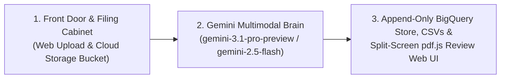

# Design Document: Hierarchical Contract Parsing & Obligation Intelligence

## Section 0: Plain-English Understanding of the Business Problem

Clean energy and infrastructure companies—such as wind farm developers, solar operators, and transmission line utilities—cannot build or operate a project without signing hundreds of binding legal agreements with local landowners, neighboring developers, and public utilities. These contracts (Accommodation Agreements, Wind and Solar Easements, Crossing Agreements, and Land Leases) govern every physical and legal boundary of a project: which parcels of land the company can access, what equipment can be installed, how much clearance must be maintained around power lines, who pays if property is damaged, how notices must be delivered, and when those rights expire.

Today, these agreements live as unstructured PDFs—often scanned paper documents with multi-page clauses, side-by-side address blocks, legal land descriptions, and attached exhibits. For land administration, legal compliance, and field operations teams, answering a seemingly simple question like *"What are our notice and non-interference obligations across this transmission corridor, and which land parcels have excluded acreage?"* requires manually reading through dozens of dense PDFs page by page. Missing a single clause or exception creates real operational and financial risk: crews could trespass on a carved-out tract of land, miss a required notice deadline, or misread an indemnification carve-out.

To solve this, the team built an initial Minimum Viable Product (MVP) that ingests contract PDFs and exports flat CSV spreadsheets mapping sections to text. However, the MVP breaks down on real-world legal drafting because **legal contracts are not written as flat lists—they are written as deeply nested hierarchies where context is shared across levels:**

1. **A sub-clause is meaningless without its parent and trailing exceptions:** When a contract states in a main paragraph that a party must indemnify the other against liabilities arising from `(i)` use of the property, `(ii)` construction and operation, or `(iii)` any act or omission, *except to the extent caused by the other party's negligence*, chopping `(i)`, `(ii)`, and `(iii)` into separate spreadsheet rows strips away both the main obligation at the start of the paragraph and the negligence exception at the end. A user searching the database sees an incomplete—and legally misleading—fragment.
2. **Contract formatting varies wildly and defies simple rules:** Sub-clauses are often buried inline inside a single long paragraph rather than neatly indented. Numbering styles change from contract to contract, skip levels unexpectedly (jumping straight from `Section 4` to `(i)` without an `(a)`), reset between the Recitals, the Main Agreement, and the Exhibits, or split mid-sentence across page breaks.
3. **The real meaning lives across cross-references, defined terms, and exhibits:** A clause in Section 3 might restrict interference with *"Operations"* on the *"Property"* subject to *"Exhibit B"* and *"Exhibit D"*. Unless the system connects those capitalized Defined Terms and links the Exhibits (which hold the actual Tax Parcel IDs, `LESS AND EXCEPT` land carve-outs, and county recording numbers for underlying easements), the extracted clause cannot be acted upon.
4. **Compliance teams need verifiable trust, not a black box:** Because these records drive legal compliance and field operations, users cannot blindly trust AI output. When a contract has an ambiguous structure, a land carve-out, a reference to an external unattached deed, or a handwritten notary block, the system must automatically flag it and let a human reviewer click the record in a web interface to jump straight to that exact page of the original PDF.

**In short:** We are building a generic, contract-agnostic ingestion and structuring platform. A user can upload any legal agreement PDF through a Web UI (or drop batches into Cloud Storage), and the system will archive the source document, use the latest Gemini multimodal model (`gemini-3.1-pro-preview` / `gemini-2.5-flash`) to reconstruct the complete multi-tier clause hierarchy without losing a single word of parent or trailing context, link defined terms and exhibits, stream every field into BigQuery using an append-only audit log (`insert_rows_json` + `QUALIFY ROW_NUMBER()` deduplication) and downloadable UTF-8 CSVs, and give human reviewers a side-by-side `pdf.js` viewer to verify, edit, and approve flagged clauses in seconds.

---

## Section 1: Plain-English Overview of the Technical Plan (Gemini-First Architecture)

### How This Feature Fits into the Ecosystem
Think of this system as the **bridge between raw PDF agreements and the tools our teams already use**, where **Gemini does all the heavy document reading, legal structuring, context reconstruction, and anomaly flagging**, and **Python acts purely as thin glue code** to move files between Cloud Storage, Gemini, BigQuery, and the Web UI.

* **Where documents come from (Upstream):** Legal, land, and project development teams receive signed PDF agreements—either one at a time as new deals close, or in large batches from historical project folders.
* **Where the structured data goes (Downstream):**
  1. **Existing Spreadsheet Workflows (CSV Exports):** Teams and legacy tools that rely on flat spreadsheets get upgraded CSV files (`clauses.csv`, `defined_terms.csv`, `exhibits_catalog.csv` encoded in `utf-8-sig` for clean Excel compatibility) where every sub-clause carries its full parent hierarchy and complete legal meaning.
  2. **Central Cloud Database (BigQuery Append-Only Tables + Deduplicated Views):** Every field from every contract is streamed into four Google BigQuery tables (`documents`, `clauses`, `defined_terms`, and `exhibits_catalog`) using an **append-only versioning pattern** (`updated_at` timestamp + `QUALIFY ROW_NUMBER()` deduplication). This avoids BigQuery's 90-minute streaming buffer lock on updates and preserves an immutable audit history of original AI output alongside human edits/approvals.
  3. **Human Review Workspace (Web UI):** Legal and land analysts get a browser-based review screen where they can inspect, edit, and approve flagged clauses side by side with the original PDF rendered via Mozilla `pdf.js`.
  4. **Foundation for Phase 2 (Obligation Tracking):** By cleanly organizing the contract structure, contracting parties, effective dates, defined terms, and exhibits first, the next phase of the platform can extract specific party-by-party obligations without getting confused by broken sentences or missing exceptions.

---

### The Three Big Components (and How They Work Together)

Because the latest Gemini models (`gemini-3.1-pro-preview` and `gemini-2.5-flash`) can read a multi-page scanned PDF directly from Google Cloud Storage inside a 1-million-token context window and return strictly formatted JSON, the entire system simplifies to three clean components:



#### 1. The Front Door & Digital Filing Cabinet (Web Upload & Cloud Storage)
* **What it does:** Gives users two simple ways to submit documents: dragging and dropping a PDF into the Web UI, or ingesting a batch of PDFs from a Google Cloud Storage bucket (`gs://<bucket>/incoming/`).
* **Why it matters:** As soon as a PDF arrives, thin Python glue code computes a deterministic `document_id` (SHA-256 content hash) and archives the original file into our Google Cloud Storage bucket (`gs://<bucket>/raw/<document_id>/<filename>.pdf`). Gemini reads the PDF directly from that Cloud Storage URI, and the finished CSV spreadsheets are saved right back to `gs://<bucket>/exports/<document_id>/` for one-click download.

#### 2. The Gemini Multimodal Brain (`gemini-3.1-pro-preview` / `gemini-2.5-flash`)
* **What it does:** Instead of writing brittle Python rules to strip page footers, untangle two-column mailing addresses, or guess numbering styles—and without relying on external OCR or `pymupdf` text-layer checks—we pass the PDF in Cloud Storage directly to **Gemini (`gemini-3.1-pro-preview` / `gemini-2.5-flash`)** using **Structured Outputs**.
* **Why it matters:** Because Gemini sees the visual page layout and understands legal grammar at the same time:
  * **Reads scanned pages and complex layouts natively:** It visually ignores repeating "Page 2 of 12" footers, ignores lined-out/struck-through text, reads two-column Notice address blocks down one column at a time, stitched sentences that cross from the bottom of Page 2 to the top of Page 3, and records **1-indexed physical PDF page numbers** (`page_start`, `page_end`) rather than printed footer numbers.
  * **Maps any contract hierarchy:** Whether a contract uses 3 levels (`1. -> (a) -> (i)`) or 6 levels (`Article I -> Section 1.01 -> (a) -> (1) -> (i) -> (A)`), or bundles multiple sub-agreements/amendments in one PDF binder, Gemini maps every parent and child node and distinguishes `(i)` the Roman numeral from `(i)` the ninth letter after `(h)`.
  * **Assembles the full legal meaning ("Sandwich" & "Double-Sandwich" Clauses):** For every sub-clause at any nesting depth, Gemini outputs both the exact words of that sub-clause (`verbatim_text`) **and** the complete, self-contained legal text (`reconstructed_context_text`) combining all governing ancestor preambles, the sub-clause, any interleaved provisos, and any trailing carve-out at the end of the paragraph.
  * **Extracts Parties, Defined Terms, Exhibits, and Warning Flags in the same pass:** Gemini simultaneously extracts the contracting parties and effective date, builds the Defined Terms glossary, catalogs attached Exhibits (holding signature pages and CAD drawings as page-numbered placeholders), and flags clauses with land carve-outs (`LESS AND EXCEPT`), skipped numbering tiers, internal cross-reference gaps, or external deed dependencies. For oversized contracts (40+ pages) that approach the 65K output token ceiling, `gemini_parser.py` supports a zone/page-windowed continuation pass.

#### 3. The Append-Only Database & Split-Screen Review App (BigQuery, CSVs & `pdf.js` Web UI)
* **What it does:** Thin Python glue code takes Gemini's structured JSON response, streams every field into four Google BigQuery tables (`documents`, `clauses`, `defined_terms`, and `exhibits_catalog`) via `insert_rows_json`, exports the matching CSV files (`utf-8-sig`) to Cloud Storage, and serves the split-screen Web UI.
* **Why it matters:**
  * **Zero Streaming Buffer Lockout (Option 3B):** Instead of running slow BigQuery `UPDATE` statements (which fail on rows in BigQuery's 90-minute streaming buffer), human reviews and text edits in the Web UI simply append a new version of the row with a newer `updated_at` timestamp, `reviewed_by`, and `review_notes`. Queries and CSV exports automatically select the latest version per `(document_id, node_id)` using `QUALIFY ROW_NUMBER() OVER (PARTITION BY document_id, node_id ORDER BY updated_at DESC) = 1`.
  * **Smooth Page-Level Navigation (Option 4B):** In the Web UI, an analyst sees the organized contract outline and warning flags on the left side of the screen, and the original PDF rendered via Mozilla `pdf.js` on the right. Clicking any clause, defined term, or warning flag immediately scrolls the `pdf.js` canvas to the exact physical PDF page (`page_start`) without iframe reload flicker.

---

## Section 2: All Alternatives Considered & Why We Ruled Them Out

Throughout our design conversations and technical review, we evaluated alternatives across **eight major design dimensions** and ruled out **19 specific options** before arriving at our final architecture.

### Summary Matrix of All Alternatives Considered

| Design Dimension | Chosen Approach | Alternatives Considered & Ruled Out |
| :--- | :--- | :--- |
| **1. Overall Pipeline Strategy** | **Two-stage pipeline across two sessions:** Session 1 builds the lossless hierarchy tree, context, parties, defined terms & exhibits; Session 2 extracts obligations. | • **1A:** Direct PDF-to-Obligation extraction only (skipping the document tree)<br>• **1B:** Stopping at a basic section splitter without Defined Terms or Exhibit catalogs |
| **2. Parsing & Extraction Engine** | **100% Gemini-First Multimodal (`gemini-3.1-pro-preview` / `gemini-2.5-flash`)** reading the PDF directly from GCS, with thin Python glue (10 files) and zero external OCR or `pymupdf` dependency. | • **2A:** Heavy custom Python parsing engine (35+ files of coordinate math, regexes, and state machines)<br>• **2B:** Document AI + Gemini two-step hybrid OCR pipeline<br>• **2C:** Document AI Layout Parser alone (without Gemini)<br>• **2D:** Open-source OCR / `pymupdf` word-count stack (`PyMuPDF` / `Tesseract` / `Docling`) |
| **3. Storage, Mutability & Export Format** | **BigQuery Append-Only Streaming (`insert_rows_json` + `updated_at` + `QUALIFY ROW_NUMBER() = 1`)** paired with **Normalized CSV Exports** (`clauses.csv`, `defined_terms.csv`, `exhibits_catalog.csv`) in GCS. | • **3A:** Flat CSV files only (no database)<br>• **3B:** Single denormalized master spreadsheet (`obligations_flat.csv`)<br>• **3C:** Vector / RAG Knowledge Base only<br>• **3D:** BigQuery Batch Load Jobs + in-place SQL `UPDATE` DML (overwrites audit history and adds 2–4s DML latency)<br>• **3E:** Dual-database SQLite primary + background BigQuery sync (state drift across containers) |
| **4. Hierarchy Columns in `clauses.csv`** | **Scheme-Agnostic Hybrid Hierarchy:** Adjacency list (`node_id`, `parent_node_id`, `canonical_path`, `depth`) + generic `level_1_label`..`level_4_label` + `level_5_plus_path`. | • **4A:** Fixed template-specific columns (`Section_Num`, `Subsection_Alpha`, `Subsubsection_Roman`)<br>• **4B:** Pure parent-child IDs (`node_id`, `parent_node_id`) with no level columns for Excel users |
| **5. "Sandwich Clauses" & Multi-Sentence Paragraphs** | **Store both atomic `verbatim_text` AND full `reconstructed_context_text`** (`Ancestor Preambles + Child + Interleaved/Trailing Exceptions`); keep unnumbered sentences together in Session 1. | • **5A:** Store only raw verbatim fragments (`(i)`, `(ii)`, `(iii)`) without parent/trailing context<br>• **5B:** Create fake sub-clause IDs for every unnumbered sentence in a paragraph during Session 1 |
| **6. Scope: Handwriting, Exhibits & CAD Drawings** | **Extract Body, Parties, Defined Terms & Text Exhibits (A–C); flag external deed dependencies; hold Handwritten Signatures & CAD Drawings (Exhibit D) as page-linked placeholders.** | • **6A:** Extract handwritten notary dates/checkboxes and parse engineering CAD drawings (tower heights, clearances) in Session 1<br>• **6B:** Extract body clauses only and ignore Exhibits, external deeds, and conflicting dates completely |
| **7. Human Review (HITL) & PDF Viewer** | **Split-screen Web UI with Mozilla `pdf.js` Canvas Viewer** jumping to physical PDF `page_start`, driven by **6 Gemini-evaluated anomaly flags** and supporting inline text/status edits. | • **7A:** Draw word/token-level polygon highlight boxes on the scanned PDF canvas<br>• **7B:** Draw paragraph-level bounding boxes on the PDF canvas<br>• **7C:** Native browser `<iframe src="...#page=N">` viewer (fails to scroll on hash change without full DOM reload flicker)<br>• **7D:** Batch pipeline with no review UI, or relying on numeric AI confidence scores (0–100%) |

---

### Detailed Plain-English Breakdown of Every Ruled-Out Alternative

#### Dimension 1: Overall Pipeline Strategy (What the System Outputs)
* **Alternative 1A — Direct Obligation Extraction Only (Skipping the Document Outline):**
  * *What we considered:* Asking the AI to read the PDF and immediately output a list of legal obligations (who owes what to whom) without first reconstructing the section-by-section outline of the contract.
  * *Why we ruled it out:* When an AI tries to jump straight from a raw PDF to a list of obligations, it frequently misses trailing exceptions (such as the negligence carve-out at the end of an indemnity clause) or confuses standard legal boilerplate (*"This Agreement shall be governed by Franklin law"*) with actual operational duties. Worse, without a complete, word-for-word outline of the contract first, compliance teams cannot verify whether a sub-clause was silently skipped.
* **Alternative 1B — Enhanced Hierarchy Splitter Only (Ignoring Defined Terms and Exhibits):**
  * *What we considered:* Fixing the MVP's section/subsection splitter to produce a clean `clauses.csv` table, while ignoring Defined Terms (`"Property"`, `"Operations"`, `"Equipment"`) and attached Exhibits (`Exhibits A–D`).
  * *Why we ruled it out:* A clause in the body of a land agreement cannot be understood without knowing which land parcels it applies to (`Exhibit A`), which underlying landowner deeds control its expiration date (`Exhibits B and C`), and how capitalized terms are defined.

#### Dimension 2: Parsing & Extraction Engine (How the PDF Is Read)
* **Alternative 2A — Writing Heavy Custom Python Code to Parse Layouts and Grammar (35+ Files):**
  * *What we considered:* Writing custom Python modules to strip headers/footers using page coordinates (`y < 0.07`), untangle two-column Notice blocks (`x < 0.48`), stitch sliding windows, disambiguate `(i)` vs. `(h)` with a Python state machine, and run regex rule engines.
  * *Why we ruled it out:* Custom Python coordinate math and regex state machines are fragile—they break as soon as a different law firm uses slightly different margins, fonts, or numbering styles. Because `gemini-3.1-pro-preview` and `gemini-2.5-flash` accept the PDF directly from Cloud Storage with a 1-million-token context window and native visual understanding, Gemini performs all of this parsing natively, shrinking our Python code to 10 thin glue files.
* **Alternative 2B — Two-Step Document AI OCR + Gemini Hybrid Pipeline:**
  * *What we considered:* Sending every PDF through Google Cloud Document AI Enterprise OCR first, caching the OCR JSON, and then feeding that OCR output into Gemini.
  * *Why we ruled it out:* Adding a separate Document AI OCR pass introduces an extra cloud service to provision, extra latency, and extra per-page OCR cost when Gemini 3.x visually reads the scanned PDF directly from Cloud Storage in a single step.
* **Alternative 2C — Using Document AI Layout Parser Alone (Without Gemini):**
  * *What we considered:* Using Document AI's built-in Layout Parser to break the PDF into sections and sub-clauses without calling an LLM.
  * *Why we ruled it out:* Document AI only splits text at visual paragraph breaks or indentations. In contracts like [Synthetic_Accommodation_Agreement.pdf](file:///usr/local/google/home/prasannaankem/Downloads/Synthetic_Accommodation_Agreement.pdf), sub-clauses `(a), (b), (c)` and `(i), (ii), (iii)` are written **inline inside a single paragraph**. Document AI lumps the entire paragraph together and cannot assemble self-contained sentences for sandwich clauses.
* **Alternative 2D — Open-Source OCR or `PyMuPDF` Word-Count Checks (`PyMuPDF` / `Tesseract` / `Docling`):**
  * *What we considered:* Using open-source OCR or using `PyMuPDF` (`fitz`) to count embedded words per page and compare against Gemini's output.
  * *Why we ruled it out:* Scanned paper agreements without an embedded text layer return 0 words in `PyMuPDF` (or contain corrupted scanner OCR layers), producing false-positive coverage gaps. Relying purely on Gemini's native visual inspection (`TEXT_COVERAGE_GAP` when illegible scan regions, cut-off margins, or missing pages are visually detected) avoids external library dependencies and works identically on digital and image-only PDFs.

#### Dimension 3: Downstream Storage, Mutability & Export Format
* **Alternative 3A — Strict Flat CSV Output Only (No Database):**
  * *What we considered:* Keeping the MVP's flat CSV output without storing records in a database.
  * *Why we ruled it out:* Flat files alone cannot support portfolio-wide search across thousands of agreements or track human review approvals in real time.
* **Alternative 3B — Single Denormalized Master CSV (`obligations_flat.csv`):**
  * *What we considered:* Putting clauses, sub-clauses, parties, defined terms, and land parcels into one giant spreadsheet.
  * *Why we ruled it out:* Because a single clause (like Section 3) has 3 sub-clauses, applies to 2 parties, uses 4 Defined Terms, and covers 4 land parcels, flattening everything into one CSV causes a "row explosion" (duplicating the same clause 24 times) or crams unreadable lists into single cells. Using four separate BigQuery tables (`documents`, `clauses`, `defined_terms`, `exhibits_catalog`) and three clean CSV exports avoids all duplication.
* **Alternative 3C — Vector / RAG Knowledge Base Only:**
  * *What we considered:* Chunking the contract into a vector database purely for chatbot Q&A.
  * *Why we ruled it out:* Land administration and compliance teams need structured, auditable tables and spreadsheets listing every single clause and exception—not just a chat box that retrieves top-k snippets.
* **Alternative 3D — BigQuery Batch Load Jobs + In-Place SQL `UPDATE` DML:**
  * *What we considered:* Using `load_table_from_json` and running SQL `UPDATE` statements whenever a human reviewer approves or edits a clause in the Web UI.
  * *Why we ruled it out:* In-place `UPDATE` DML takes 2–4 seconds per click, is subject to BigQuery concurrent table-mutation quotas, and overwrites the original AI extraction so compliance teams lose the before-and-after audit trail. By using **Option 3B (Streaming Inserts `insert_rows_json` + Append-Only Versioning with `updated_at` and `QUALIFY ROW_NUMBER() = 1`)**, human reviews complete in ~300ms, never hit the 90-minute streaming buffer lock, and retain full version history.
* **Alternative 3E — Local SQLite Operational Primary + Background BigQuery Sync:**
  * *What we considered:* Serving the Web UI from a local SQLite database and syncing to BigQuery in the background.
  * *Why we ruled it out:* Local SQLite files are isolated per container instance on Cloud Run and can drift out of sync with BigQuery if a background task fails.

#### Dimension 4: Hierarchy Columns in `clauses.csv`
* **Alternative 4A — Fixed Template-Specific Columns (`Section_Num`, `Subsection_Alpha`, `Subsubsection_Roman`):**
  * *What we considered:* Naming the hierarchy columns after numbers, letters, and Roman numerals based on our 12-page sample document (and creating exhibit columns named after Cedar Lantern and Blue Meridian).
  * *Why we ruled it out:* Fails immediately on contracts that use decimal numbering (`1.1.1`), skip levels (`Section 4 -> (i)` with no `(a)`), or nest 6 levels deep (`Article I -> Section 1.01 -> (a) -> (1) -> (i) -> (A)`). Using generic tier columns (`level_1_label`..`level_4_label`, `level_5_plus_path`, and `numbering_scheme`) makes the table universal.
* **Alternative 4B — Pure Adjacency List Only (`node_id` and `parent_node_id` with No Tier Columns):**
  * *What we considered:* Storing only `node_id` and `parent_node_id` without any `level_1_label`..`level_4_label` columns.
  * *Why we ruled it out:* Analysts opening `clauses.csv` in Excel need to filter and pivot by top-level section and sub-clause level without writing recursive SQL queries. Combining parent-child IDs *with* convenience level columns gives the best of both worlds.

#### Dimension 5: "Sandwich Clauses" & Multi-Sentence Paragraphs
* **Alternative 5A — Storing Only Raw Verbatim Sub-Clause Fragments:**
  * *What we considered:* Saving only `(i) Cedar Lantern's use of Property;` in its row and expecting the user to look up the parent row to see the rest of the sentence.
  * *Why we ruled it out:* In "sandwich" clauses (Sections 4 and 5), the opening rule sits before `(i)` and the negligence carve-out sits after `(iii)`. Reading `(i)` alone—or attaching the trailing carve-out only to `(iii)`—distorts the legal meaning. Every row must store both `verbatim_text` and `reconstructed_context_text` (`Ancestor Preambles + Child + Interleaved/Trailing Postambles`).
* **Alternative 5B — Creating Synthetic Sub-Nodes for Every Unnumbered Sentence in Session 1:**
  * *What we considered:* Breaking every unnumbered sentence in a multi-sentence paragraph (like the 4 sentences in Section 8 Confidentiality) into artificial tree nodes during Session 1.
  * *Why we ruled it out:* Creating fake clause numbers in Session 1 alters the true outline of the legal document. Keeping unnumbered continuation sentences in the parent's `postamble_text` during Session 1—and splitting them into individual obligations in Session 2—preserves structural accuracy.

#### Dimension 6: Scope of Extraction (Handwriting, Exhibits, Dates & CAD Drawings)
* **Alternative 6A — Extracting Handwritten Notary Blocks and Engineering CAD Drawings in Session 1:**
  * *What we considered:* Extracting handwritten notary dates/names and checkboxes (Pages 5–6) and parsing tower heights, voltages, and sag clearances from engineering CAD drawings (Exhibit D, Page 12) right away.
  * *Why we ruled it out:* Handwriting recognition and CAD schematic extraction are specialized problems that can be reviewed later. Capturing them as page-indexed placeholders (`PLACEHOLDER_FOR_REVIEW`) guarantees nothing is missed while keeping Session 1 focused on contract structure.
* **Alternative 6B — Ignoring External Dependencies and Conflicting Dates:**
  * *What we considered:* Extracting only a single contract date and ignoring references to external deeds in Exhibits B and C.
  * *Why we ruled it out:* Section 2 (Term) states that the agreement expires when the underlying easements in Exhibits B and C expire—but Exhibits B and C only list county recording Book and Page numbers, not expiration dates. Automatically flagging `UNRESOLVED_EXTERNAL_DEPENDENCY` alerts the compliance team that an external recorded deed must be looked up.

#### Dimension 7: Human-in-the-Loop (HITL) Review & Visual Citations
* **Alternative 7A — Word/Token-Level Polygon Bounding Boxes on the PDF Canvas:**
  * *What we considered:* Drawing tight highlight polygons around inline sub-clauses like `(b)` directly on top of the scanned PDF image.
  * *Why we ruled it out:* Inline clauses start and end mid-line and wrap across pages. Token-level coordinate mapping adds heavy complexity and visual drift, whereas scrolling the `pdf.js` viewer directly to physical `page_start` next to the extracted text is clean and reliable.
* **Alternative 7B — Paragraph-Level Bounding Boxes on the PDF Canvas:**
  * *What we considered:* Drawing a box around the entire parent paragraph on the PDF page.
  * *Why we ruled it out:* Because inline sub-clauses share the same paragraph block, highlighting the whole paragraph adds little value over simply scrolling straight to that page.
* **Alternative 7C — Native Browser `<iframe src="...#page=N">` PDF Viewer:**
  * *What we considered:* Embedding the PDF in a native browser `<iframe>` and changing the URL hash `#page=N` when a user clicks a clause.
  * *Why we ruled it out:* Chrome's built-in PDF viewer ignores URL hash changes after initial load unless the entire `<iframe>` DOM node is destroyed and recreated on every click, causing visual flicker and lost zoom state. Rendering with Mozilla `pdf.js` (Option 4B) enables smooth, instant `scrollIntoView()` navigation to any physical page.
* **Alternative 7D — Batch Pipeline Without a Review UI, or Relying on AI Self-Confidence Scores:**
  * *What we considered:* Skipping the review UI or only flagging clauses where the AI reports low confidence (`< 0.80`).
  * *Why we ruled it out:* LLMs are poorly calibrated at grading their own confidence. Using explicit, domain-grounded flag categories (carve-outs, skipped numbering tiers, unresolved external deeds, illegible/cut-off text coverage gaps, and placeholders) paired with a split-screen `pdf.js` Web UI gives legal teams trustworthy control.

---

## Section 3: Detailed File-by-File Implementation Plan (Thin Python Glue + Gemini 3.x)

Because **Gemini (`gemini-3.1-pro-preview` / `gemini-2.5-flash`)** performs all document reading, layout handling, hierarchy tree construction, sandwich-clause context assembly, defined-term resolution, exhibit cataloging, and review flagging via Structured Outputs, our Python codebase is strictly **thin glue code**.

Every file to be created in `/usr/local/google/home/prasannaankem/Code/Invenergy` is listed below along with the exact rationale for why it is needed.

### 3.1 Lean Repository Tree Overview (10 Files Total)

```text
/usr/local/google/home/prasannaankem/Code/Invenergy/
├── pyproject.toml                        # 1. Package dependencies & CLI script entrypoint
├── Changelog.md                          # 2. Append-only project change log
├── hierarchical_contract_parser_design.md
├── Design/
│   ├── DESIGN_DOC.md
│   └── technical_implementation_proposal.md
├── contract_parser/
│   ├── __init__.py                       # 3. Package marker & top-level exports
│   ├── config.py                         # 4. Environment settings (Project, Bucket, BQ Dataset, Gemini model)
│   ├── schemas.py                        # 5. Pydantic schemas for Gemini Structured Output, Append-Only BQ & CSVs
│   ├── gemini_parser.py                  # 6. Thin Gemini caller (sends GCS PDF URI + prompt + schema, with retry/chunking)
│   ├── storage.py                        # 7. Thin GCS + Append-Only BigQuery (QUALIFY dedup) + CSV persistence glue
│   ├── app.py                            # 8. FastAPI web server & CLI entrypoint
│   └── static/
│       └── index.html                    # 9. Split-screen Web UI (Outline, Edits & Flags on left, pdf.js on right)
└── tests/
    └── test_pipeline.py                  # 10. End-to-end schema & pipeline verification tests
```

---

### 3.2 Complete Enumeration of Every File Created & Its Rationale

1. **`/usr/local/google/home/prasannaankem/Code/Invenergy/pyproject.toml` `[CREATE]`**
   * **Why this file is necessary:** Declares the minimal set of Python libraries needed for our glue layer (with zero external OCR or PDF parsing libraries):
     * `google-genai` (the unified Google Gen AI SDK to call `gemini-3.1-pro-preview` and `gemini-2.5-flash`)
     * `google-cloud-storage` (to upload raw PDFs and `utf-8-sig` CSV exports to the GCS bucket)
     * `google-cloud-bigquery` (to stream append-only rows and query deduplicated views across the 4 BigQuery tables)
     * `pydantic` (to define the strict JSON schema passed to Gemini)
     * `fastapi`, `uvicorn`, `python-multipart` (to serve the Web UI and file upload/review endpoints)

2. **`/usr/local/google/home/prasannaankem/Code/Invenergy/Changelog.md` `[CREATE / APPEND-ONLY]`**
   * **Why this file is necessary:** Tracks every milestone added to the project in an append-only log without modifying previous entries.

3. **`/usr/local/google/home/prasannaankem/Code/Invenergy/contract_parser/__init__.py` `[CREATE]`**
   * **Why this file is necessary:** Exposes the package entrypoints (`parse_contract`, `PipelineConfig`) so both the CLI and FastAPI app can import them cleanly.

4. **`/usr/local/google/home/prasannaankem/Code/Invenergy/contract_parser/config.py` `[CREATE]`**
   * **Why this file is necessary:** Reads environment variables into a single configuration object (`PipelineConfig`):
     * `google_cloud_project`: GCP Project ID (`GOOGLE_CLOUD_PROJECT`)
     * `google_cloud_location`: Defaults to `"global"` (`GOOGLE_CLOUD_LOCATION`) with `GOOGLE_GENAI_USE_ENTERPRISE=true`
     * `gemini_model`: Defaults to `"gemini-3.1-pro-preview"` (configurable via `GEMINI_MODEL` to `"gemini-2.5-flash"` or any newer model release)
     * `gcs_bucket_name`: Target Cloud Storage bucket for storing PDFs and CSV exports
     * `bq_dataset_id`: Target BigQuery dataset (e.g., `contract_intelligence`)
   * **Rationale:** Keeps all cloud resource names and the Gemini model version configurable via environment variables without touching code.

5. **`/usr/local/google/home/prasannaankem/Code/Invenergy/contract_parser/schemas.py` `[CREATE]`**
   * **Why this file is necessary:** Defines the Pydantic data models that serve double duty as **Gemini's `response_schema`** and **our BigQuery / CSV table contracts**:
     * **Enums:** `DocumentZone`, `NumberingScheme`, `ExhibitModality`, `DefinitionType`, `HITLStatus`, `FlagCode`, `IngestionStatus`.
     * **`ClauseRow` (30 columns — 27 core structural/context fields + 3 append-only audit fields):** `document_id`, `gcs_pdf_uri`, `node_id`, `parent_node_id`, `sibling_order`, `document_zone`, `canonical_path`, `depth`, `clause_label`, `numbering_scheme`, `level_1_label`..`level_4_label`, `level_5_plus_path`, `clause_title`, `is_inline_clause`, `preamble_text`, `verbatim_text`, `postamble_text`, `reconstructed_context_text`, `defined_terms_used`, `cross_references`, `page_start`, `page_end`, `hitl_status`, `hitl_flag_reasons`, plus audit metadata `updated_at`, `reviewed_by`, and `review_notes`.
     * **`DefinedTermRow` (8 columns):** `document_id`, `term_name`, `defined_in_node_id`, `definition_type`, `verbatim_definition`, `referenced_in_nodes`, `page_number`, `updated_at`.
     * **`ExhibitCatalogRow` (10 columns):** `document_id`, `exhibit_id`, `exhibit_title`, `exhibit_modality`, `page_start`, `page_end`, `referenced_by_nodes`, `structured_entities_json`, `has_unresolved_external_dep`, `updated_at`.
     * **`DocumentRegistryRow` (12 columns):** Master record for the `documents` table in BigQuery, including `document_id`, `filename`, `gcs_pdf_uri`, `gcs_export_prefix`, `page_count`, `contracting_parties_json`, `effective_date`, `flagged_node_count`, `ingestion_status`, `error_message`, `ingested_at`, and `updated_at`.
     * **`ClauseReviewRequest`:** Payload for human review approvals and inline edits (`hitl_status`, optional edited `verbatim_text`, `reconstructed_context_text`, `clause_label`, `reviewed_by`, `review_notes`).
     * **`GeminiContractExtraction`:** The top-level structured output container returned directly by Gemini (`page_count`, `contracting_parties_json`, `effective_date`, `clauses`, `defined_terms`, `exhibits_catalog`).
   * **Rationale:** Because Gemini enforces `response_schema=GeminiContractExtraction`, the model is guaranteed to return valid JSON matching our BigQuery tables and CSV files, while the `updated_at` and reviewer columns support Option 3B's append-only audit log.

6. **`/usr/local/google/home/prasannaankem/Code/Invenergy/contract_parser/gemini_parser.py` `[CREATE]`**
   * **Why this file is necessary:** Contains the thin wrapper around the `google-genai` SDK (`client.models.generate_content`) and the system prompt instructing `gemini-3.1-pro-preview` / `gemini-2.5-flash` how to parse any legal contract PDF:
     * Passes the PDF directly from GCS (`types.Part.from_uri(file_uri=gcs_pdf_uri, mime_type="application/pdf")`) or local bytes, with exponential backoff for `429 RESOURCE_EXHAUSTED` rate limits and page-range continuation if a massive contract approaches `max_output_tokens`.
     * Instructs Gemini to:
       1. Ignore running headers, footers, margin line numbers, and struck-through/redlined text, read two-column blocks (like Notice addresses) column by column, and always report **1-indexed physical PDF page numbers** (`page_start`, `page_end`).
       2. Decompose the contract into an arbitrary-depth hierarchy (`PREAMBLE`, `RECITALS`, `BODY`, `SIGNATURES`, `EXHIBIT_OR_SCHEDULE`, `AMENDMENT`), disambiguating `(i)` Roman numerals from `(i)` alphabetical items after `(h)`.
       3. Populate both `verbatim_text` and `reconstructed_context_text` (`Ancestor Preambles + Sub-Clause + Interleaved/Trailing Carve-Outs`) for every sub-clause, including multi-level "double sandwich" clauses.
       4. Quarantine handwritten signature/notary pages and CAD/engineering drawings as `PLACEHOLDER_FOR_REVIEW` nodes with their exact physical PDF page ranges.
       5. Extract contracting parties, effective date, all Defined Terms, and Exhibits, and attach the 6 universal HITL flag codes (`AMBIGUOUS_HIERARCHY_MARKER`, `SCOPE_CARVEOUT_DETECTED`, `UNRESOLVED_EXTERNAL_DEPENDENCY`, `BROKEN_INTERNAL_REFERENCE`, `DEFERRED_MODALITY_PLACEHOLDER`, `TEXT_COVERAGE_GAP`).
   * **Rationale:** Puts 100% of the parsing and flagging intelligence inside Gemini where it belongs, keeping this Python file under ~140 lines of clean SDK glue and prompt instructions.

7. **`/usr/local/google/home/prasannaankem/Code/Invenergy/contract_parser/storage.py` `[CREATE]`**
   * **Why this file is necessary:** Handles all cloud and local storage I/O using **Option 3B (Append-Only BigQuery Streaming + `QUALIFY ROW_NUMBER()` Deduplication)**:
     * **Cloud Storage (GCS):** Uploads the source PDF to `gs://<bucket>/raw/<document_id>/<filename>.pdf`, uploads the generated `clauses.csv`, `defined_terms.csv`, and `exhibits_catalog.csv` (encoded with `utf-8-sig` for Excel compatibility) to `gs://<bucket>/exports/<document_id>/`, and streams PDF bytes or Signed URLs to the Web UI.
     * **BigQuery (Append-Only Streaming):** Auto-creates (if not exists) `<project>.<dataset>.documents`, `clauses`, `defined_terms`, and `exhibits_catalog` (plus deduplicated views), streams initial rows via `insert_rows_json`, and when a reviewer approves or edits a clause in the Web UI, **appends a new row version** with a current `updated_at` timestamp (`hitl_status = APPROVED_BY_HUMAN`, `reviewed_by`, `review_notes`). All reads and CSV regenerations query the latest row per `(document_id, node_id)` using `QUALIFY ROW_NUMBER() OVER (PARTITION BY document_id, node_id ORDER BY updated_at DESC) = 1`.
     * **Local Fallback:** Mirrors append-only records to local `./data/` and SQLite when running offline without GCP credentials.

8. **`/usr/local/google/home/prasannaankem/Code/Invenergy/contract_parser/app.py` `[CREATE]`**
   * **Why this file is necessary:** Provides the FastAPI web application and CLI entrypoint:
     * `POST /api/v1/documents/upload` — Accepts a PDF upload, computes its SHA-256 `document_id`, archives it to GCS `raw/`, calls `gemini_parser.py`, appends all 4 tables to BigQuery, exports `utf-8-sig` CSVs to GCS `exports/`, and returns the structured contract bundle.
     * `POST /api/v1/documents/ingest-gcs` — Batch endpoint / CLI hook that scans `gs://<bucket>/incoming/` (or a provided `gs://` URI) and ingests queued PDFs.
     * `GET /api/v1/documents` — Lists all processed contracts from BigQuery (deduplicated by `updated_at DESC`) with flag counts, party names, and status.
     * `GET /api/v1/documents/{document_id}` — Returns the deduplicated hierarchy tree, defined terms, exhibits, and PDF stream URL.
     * `GET /api/v1/documents/{document_id}/pdf` — Streams the PDF with byte-range and CORS headers so the embedded `pdf.js` viewer renders and scrolls smoothly.
     * `PATCH /api/v1/documents/{document_id}/clauses/{node_id}` — Appends a new reviewed version of a clause (`APPROVED_BY_HUMAN` along with any text/label edits and reviewer metadata) to BigQuery and refreshes `clauses.csv` in GCS.
     * `GET /api/v1/documents/{document_id}/export/{csv_name}` — Downloads the latest deduplicated `clauses.csv`, `defined_terms.csv`, or `exhibits_catalog.csv`.
     * CLI support: `python -m contract_parser.app ingest <pdf_path_or_gcs_uri>`.

9. **`/usr/local/google/home/prasannaankem/Code/Invenergy/contract_parser/static/index.html` `[CREATE]`**
   * **Why this file is necessary:** Delivers the split-screen Human-in-the-Loop (HITL) Web UI with **Option 4B (Mozilla `pdf.js` Canvas Viewer)**:
     * **Left Pane:** Drag-and-drop PDF upload bar, contract selector, collapsible Clause Hierarchy Tree, toggle between atomic `verbatim_text` and full `reconstructed_context_text`, inline edit drawer for fixing flagged clauses, Defined Terms & Exhibits tabs, filter for `FLAGGED_FOR_REVIEW` / `PLACEHOLDER_FOR_REVIEW`, one-click "Approve & Save" button, and CSV download buttons.
     * **Right Pane:** Embedded Mozilla `pdf.js` multi-page canvas viewer with zoom and page controls that smoothly scrolls (`scrollIntoView`) directly to physical PDF page `page_start` whenever an analyst clicks any clause, defined term, exhibit, or warning flag on the left.

10. **`/usr/local/google/home/prasannaankem/Code/Invenergy/tests/test_pipeline.py` `[CREATE]`**
    * **Why this file is necessary:** Verifies that:
      * The Pydantic schemas in `schemas.py` match all columns of `clauses`, `defined_terms`, `exhibits_catalog`, and `documents` (`SA-1`–`SA-4`).
      * Calling the pipeline on [Synthetic_Accommodation_Agreement.pdf](file:///usr/local/google/home/prasannaankem/Downloads/Synthetic_Accommodation_Agreement.pdf) archives the PDF, populates the hierarchy tree with full reconstructed context on sandwich clauses (Sections 4 and 5), flags skipped tiers and external dependencies (Section 2 $\rightarrow$ Exhibits B/C), creates placeholders for handwritten signature pages (Pages 5–6) and Exhibit D (Pages 11–12), streams append-only versions to BigQuery/SQLite, deduplicates updated rows on HITL approval, exports `utf-8-sig` CSVs, and serves the Web UI endpoints (`IT-1`–`IT-4`, `JIT-1`, `JIT-2`).
