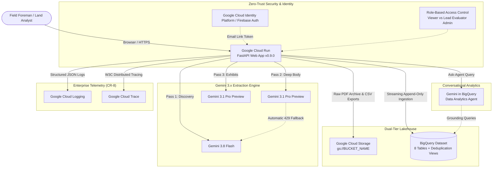

# Invenergy Contract Intelligence & Subcontractor DND Platform

An enterprise-grade, Gemini-first hierarchical contract parsing, extraction, and subcontractor clearance platform. The system ingests complex renewable energy land leases, easement agreements, and power purchase agreements (PPAs), decomposes them into structural AST nodes, extracts actionable landowner special conditions, and stages records into a dual-store lakehouse (Cloud Storage + BigQuery).

---

## 1. System Architecture



---

## 2. Repository Layout

```
.
├── contract_parser/            # Core Application Source Code
│   ├── app.py                  # FastAPI Application, Routes & Static HTML Serving
│   ├── auth.py                 # Identity Platform / Firebase Auth & RBAC
│   ├── ask_agent.py            # BigQuery Data Analytics Agent Client & Proxy
│   ├── config.py               # Centralized Pipeline Configuration & Settings
│   ├── gemini_parser.py        # 3-Pass Gemini Multi-Pass Extraction Engine
│   ├── schemas.py              # Pydantic Schemas, AST Nodes & Enums
│   ├── storage.py              # Lakehouse Persistence (SQLite, GCS, BigQuery)
│   └── telemetry/              # OpenTelemetry Tracing & Cloud Logging (CR-8)
│       ├── logging_formatter.py # Cloud Logging Single-Line Structured JSON Formatter
│       ├── tracing.py          # TracerProvider & CloudTraceSpanExporter Setup
│       └── thread_propagation.py # TracedThreadPoolExecutor Context Propagation
├── scripts/
│   ├── setup_gcp_environment.sh # Automated GCP Infrastructure Provisioning Script
│   └── sql/
│       ├── 01_create_tables.sql      # BigQuery 8-Table DDL with Partitioning & Clustering
│       ├── 02_create_views.sql       # Analytical Deduplication Views (QUALIFY ROW_NUMBER() = 1)
│       └── 03_seed_erp_projects.sql  # Initial ERP Portfolio Projects Seed
├── tests/                      # Pytest Unit & Integration Test Suites
├── Dockerfile                  # Production Container Specification
├── pyproject.toml              # Dependencies & Package Metadata
├── .env.example                # Runtime Environment Variables Template
└── Changelog.md                # Version History & Release Notes
```

---

## 3. Prerequisites

Before deploying to Sophia's GCP project, ensure the following are available:

1. **Google Cloud Project** with active billing enabled.
2. **Google Cloud SDK (`gcloud` and `bq` CLI tools)** installed and authenticated:
   ```bash
   gcloud auth login
   gcloud auth application-default login
   ```
3. **IAM Permissions:** The user or deployment pipeline running the provisioning scripts must hold:
   - `roles/resourcemanager.projectIamAdmin` (or `roles/owner`) to bind service account roles.
   - `roles/serviceusage.serviceUsageAdmin` to enable Google Cloud APIs.
   - `roles/storage.admin` to create Cloud Storage buckets.
   - `roles/bigquery.admin` to create datasets, tables, and views.
   - `roles/run.admin` and `roles/iam.serviceAccountUser` to deploy Cloud Run services.

---

## 4. Quick Start: Automated GCP Infrastructure Setup

Run the automated setup script to enable APIs, create the GCS bucket, build BigQuery tables/views, and configure the runtime service account in a single step:

```bash
# 1. Set target GCP Project and Region
export PROJECT_ID="your-target-project-id"
export REGION="us-central1"

# 2. Execute automated setup script
chmod +x ./scripts/setup_gcp_environment.sh
./scripts/setup_gcp_environment.sh
```

### What This Script Does:
1. **Enables 9 GCP APIs:** Cloud Run, Cloud Build, Artifact Registry, Vertex AI (`aiplatform`), BigQuery, Cloud Storage, Identity Toolkit, Cloud Trace, and Cloud Logging.
2. **Provisions Storage Bucket:** Creates `gs://${PROJECT_ID}-contract-intelligence` with Uniform Bucket-Level Access.
3. **Provisions BigQuery Lakehouse:** Creates dataset `contract_intelligence` in the specified region and runs:
   - `scripts/sql/01_create_tables.sql`: Creates 8 tables with clustering and partitioning.
   - `scripts/sql/02_create_views.sql`: Creates 9 analytical views with `QUALIFY ROW_NUMBER() = 1` active-state deduplication.
   - `scripts/sql/03_seed_erp_projects.sql`: Populates baseline renewable energy development assets.
4. **Provisions Runtime Service Account:** Creates `contract-parser-sa@${PROJECT_ID}.iam.gserviceaccount.com` and binds the 6 least-privilege roles:
   - `roles/bigquery.dataEditor`
   - `roles/bigquery.jobUser`
   - `roles/storage.objectAdmin`
   - `roles/aiplatform.user`
   - `roles/cloudtrace.agent`
   - `roles/logging.logWriter`

---

## 5. Manual Step-by-Step GCP Setup

For enterprise DevOps teams requiring manual control over each step:

### Step 5.1: Enable APIs
```bash
gcloud services enable \
    run.googleapis.com \
    cloudbuild.googleapis.com \
    artifactregistry.googleapis.com \
    aiplatform.googleapis.com \
    bigquery.googleapis.com \
    storage.googleapis.com \
    identitytoolkit.googleapis.com \
    cloudtrace.googleapis.com \
    logging.googleapis.com \
    --project="${PROJECT_ID}"
```

### Step 5.2: Create Cloud Storage Bucket
```bash
gcloud storage buckets create "gs://${PROJECT_ID}-contract-intelligence" \
    --project="${PROJECT_ID}" \
    --location="${REGION}" \
    --uniform-bucket-level-access
```

### Step 5.3: Create BigQuery Dataset & Run SQL DDL
```bash
# Create dataset
bq --location="${REGION}" mk \
    --project_id="${PROJECT_ID}" \
    --dataset \
    --description="Invenergy Contract Intelligence Lakehouse" \
    contract_intelligence

# Run DDL scripts
bq query --use_legacy_sql=false --project_id="${PROJECT_ID}" < scripts/sql/01_create_tables.sql
bq query --use_legacy_sql=false --project_id="${PROJECT_ID}" < scripts/sql/02_create_views.sql
bq query --use_legacy_sql=false --project_id="${PROJECT_ID}" < scripts/sql/03_seed_erp_projects.sql
```

### Step 5.4: Create Runtime Service Account & Bind Roles
```bash
SA_NAME="contract-parser-sa"
SA_EMAIL="${SA_NAME}@${PROJECT_ID}.iam.gserviceaccount.com"

gcloud iam service-accounts create "${SA_NAME}" \
    --project="${PROJECT_ID}" \
    --display-name="Contract Intelligence Runtime SA"

ROLES=(
    "roles/bigquery.dataEditor"
    "roles/bigquery.jobUser"
    "roles/storage.objectAdmin"
    "roles/aiplatform.user"
    "roles/cloudtrace.agent"
    "roles/logging.logWriter"
)

for role in "${ROLES[@]}"; do
    gcloud projects add-iam-policy-binding "${PROJECT_ID}" \
        --member="serviceAccount:${SA_EMAIL}" \
        --role="${role}" \
        --condition=None
done
```

---

## 6. BigQuery Conversational Data Analytics Agent Setup (CR-4)

The platform includes a conversational BigQuery Data Agent tab that allows legal analysts and construction foremen to query the contract lakehouse in natural language.

### Creating the Agent in BigQuery Studio:
1. Open the [Google Cloud Console > BigQuery](https://console.cloud.google.com/bigquery).
2. In the BigQuery Studio navigation menu, select **Data Agents** (or **Gemini Data Analytics Agents**).
3. Click **Create Data Agent**.
4. Configure the agent settings:
   - **Agent Name:** `contract-intelligence-agent`
   - **Region:** `us` (or matching multi-region / region)
   - **Grounded Data Source:** Select BigQuery dataset `contract_intelligence`.
   - **Selected Views:** Select `v_contract_intelligence_mart`, `v_active_documents`, and `v_active_special_conditions`.
   - **System Instructions:** 
     > "You are an expert contract intelligence assistant for renewable energy projects. You help project managers and legal teams analyze land leases, special conditions, and subcontractor restrictions from the provided BigQuery views."
5. Click **Create & Publish**.
6. Copy the **Resource URN** or **Resource Name**:
   - Format: `urn:agent:projects-<project-number>:projects:<project-number>:locations:us:geminidataanalytics:dataAgents:<agent-id>`
   - Or: `projects/<project-number>/locations/us/dataAgents/<agent-id>`
7. Set this value in your environment as `BQ_DATA_AGENT_URN`.

> [!NOTE]
> If `BQ_DATA_AGENT_URN` is left blank, the application will run normally. The conversational agent tab will display a helpful banner stating that the agent has not yet been provisioned.

---

## 7. Firebase Authentication & Identity Platform Setup (CR-7)

The application provides zero-trust passwordless Email Link authentication:

1. Open [Google Cloud Console > Identity Platform](https://console.cloud.google.com/customer-identity) or [Firebase Console](https://console.firebase.google.com).
2. If using Firebase, add your GCP Project.
3. Under **Authentication > Sign-in Method**:
   - Enable **Email/Password**.
   - Check **Email Link (passwordless sign-in)**.
4. Under **Settings > Authorized Domains**:
   - Add your Cloud Run domain (e.g. `contract-parser-<hash>.us-central1.run.app`).
   - Add `localhost` for local development.
5. Retrieve your Web App configuration:
   - **`FIREBASE_API_KEY`**: Your Web API Key (found in Project Settings > General).
   - **`FIREBASE_AUTH_DOMAIN`**: `<project-id>.firebaseapp.com`.
6. Set the administrative whitelist:
   - Configure `ADMIN_EMAIL_WHITELIST=lead.evaluator@invenergy.com,sophia@customer.com` to grant specific users full HITL overrides and CSV export capabilities.

---

## 8. Local Execution & Testing

To test or develop locally:

```bash
# 1. Create and activate Python virtual environment
python3 -m venv .venv
source .venv/bin/activate

# 2. Install application with development and test dependencies
pip install -e ".[dev]"

# 3. Configure local environment
cp .env.example .env
# Edit .env with your local credentials and project IDs

# 4. Run full test suite
pytest tests/

# 5. Start development server
uvicorn contract_parser.app:app --host 127.0.0.1 --port 8000 --reload
```
Open [http://127.0.0.1:8000](http://127.0.0.1:8000) in your browser.

---

## 9. Google Cloud Run Deployment

Deploy the container from source directly to Cloud Run:

```bash
gcloud run deploy contract-parser \
  --source . \
  --region us-central1 \
  --project "${PROJECT_ID}" \
  --service-account "${SA_EMAIL}" \
  --memory 2Gi \
  --cpu 2 \
  --timeout 600 \
  --set-env-vars "\
GOOGLE_CLOUD_PROJECT=${PROJECT_ID},\
GOOGLE_CLOUD_LOCATION=global,\
GOOGLE_GENAI_USE_ENTERPRISE=true,\
GCS_BUCKET_NAME=${PROJECT_ID}-contract-intelligence,\
BQ_DATASET_ID=contract_intelligence,\
BQ_DATA_AGENT_URN=${BQ_DATA_AGENT_URN},\
LOCAL_DATA_DIR=/tmp/data,\
GEMINI_MODEL=gemini-3.1-pro-preview,\
GEMINI_FALLBACK_MODEL=gemini-3.8-flash,\
FAST_DISCOVERY_MODEL=gemini-3.8-flash,\
MULTI_PASS_ENABLED=true,\
PASS_TIMEOUT_SECONDS=480.0,\
GEMINI_MAX_OUTPUT_TOKENS=65536,\
AUTH_ENABLED=true,\
FIREBASE_API_KEY=${FIREBASE_API_KEY},\
FIREBASE_AUTH_DOMAIN=${FIREBASE_AUTH_DOMAIN},\
ADMIN_EMAIL_WHITELIST=aprasanna@google.com,sophia@customer.com,\
LOG_FORMAT=json,\
LOG_LEVEL=INFO,\
CLOUD_TRACE_ENABLED=true,\
CLOUD_TRACE_SCHEDULE_DELAY_MS=500,\
TELEMETRY_SERVICE_NAME=contract-parser,\
TELEMETRY_SERVICE_VERSION=0.9.0,\
TELEMETRY_SAMPLE_RATE=1.0" \
  --allow-unauthenticated
```

---

## 10. Post-Deployment Verification

1. **Verify UI Availability:**
   ```bash
   curl -s -o /dev/null -w "%{http_code}\n" https://<SERVICE_URL>/
   # Expected output: 200
   ```

2. **Verify Auth Configuration Endpoint:**
   ```bash
   curl -s https://<SERVICE_URL>/api/v1/auth/config
   # Expected response: JSON containing auth_enabled, firebase_api_key, and allowed_domains
   ```

3. **Verify Cloud Trace and Structured Logging:**
   In [Google Cloud Console > Logs Explorer](https://console.cloud.google.com/logs), search:
   ```
   resource.type="cloud_run_revision"
   resource.labels.service_name="contract-parser"
   ```
   Confirm logs arrive as single-line JSON with `serviceContext`, `sourceLocation`, and linked `trace` properties.

---

## 11. Troubleshooting & Operational Runbook

| Issue | Cause | Resolution |
| :--- | :--- | :--- |
| **403 Forbidden / PermissionDenied** | Service Account lacks IAM roles. | Ensure `roles/bigquery.dataEditor`, `roles/storage.objectAdmin`, and `roles/aiplatform.user` are assigned to the runtime service account. |
| **429 ResourceExhausted on Gemini** | Vertex AI per-minute quota reached. | The system automatically attempts exponential backoff and triggers the `GEMINI_FALLBACK_MODEL` (`gemini-3.8-flash`). Request a Vertex AI quota increase in the GCP Quotas console. |
| **Auth Domain Not Authorized** | Cloud Run domain missing from Firebase Auth settings. | Add the Cloud Run domain (e.g. `*.run.app` or custom domain) to Firebase Console > Authentication > Settings > Authorized Domains. |
| **PDF Extraction Timeout** | Very large PDF document (>150 pages). | Increase `PASS_TIMEOUT_SECONDS` (default: 480s) and ensure Cloud Run `--timeout` is set to 600 seconds or higher. |
| **Ask-Agent 404 / Unavailable** | BigQuery Data Agent URN invalid or not yet published. | Verify `BQ_DATA_AGENT_URN` matches the published agent resource in BigQuery Studio > Data Agents. |
