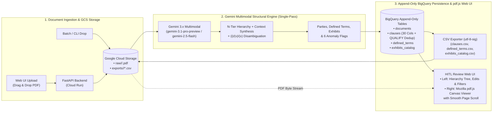
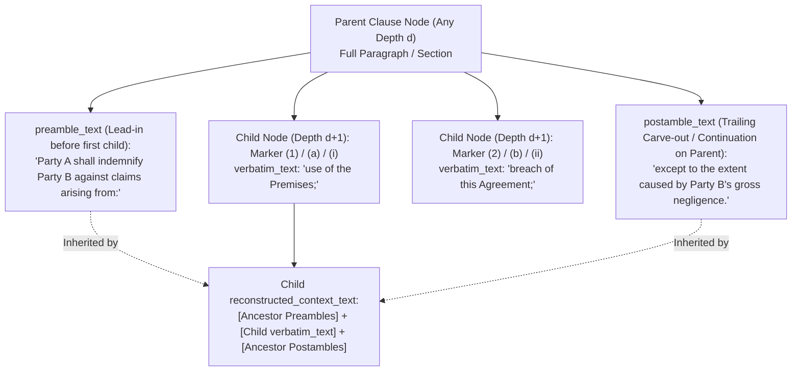

# Design Specification: Generic Hierarchical Contract Parsing & Context Preservation (Session 1)

> [!IMPORTANT]
> **Design Principle: Contract-Agnostic Architecture**
> This system is designed as a **universal legal document parser** capable of ingesting arbitrary energy, land, infrastructure, and commercial agreements (e.g., Wind/Solar Leases, Transmission Easements, Accommodation Agreements, PPAs, Interconnection Agreements, O&M Contracts, and Amendments)—not just a single template.
> * **Session 1 (Current Scope):** End-to-end ingestion (via Web UI upload or direct GCS bucket drop), archiving the PDF in Google Cloud Storage (GCS), reconstructing a lossless $N$-tier Document Tree (`clauses`), resolving Defined Terms (`defined_terms`), cataloging arbitrary Exhibits/Schedules (`exhibits_catalog`), persisting all fields to BigQuery, exporting normalized CSVs, and providing a Web UI with Jump-to-Page PDF review for flagged items.
> * **Handwritten & Visual Blocks (Deferred Placeholder):** Signature/notary blocks containing handwriting/checkboxes and non-text engineering/map exhibits are captured as generic structural placeholders (`hitl_status = PLACEHOLDER_FOR_REVIEW`) with page citations for later review.
> * **Session 2 (Next Session):** Semantic Obligation Extraction (`obligations.csv`), separating declaratory boilerplate from actionable duties, and modeling unilateral vs. multi-party obligations.

---

## 1. End-to-End Generic Architecture (Web UI + GCS + Gemini 3.x + Append-Only BigQuery)

Documents can enter the system through two entrypoints: **interactive upload via the Web UI** or **automated batch ingestion from a Google Cloud Storage (GCS) bucket**. Every uploaded PDF is archived in GCS (`gs://<bucket>/raw/<document_id>/<filename>.pdf`), processed directly through **Gemini Multimodal (`gemini-3.1-pro-preview` / `gemini-2.5-flash`)** with Structured Outputs (no external OCR or `pymupdf` dependency), streamed as append-only versioned rows into BigQuery, and served back to the Web UI (`pdf.js`) for side-by-side verification, inline editing, approval, and CSV export.

---

## 2. Document Ingestion, Cloud Storage (GCS), and Web UI Workflow

### 2.1 How Documents Are Passed Into the System
1. **Path A — Interactive Web UI Upload:**
   * A user opens the Web UI and uploads one or more contract PDFs.
   * The backend generates a deterministic `document_id` (SHA-256 content hash), streams the original PDF to **Google Cloud Storage (`gs://<bucket>/raw/<document_id>/<filename>.pdf`)**, registers the document in BigQuery (`documents` table with `ingestion_status = PROCESSING`), and runs the Gemini extraction pipeline.
2. **Path B — Direct GCS Bucket Drop / Batch CLI:**
   * For bulk migrations (e.g., 500 historical leases), files dropped into `gs://<bucket>/incoming/` (or passed via CLI `python -m contract_parser.app ingest <path_or_gcs_uri>` / `POST /api/v1/documents/ingest-gcs`) automatically archive to `raw/`, run the pipeline with rate-limit backoff, populate BigQuery, and appear in the Web UI queue.

### 2.2 What gets stored in Google Cloud Storage (GCS)
A single GCS bucket with lifecycle prefixes stores all immutable artifacts per contract:
* `gs://<bucket>/raw/<document_id>/<original_filename>.pdf` — The source PDF (streamed to the Web UI's embedded `pdf.js` canvas viewer for physical page navigation and passed directly as a `gs://` URI to Gemini).
* `gs://<bucket>/exports/<document_id>/clauses.csv`, `defined_terms.csv`, `exhibits_catalog.csv` — Generated flat CSV exports (`utf-8-sig` encoded for Excel) ready for one-click download in the Web UI or downstream system pickup.

### 2.3 Web UI Capabilities
The Web UI provides a two-pane workspace:
* **Left Pane (Interactive Contract Explorer & HITL Queue):**
  * Displays contract metadata (parties, effective date, page count), and tabs for **Clause Hierarchy Tree**, **Defined Terms**, **Exhibits Catalog**, and **Flagged Items (`FLAGGED_FOR_REVIEW` / `PLACEHOLDER_FOR_REVIEW`)**.
  * Toggling any clause shows both its atomic `verbatim_text` and its `reconstructed_context_text` (`Ancestor Preambles + Child + Interleaved/Trailing Postambles`), alongside clickable chips for any Defined Terms or Exhibits used.
  * Includes **"Download CSVs"** and **"Edit / Approve & Resolve Flag"** actions (which append a new versioned row with `hitl_status = APPROVED_BY_HUMAN`, `reviewed_by`, `review_notes`, and `updated_at` in BigQuery without hitting streaming buffer locks).
* **Right Pane (Embedded Mozilla `pdf.js` Canvas Viewer with Page-Level Citation):**
  * Renders the PDF onto HTML5 canvases via `pdf.js`. Clicking any clause, defined term, exhibit, or HITL flag in the left pane immediately scrolls the viewer to physical PDF page `page_start` without iframe reload flicker.

---

## 3. Universal Structural Challenges & Generic Design Patterns

Rather than hardcoding rules for a specific document layout, the Gemini multimodal engine handles universal structural anomalies found across legal contracts:

### 3.1 Arbitrary Depth & Mixed Numbering Schemes
Contracts do not follow a fixed `Section -> (a) -> (i)` hierarchy. Across different law firms and agreement types:
* **Deep Multi-Tier Trees:** `ARTICLE I` $\rightarrow$ `Section 1.01` $\rightarrow$ `(a)` $\rightarrow$ `(1)` $\rightarrow$ `(i)` $\rightarrow$ `(A)` (6+ levels).
* **Decimal Outlines:** `1.` $\rightarrow$ `1.1` $\rightarrow$ `1.1.1` $\rightarrow$ `1.1.1.1`.
* **Skipped Hierarchy Tiers:** A section may jump directly from a top-level number (`4.`) to lowercase roman numerals (`(i), (ii), (iii)`) with no intermediate `(a)` level.
* **Zone Numbering Resets & Multi-Document Binders:** Numbering restarts across document zones (`RECITALS 1..N`, `AGREEMENT 1..N`, `EXHIBIT A 1..N`, `SCHEDULE 1`, `AMENDMENT 1`).

**Generic Solution:**
* The hierarchy is modeled as an **unbounded Adjacency List (`node_id` $\rightarrow$ `parent_node_id`) + `canonical_path`** segmented by `document_zone` (e.g., `RECITALS.1` vs. `BODY.1` vs. `EXHIBIT_A.1`).
* Instead of hardcoding column names to numbering styles (like `level_2_alpha` or `level_3_roman`), the flattened schema uses **scheme-agnostic tier columns** (`level_1_label`, `level_2_label`, `level_3_label`, `level_4_label`, `level_5_plus_path`) paired with a `numbering_scheme` metadata column.

### 3.2 The Roman vs. Alphabetical Ambiguity (`(i)`, `(v)`, `(x)`)
In any generic contract parser, inline markers `(i)`, `(v)`, and `(x)` are ambiguous:
* Is `(i)` the **first Roman numeral** sub-clause (`(i), (ii), (iii)`), or is it the **ninth alphabetical clause** following `(a), (b), (c), (d), (e), (f), (g), (h)`?
* **Generic Solution (Contextual Sibling Lookbehind & Lookahead):** When encountering `(i)`, `(v)`, or `(x)`, Gemini inspects the active sibling sequence and the next marker token:
  * If the immediately preceding sibling at the current depth is `(h)` (or `(u)` for `(v)`, `(w)` for `(x)`) **and** the subsequent marker is `(j)` (or there is no `(ii)`), `(i)` is classified as a continuation of `ALPHA_LOWER` at the same depth.
  * Otherwise, if `(i)` follows a colon/preamble or is followed by `(ii)`, it opens a new child depth level as `ROMAN_LOWER`. If only a single `(i)` exists without `(ii)` after `(h)`, the node is flagged with `AMBIGUOUS_HIERARCHY_MARKER` for HITL review.

### 3.3 The "Sandwich Clause" & Multi-Level "Double Sandwich" (Preamble $\rightarrow$ Inline Children $\rightarrow$ Postamble Modifiers)
Across legal drafting, sub-clauses frequently appear **inline inside a single paragraph** rather than as indented blocks, and are often bookended by a leading preamble, interleaved provisos, and a trailing legal modifier (e.g., `except to the extent...`, `provided, however, that...`, `subject to...`) or followed by additional unnumbered sentences.

**Generic Solution:**
1. Every clause node at any depth $d$ separates its text into `preamble_text` (text before its first child), `children[]` (ordered child nodes at depth $d+1$), and `postamble_text` (trailing modifiers or unnumbered continuation sentences belonging to depth $d$ after the last child).
2. Every child node stores both its atomic `verbatim_text` and a complete `reconstructed_context_text` (`ancestor_preambles + child.verbatim_text + interleaved_or_ancestor_postambles`), ensuring that any sub-clause queried in isolation retains its governing verb and legal carve-outs across all ancestor levels.

### 3.4 Visual Layout De-Interleaving, Strikeouts & Physical Page Indexing
Generic contracts contain layout artifacts that corrupt naive text streams:
* **Running Headers, Footers, Line Numbers & Strikeouts:** Page numbers, document control IDs, Execution Copy stamps, margin numbers `1..28` on legal pleading paper, and struck-through redlines are visually ignored by Gemini *before* cross-page sentence stitching so they never land in the middle of a split clause.
* **Multi-Column & Tabular Blocks:** Side-by-side blocks (such as multi-party Notice addresses or signature blocks) are visually read column-by-column rather than left-to-right across the page width.
* **Physical vs. Printed Page Indexing:** `page_start` and `page_end` always record the **1-indexed physical PDF page number** (1 to `page_count`) rather than printed page footers so `pdf.js` navigation lands on the exact PDF page.

---

## 4. Append-Only BigQuery & CSV Data Model (All Fields Persisted)

All extracted data is streamed via `insert_rows_json` into **four BigQuery tables** (`documents`, `clauses`, `defined_terms`, `exhibits_catalog`) using **Option 3B (Append-Only Versioning with `updated_at`)**. All reads and CSV exports (`gs://<bucket>/exports/<document_id>/`) deduplicate the latest version of each record using `QUALIFY ROW_NUMBER() OVER (PARTITION BY document_id, <entity_key> ORDER BY updated_at DESC) = 1`.

### 4.1 Table 1: `documents` (Master Document Registry in BigQuery — 12 Columns)
Tracks every ingested PDF, its Cloud Storage location, contracting parties, effective date, and overall QA status:

| Column Name | BigQuery Type | Description |
| :--- | :--- | :--- |
| `document_id` | `STRING` | Primary key (deterministic SHA-256 content hash). |
| `filename` | `STRING` | Original uploaded filename (e.g., `Synthetic_Accommodation_Agreement.pdf`). |
| `gcs_pdf_uri` | `STRING` | `gs://<bucket>/raw/<document_id>/<filename>.pdf`. |
| `gcs_export_prefix` | `STRING` | `gs://<bucket>/exports/<document_id>/`. |
| `page_count` | `INT64` | Total physical pages in the PDF. |
| `contracting_parties_json` | `JSON` | Extracted parties and roles (e.g., `[{"name": "Cedar Lantern...", "role": "Developer"}]`) for Session 2 readiness. |
| `effective_date` | `STRING` | Extracted effective or execution date of the agreement (if stated). |
| `flagged_node_count` | `INT64` | Count of clauses currently in `FLAGGED_FOR_REVIEW` or `PLACEHOLDER_FOR_REVIEW`. |
| `ingestion_status` | `STRING` | `PROCESSING`, `NEEDS_HITL_REVIEW`, `VERIFIED_COMPLETE`, `FAILED`. |
| `error_message` | `STRING` | Populated if `ingestion_status = FAILED`. |
| `ingested_at` | `TIMESTAMP` | UTC timestamp of initial ingestion. |
| `updated_at` | `TIMESTAMP` | UTC timestamp of this row version (for `QUALIFY ROW_NUMBER()` deduplication). |

### 4.2 Table 2: `clauses` / `clauses.csv` (30 Columns: 27 Core Structural/Context Fields + 3 Audit Fields)
Every field is streamed to BigQuery (`contract_intelligence.clauses`) and the latest deduplicated version per `(document_id, node_id)` is exported to `clauses.csv`:

| Column Name | BigQuery Type | Description |
| :--- | :--- | :--- |
| `document_id` | `STRING` | Foreign key to `documents.document_id`. |
| `gcs_pdf_uri` | `STRING` | Direct GCS URI of the source PDF for lineage. |
| `node_id` | `STRING` | Unique key for this structural node within the document. |
| `parent_node_id` | `STRING` | Foreign key to the immediate parent `node_id` (`NULL` for root nodes). |
| `sibling_order` | `INT64` | 1-indexed sequential order among siblings under the same parent. |
| `document_zone` | `STRING` | `PREAMBLE`, `RECITALS`, `BODY`, `SIGNATURES`, `EXHIBIT_OR_SCHEDULE`, `AMENDMENT`. |
| `canonical_path` | `STRING` | Lossless dot-delimited path supporting arbitrary depth $N$ (e.g., `BODY.ART_I.SEC_1_01.a.i`). |
| `depth` | `INT64` | Structural nesting depth (`1..N`) relative to the root of the zone. |
| `clause_label` | `STRING` | Exact numbering or heading token of this node (e.g., `Article I`, `Section 4`, `(a)`, `(i)`, `1.2.3`). |
| `numbering_scheme` | `STRING` | `ROMAN_UPPER`, `INTEGER`, `DECIMAL`, `ALPHA_LOWER`, `ALPHA_UPPER`, `ROMAN_LOWER`, `PAREN_INT`, `NAMED_HEADER`, `UNNUMBERED`. |
| `level_1_label` | `STRING` | Tier 1 ancestor label (e.g., `Article I` or `Section 4` or `Exhibit A`). |
| `level_2_label` | `STRING` | Tier 2 label regardless of numbering scheme (e.g., `Section 1.01`, `(a)`, `(i)`, or `Parcel 4`). |
| `level_3_label` | `STRING` | Tier 3 label if depth $\ge 3$ (e.g., `(a)`, `(i)`, `LESS_AND_EXCEPT`). |
| `level_4_label` | `STRING` | Tier 4 label if depth $\ge 4$ (`NULL` if shallower). |
| `level_5_plus_path` | `STRING` | Overflow sub-path for deeply nested contracts with depth $\ge 5$ (e.g., `(i).(A).(1)`). |
| `clause_title` | `STRING` | Extracted title/heading of the clause or section, if present. |
| `is_inline_clause` | `BOOL` | `TRUE` if extracted from an inline run-in paragraph; `FALSE` if a distinct visual block. |
| `preamble_text` | `STRING` | Lead-in text on a parent node preceding its first inline/block child. |
| `verbatim_text` | `STRING` | Exact atomic text belonging strictly to this node. |
| `postamble_text` | `STRING` | Trailing modifier or unnumbered continuation sentences following child nodes on a parent. |
| `reconstructed_context_text` | `STRING` | Self-contained legal text combining ancestor preambles, `verbatim_text`, and ancestor postambles. |
| `defined_terms_used` | `STRING` | Pipe-delimited Defined Terms detected in this clause. |
| `cross_references` | `STRING` | Pipe-delimited internal/external references (e.g., `Section 3.2|Exhibit B|Book 412 Page 188`). |
| `page_start` | `INT64` | Starting physical PDF page number (1-indexed) for `pdf.js` navigation. |
| `page_end` | `INT64` | Ending physical PDF page number (captures cross-page clauses). |
| `hitl_status` | `STRING` | `VERIFIED_AUTO`, `FLAGGED_FOR_REVIEW`, `PLACEHOLDER_FOR_REVIEW`, `APPROVED_BY_HUMAN`. |
| `hitl_flag_reasons` | `STRING` | Pipe-delimited universal anomaly codes triggering human review. |
| `updated_at` | `TIMESTAMP` | UTC timestamp of this row version (latest row per `document_id, node_id` wins). |
| `reviewed_by` | `STRING` | Identifier of the human reviewer who approved or edited the node (`NULL` for initial AI version). |
| `review_notes` | `STRING` | Optional reviewer notes recorded when approving or editing a flagged clause. |

### 4.3 Table 3: `defined_terms` / `defined_terms.csv` (8 Columns)
Captures both dedicated "Definitions" articles and inline parenthetical definitions (`...(collectively, the "Facilities")`):

| Column Name | BigQuery Type | Description |
| :--- | :--- | :--- |
| `document_id` | `STRING` | Foreign key to `documents.document_id`. |
| `term_name` | `STRING` | Normalized defined term (e.g., `Property`, `Effective Date`, `Force Majeure`). |
| `defined_in_node_id` | `STRING` | `node_id` where the term is formally defined. |
| `definition_type` | `STRING` | `DEDICATED_DEFINITION_CLAUSE`, `INLINE_PARENTHETICAL`, `EXTERNAL_INCORPORATION`. |
| `verbatim_definition` | `STRING` | Exact text defining the term. |
| `referenced_in_nodes` | `STRING` | Pipe-delimited list of `node_id`s that use this term. |
| `page_number` | `INT64` | Physical PDF page number where defined. |
| `updated_at` | `TIMESTAMP` | UTC timestamp of this row version. |

### 4.4 Table 4: `exhibits_catalog` / `exhibits_catalog.csv` (10 Columns)
Every attached Exhibit, Schedule, or Appendix is cataloged with a universal modality classification and a BigQuery `JSON` column (`structured_entities_json`) for domain-specific entities:

| Column Name | BigQuery Type | Description |
| :--- | :--- | :--- |
| `document_id` | `STRING` | Foreign key to `documents.document_id`. |
| `exhibit_id` | `STRING` | Identifier (`Exhibit A`, `Schedule 2.1`, `Appendix I`). |
| `exhibit_title` | `STRING` | Extracted title of the exhibit/schedule. |
| `exhibit_modality` | `STRING` | `PROSE_CLAUSES`, `TABULAR_SCHEDULE`, `PROPERTY_DESCRIPTION`, `EXTERNAL_INSTRUMENT_LIST`, `VISUAL_DRAWING_OR_MAP_STUB`. |
| `page_start` | `INT64` | Starting physical page in the PDF. |
| `page_end` | `INT64` | Ending physical page in the PDF. |
| `referenced_by_nodes` | `STRING` | Body `node_id`s that reference this exhibit. |
| `structured_entities_json` | `JSON` | Domain-flexible array of extracted records (e.g., `[{"entity_type": "PARCEL", "id": "...", "carveouts": [...]}, {"entity_type": "EXTERNAL_CONTRACT", "recording_ref": "..."}]`). |
| `has_unresolved_external_dep` | `BOOL` | `TRUE` if a body clause depends on data (e.g., an expiration date or rate) inside an external instrument listed in this exhibit but not present in the PDF text. |
| `updated_at` | `TIMESTAMP` | UTC timestamp of this row version. |

---

## 5. Universal Gemini Multimodal QA & HITL Flag Taxonomy

To ensure high reliability across unseen contract templates without relying on uncalibrated numeric LLM confidence scores or external OCR dependencies, Gemini flags nodes using **six contract-agnostic rules**:

| Universal Flag Code | Trigger Condition (Contract-Agnostic) | HITL Action |
| :--- | :--- | :--- |
| `TEXT_COVERAGE_GAP` | Gemini visually detects illegible scan regions, cut-off page margins, redacted blocks, or corrupted text on physical Page $P$ that prevents complete verbatim transcription. | Analyst scrolls `pdf.js` to Page $P$ to inspect and edit any unreadable text. |
| `AMBIGUOUS_HIERARCHY_MARKER` | Skipped numbering tier (e.g., `INTEGER` directly to `ROMAN_LOWER` without `ALPHA_LOWER`), non-sequential numbering jump, or ambiguous `(i)`/`(v)`/`(x)` transition. | Analyst verifies parent-child nesting level on Page $P$. |
| `SCOPE_CARVEOUT_DETECTED` | Clause or exhibit contains a material legal exception or exclusion marker (`LESS AND EXCEPT`, `EXCEPT that part`, `Notwithstanding`, `provided, however`, `except to the extent`). | Analyst confirms the carve-out is properly attached to its target scope. |
| `UNRESOLVED_EXTERNAL_DEPENDENCY` | A governing clause (such as Term, Termination, or Pricing) depends on an external document, permit, or recorded instrument referenced by citation (e.g., County Book/Page) whose terms are not in the PDF. | Compliance team links or requests the underlying external document. |
| `BROKEN_INTERNAL_REFERENCE` | A clause references a `Section X`, `Exhibit Y`, or `"Defined Term"` that does not exist in `clauses.csv`, `exhibits_catalog.csv`, or `defined_terms.csv`. | Analyst checks for missing attachment pages or drafting typos. |
| `DEFERRED_MODALITY_PLACEHOLDER` | Node is classified as a `SIGNATURE_BLOCK` with handwritten/checkbox fields or a `VISUAL_DRAWING_OR_MAP_STUB` (CAD drawings, site maps, plats). | Held as a page-indexed placeholder for specialized or manual review. |

---

## 6. Validation Example: Applying the Generic Schema to [Synthetic_Accommodation_Agreement.pdf](file:///usr/local/google/home/prasannaankem/Downloads/Synthetic_Accommodation_Agreement.pdf)

To illustrate how this generic schema handles a concrete document without any template-specific columns, here is how [Synthetic_Accommodation_Agreement.pdf](file:///usr/local/google/home/prasannaankem/Downloads/Synthetic_Accommodation_Agreement.pdf) maps into `clauses.csv`:

| `document_zone` | `canonical_path` | `depth` | `numbering_scheme` | `level_1_label` | `level_2_label` | `level_3_label` | `is_inline_clause` | `verbatim_text` (Abbreviated) | `reconstructed_context_text` (Abbreviated) | `page_start`–`end` | `hitl_flag_reasons` |
| :--- | :--- | :--- | :--- | :--- | :--- | :--- | :--- | :--- | :--- | :--- | :--- |
| `RECITALS` | `RECITALS.1` | 1 | `INTEGER` | `1` | `NULL` | `NULL` | `FALSE` | `1. Cedar Lantern has obtained certain rights...` | *(Same as verbatim)* | `1–1` | `NONE` |
| `BODY` | `BODY.1` | 1 | `INTEGER` | `1` | `NULL` | `NULL` | `FALSE` | `1. Recitals. The foregoing recitals are true...` | *(Same as verbatim)* | `2–2` | `NONE` |
| `BODY` | `BODY.2.i` | 2 | `ROMAN_LOWER` | `2` | `(i)` | `NULL` | `TRUE` | `(i) expiration of the Blue Meridian Easements...` | `This Agreement shall terminate upon the earlier of (i) expiration of the Blue Meridian Easements and removal of the Blue Meridian Facilities` | `2–2` | `AMBIGUOUS_HIERARCHY_MARKER` \| `UNRESOLVED_EXTERNAL_DEPENDENCY` |
| `BODY` | `BODY.3.b` | 2 | `ALPHA_LOWER` | `3` | `(b)` | `NULL` | `TRUE` | `(b) it shall, and shall cause its representatives...` | `Each of the Parties covenants, acknowledges and agrees that (b) it shall... exercise due care with respect to the Operations and Equipment...` | `2–2` | `NONE` |
| `BODY` | `BODY.4.i` | 2 | `ROMAN_LOWER` | `4` | `(i)` | `NULL` | `TRUE` | `(i) Cedar Lantern's use of Property;` | `To the fullest extent permitted by law, Cedar Lantern shall indemnify... Blue Meridian harmless from... Liabilities... arising out of: (i) Cedar Lantern's use of Property; except to the extent such Liabilities arise from... negligence or willful misconduct of Blue Meridian.` | `2–2` | `AMBIGUOUS_HIERARCHY_MARKER` \| `SCOPE_CARVEOUT_DETECTED` |
| `BODY` | `BODY.6` | 1 | `INTEGER` | `6` | `NULL` | `NULL` | `FALSE` | `6. WAIVER OF CONSEQUENTIAL DAMAGES...` | *(Stitched across pages 2 and 3)* | `2–3` | `NONE` |
| `SIGNATURES` | `SIGNATURES.1` | 1 | `NAMED_HEADER` | `SIG_1` | `NULL` | `NULL` | `FALSE` | `IN WITNESS WHEREOF... [Execution & Notary Block]` | `[Placeholder: Execution & Notary Block on Page 5]` | `5–5` | `DEFERRED_MODALITY_PLACEHOLDER` |
| `EXHIBIT_OR_SCHEDULE` | `EXHIBIT_A.PARCEL_4.EXCEPT_1` | 3 | `NAMED_HEADER` | `Exhibit A` | `Parcel 4` | `LESS_AND_EXCEPT` | `FALSE` | `LESS AND EXCEPT: A tract of land in the NW1/4...` | `Excluded from Exhibit A, Parcel 4: A tract of land... containing 6.15 acres... Book 418, Page 127` | `8–8` | `SCOPE_CARVEOUT_DETECTED` |
| `EXHIBIT_OR_SCHEDULE` | `EXHIBIT_D.STUB` | 1 | `NAMED_HEADER` | `Exhibit D` | `NULL` | `NULL` | `FALSE` | `EXHIBIT D: Blue Meridian Facilities [Drawing]` | `[Placeholder: Visual/CAD Exhibit on Pages 11–12]` | `11–12` | `DEFERRED_MODALITY_PLACEHOLDER` |
